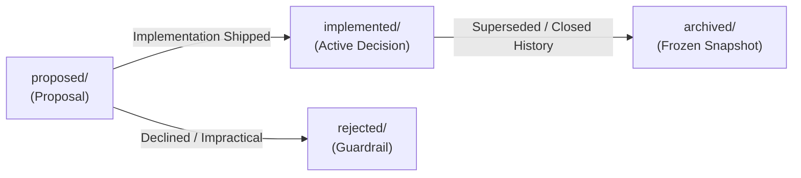

# mini-agent-harness Architecture and Design Decisions (Agent Notes)


This directory records architectural decision records (ADRs), technology selections, and trade-off analyses for the **mini-agent-harness** project.

---

## Current Maintenance Gate (2026-08-31)

The line-budget release work has completed its low-risk Stage 1 audit and the targeted **Stage 2: protect core boundaries** acceptance. It is now operating under **Stage 3: normal budget admission**, with the hard gates still active:

- runtime (`core + protocol + host + app-server`): `15,286 / 20,000` lines (76.4%; 4,714 remaining)
- all Rust source: `28,306 / 30,000` lines (94.4%; 1,694 remaining)
- Stage 1 released `679` lines; the Stage 2 timeout lifecycle fix adds `51` structural lines, leaving `1,406` lines to reach the approximate `26,900` target

The latest maintenance batches removed repeated App Server action transport wrapping, one-time facade wrappers, duplicate capability argument/error wrappers, repeated skill metadata projection, duplicate result argument validation, duplicated built-in provider descriptors, static shell/image/configuration tests, duplicate App Server test fixtures, repeated WorldState result projection, repeated workflow goal response projection, a Host OpenAI builder forwarding wrapper, an App Server runtime image mirror plus unused accessors, two frontend forwarding functions, a duplicate frontend workflow enum projection, and duplicate Python test fixture probing. Core tests and the Actor/CAS/Session boundaries remain protected. Remaining public convenience APIs and configuration aliases are recorded as compatibility candidates and are not removed without an explicit API decision.

The low-risk Stage 1 candidates are now exhausted. The remaining reduction candidates are intentional frontend facades, input-compatibility aliases, provider/protocol coverage, or larger state-boundary changes; they require an explicit design decision. Stage 2 remains the active boundary guard while the budget gates stay active. The admission rule for each follow-up batch is: keep the diff to a few hundred lines, run the affected crate tests and Clippy, run `python scripts/line_budget.py`, update the relevant note, and commit the batch.

Stage 2 targeted boundary checks pass for Core, Protocol, App Server Protocol, App Server, Capabilities, Host, and the complete CLI interactive integration target. The goal-timeout lifecycle now settles `turn/interrupt` and durable checkpoint state before marking the goal failed. The full workspace test suite remains unrun pending explicit approval.

Stage 3 is now the active admission mode. The approximate `26,900` Stage 1 target is optimization debt, not permission to remove protected behavior. New changes must preserve both hard ceilings, report the runtime and whole-workspace line delta, and default to net-zero growth or identify an explicit offset. Code changes run the affected tests, Clippy, formatting, and `python scripts/line_budget.py`; new Core/Protocol/Actor/CAS/Session behavior also needs an architecture note and boundary-level evidence.

---

## 1. Multi-Level Directory Semantics & Layout

Every Agent Note has two orthogonal axes encoded directly in its file path: `{lifecycle}/{class}/yyyy-mm-dd-topic-title.md`.

```text
.agents/notes/
├── proposed/                  # Proposals under review; not yet built (or partially built)
├── implemented/               # Decisions implemented and shipped in production
│   ├── architecture/          # Structural design, microkernel, capability seams, services
│   ├── feature/               # User- or model-facing agent capabilities
│   ├── simplification/        # Removing dead code/complexity without losing capabilities
│   ├── process/               # Development workflows, gates, tooling
│   ├── testing/               # Testing strategies and infrastructure
│   └── bug-fix/               # Postmortem fixes and architectural defect closure
├── rejected/                  # Proposals considered and declined (retained only if guardrail)
└── archived/                  # Completed historical snapshots that no longer guide future work
    └── experiments/
```

### Primary Axis: Lifecycle (`{lifecycle}/`)
- **`proposed/`**: Proposals under review prior to implementation. Free-form future tense (`## Proposal`, `## Acceptance criteria`, `## Risks`).
- **`implemented/`**: Shipped reality. Kept current with actual code (facts, paths, names). Uses present tense (`## Decision`, `## Consequences`).
- **`rejected/`**: Proposals declined during review. Carries `Status: rejected — <why, in one line>`. Kept only when its rationale prevents a tempting mistake.
- **`archived/`**: Shipped decisions that are 100% complete and whose rationale is superseded or unlikely to guide future changes. Permanently frozen.

### Secondary Axis: Class (`{class}/`)
| Class | Scope & Coverage |
| :--- | :--- |
| `architecture` | Structural decisions about shipped source code: microkernel, service matrices, capability seams, protocols. |
| `feature` | New user-facing or model-facing capabilities (e.g. new plugin, TUI component). |
| `simplification` | Removing code, behavior, or cognitive overhead without sacrificing capability. |
| `process` | Tooling, workflow, package management, and linting around the codebase. |
| `testing` | Test frameworks, mocking strategies, and regression gates. |
| `bug-fix` | Postmortem fixes for subtle architectural defects. |

---

## 2. Lifecycle Progression & Evolution Methodology



### 1. Advancing from `proposed/` to `implemented/`
When code for a proposal is built, verified, and merged:
1. **Move File**: Move from `proposed/{topic}.md` to `implemented/{class}/{topic}.md`.
2. **Update Status**: Change `Status: proposed` to `Status: implemented`.
3. **Rewrite Body**:
   - Replace `## Proposal` with `## Decision` (written in present-tense fact).
   - Fold `## Acceptance criteria` and `## Risks` into `## Consequences` or `## Verification`.
   - Remove hypothetical or migration planning text in favor of what actually shipped.

### 2. Archiving from `implemented/` to `archived/`
When a decision is completely shipped, stable, and its rationale has been superseded or absorbed into newer notes:
1. **Move File**: Move from `implemented/{class}/{topic}.md` to `archived/{class}/{topic}.md` (`implemented` is omitted in the archive path).
2. **Add Archive Header**: Insert `Archived: YYYY-MM-DD` immediately below `Status: implemented`.
3. **Freeze Content**: Do not edit, translate, or refactor archived notes; they remain historical records.

### 3. Rejecting a Proposal
If a proposed approach is rejected during review:
1. **Move File**: Move from `proposed/{topic}.md` to `rejected/{class}/{topic}.md`.
2. **Update Status**: Set `Status: rejected — <concise rationale in one line>`.
3. **Retention Policy**: Retain only if the rejected proposal prevents a recurring, tempting mistake; otherwise delete.

---

## 3. Working Inventory of Agent Notes

### Proposed Notes Under Review (`proposed/`)

#### Architecture (`proposed/architecture/`)

| Date | Title | Focus |
|---|---|---|
| 2026-08-28 | [CLI Through App Server: Unified Execution Base](proposed/architecture/2026-08-28-cli-through-app-server-unified-runtime.md) | Make App Server the single CLI, JSON-RPC, and ACP execution base and remove parallel turn orchestration |

#### Bug Fixes (`proposed/bug-fix/`)

| Date | Title | Focus |
|---|---|---|
| 2026-08-28 | [Goal Mode Runtime Repair and End-to-End Evidence](proposed/bug-fix/2026-08-28-goal-runtime-and-verifier-evidence.md) | Repair worker timer construction and verifier history admission; gate Goal readiness on the actual CLI workflow |

#### Development Process (`proposed/process/`)

| Date | Title | Focus |
|---|---|---|
| 2026-08-27 | [Stabilization and Evidence Gates](proposed/process/2026-08-27-stabilization-and-evidence-gates.md) | Close runtime boundary defects, verify complete workflows, and align release claims with evidence before expanding scope |

---

### Active Implemented Notes (`implemented/`)

#### Architecture (`implemented/architecture/`)
| Date | Title | Focus |
|---|---|---|
| 2026-08-28 | [In-Process Agent Protocol](../../crates/mini-agent-protocol) | Portable model, tool, message, event, stop, and limit contracts shared by hosts |
| 2026-08-28 | [Codex-Style Core and Protocol Reorganization](implemented/architecture/2026-08-28-codex-style-core-and-protocol-reorganization.md) | Core-owned runtime semantics, structured tool outcomes, storage-neutral checkpoints, and a thin app-server control plane |
| 2026-08-28 | [Current Harness Execution Flow](implemented/architecture/2026-08-28-harness-execution-flow.md) | Actual one-shot, interactive, and app-server paths through Thread, Harness, model/tool steps, events, control, and persistence |
| 2026-08-28 | [External Harness and ACP Boundary](implemented/architecture/2026-08-28-external-harness-and-acp-boundary.md) | Four-layer CLI → App Server → Host/Workflows → Core/Protocol boundary with JSON-RPC, stdio, approvals, lifecycle, and experimental ACP mapping |
| 2026-08-29 | [App Server Session, World, and MCP Management](implemented/architecture/2026-08-29-app-server-session-world-mcp-management.md) | Shared local and JSON-RPC management service for session metadata, workspace state, execution policy, and MCP status/retry |
| 2026-08-29 | [CLI Without Direct Host and Capabilities Dependencies](implemented/architecture/2026-08-29-cli-without-host-capabilities-dependencies.md) | App Server frontend facade removes direct CLI compilation dependencies; provider experiments move to a separate crate |
| 2026-08-29 | [CLI Workflow Control Plane Through App Server](implemented/architecture/2026-08-29-cli-workflow-control-plane.md) | Goal, Plan, verifier, and restart workflow operations use the LocalAppServerClient management contract |
| 2026-08-30 | [Runtime Control-Plane Ownership](implemented/architecture/2026-08-30-runtime-control-plane-ownership.md) | One local/remote App Server path, one runtime service unit, and fewer duplicated runtime state sources |
| 2026-08-30 | [File Boundaries and Runtime Start Options](implemented/architecture/2026-08-30-file-boundaries-and-runtime-start-options.md) | Internal module boundaries for large files and one named host runtime startup input |
| 2026-08-30 | [Capabilities API Boundaries](implemented/architecture/2026-08-30-capabilities-api-boundaries.md) | Capabilities root facade split into stable contracts, composition seams, and crate-internal implementation |
| 2026-08-30 | [Goal Verifier Naming Boundary](implemented/architecture/2026-08-30-goal-verifier-naming.md) | Replaced current Mentor implementation names with Goal verifier terminology without retaining legacy environment aliases |
| 2026-08-30 | [Dead-Code Suppression Audit](implemented/architecture/2026-08-30-dead-code-suppression-audit.md) | Removed stale dead-code suppressions after classifying each item by mainline, embedding, test, or leftover usage |
| 2026-08-30 | [Runtime Authority and Action Ordering](implemented/architecture/2026-08-30-runtime-authority-and-action-ordering.md) | Core/App Server/Host authority boundaries, internal action envelopes, and separate action/event ordering |
| 2026-08-30 | [Runtime State Actor Queue](implemented/architecture/2026-08-30-runtime-state-actor-queue.md) | Session, World, MCP, and Workflow state ownership through one App Server actor queue |
| 2026-08-30 | [Runtime Revision, CAS, and Transaction Boundary](implemented/architecture/2026-08-30-runtime-revision-cas-and-transaction.md) | Unified runtime revisions, stale-write rejection, and the Thread/Session persistence boundary |
| 2026-08-29 | [Model Provider Factory Seam](implemented/architecture/2026-08-29-model-provider-factory-seam.md) | Generic Core Model construction through Host and App Server provider factories with an external provider example |
| 2026-08-29 | [CLI REPL Worker Split](implemented/architecture/2026-08-29-cli-repl-worker-split.md) | Terminal presentation and command queueing separated from App Server worker and workflow execution |
| 2026-08-29 | [App Server Owned Frontend Approval Contract](implemented/architecture/2026-08-29-app-server-owned-frontend-approval.md) | Approval lifecycle is wrapped at the App Server boundary while CLI startup policy remains explicit |
| 2026-08-29 | [Core Protocol Boundary and Harness Module Ownership](implemented/architecture/2026-08-29-core-protocol-boundary-and-harness-modules.md) | Protocol contracts are imported directly and Harness execution responsibilities are split into private Core modules |
| 2026-08-24 | [Core Harness Boundary](implemented/architecture/2026-08-24-core-harness-boundary.md) | Strict boundary between pure microkernel core and host CLI adapters |
| 2026-08-24 | [Hard Limits System](implemented/architecture/2026-08-24-hard-limits-system.md) | Hard bounds on context, responses, step count, and UTF-8 head/tail truncation |
| 2026-08-26 | [Event-Driven Reactive Loop](implemented/architecture/2026-08-26-event-driven-reactive-loop.md) | Passive immutable observers driving live client UI and session-backed durable history |
| 2026-08-28 | [Session as the Single Durable Runtime Store](implemented/architecture/2026-08-28-session-single-source-of-truth.md) | Session JSONL owns settled history and result handles; live events remain in-process |
| 2026-08-26 | [Session Branching Lanes](implemented/architecture/2026-08-26-session-branching-lanes.md) | Multi-branch tree conversations and speculative exploration lanes |
| 2026-08-26 | [Local Sandbox Adapter](implemented/architecture/2026-08-26-local-sandbox-adapter.md) | Approval rules, path checks, Docker execution, and native process-tree cleanup |
| 2026-08-27 | [Model Context Boundaries & CLI Decoupling](implemented/architecture/2026-08-27-model-context-boundaries-and-cli-decoupling.md) | Model item ceilings, atomic turn trimming, CLI decoupling, and session continuity |
| 2026-08-27 | [Subprocess CLI & ACP Subagent Execution](implemented/architecture/2026-08-27-subprocess-cli-and-acp-subagent-execution.md) | Headless `mini-agent ask --json` subprocess spawning and `spawn_agent` |
| 2026-08-27 | [Multi-turn Interactive Subagent Sessions](implemented/architecture/2026-08-27-multi-turn-interactive-subagent-sessions.md) | Session-backed resumption through `send_subagent_message` |
| 2026-08-27 | [Subagent Trace Replay & Session Lineage](implemented/architecture/2026-08-27-subagent-trace-replay-and-session-lineage.md) | Parent-session subagent records and bounded result rollup |
| 2026-08-27 | [Session Directory & Metadata Architecture](implemented/architecture/2026-08-27-session-directory-and-metadata-architecture.md) | Actual session files, goal/plan state, attachments, and subagent records |
| 2026-08-27 | [Builtin Agent & Persona Prompt System](implemented/architecture/2026-08-27-builtin-agent-personas-and-file-contracts.md) | Builtin agent/persona prompts, dual-mode file contracts (review/summary), and issue state tracking |
| 2026-08-27 | [Goal and Plan Subsystem Architecture](implemented/architecture/2026-08-27-goal-and-plan-subsystem-architecture.md) | Explicit triggers, Living Plan protocol (plan.md), and autonomous verification state machine (goal/) |
| 2026-08-27 | [web_fetch / read_image session impact](implemented/architecture/2026-08-27-web-fetch-and-read-image-session-impact.md) | Envelope-only history; resume/fork attachments; compact empty tools; prefix-cache misses |
| 2026-08-28 | [Interactive Steer and Follow-up Run Control](implemented/architecture/2026-08-28-steer-and-follow-up-run-control.md) | `/steer` priority correction, FIFO follow-up queue, cooperative safe checkpoints, and durable `steered` turns |
| 2026-08-28 | [Host Capability Profiles and Runtime Seams](implemented/architecture/2026-08-28-host-capability-profiles-and-runtime-seams.md) | CLI/App Server/ACP profile selection, regular-agent prompt/rule scope, bounded manifests, startup profile resolution, and selected MCP loading |
| 2026-08-31 | [Agent Framework 与 Harness 成熟度分析](implemented/architecture/2026-08-31-agent-framework-and-harness-maturity.md) | mini-agent-harness 与 Codex 原生框架的分层、Turn/Step 流程、steering 边界、硬限制、成熟度评估与行数门禁推进 |

#### Features & Extensions (`implemented/feature/`)
| Date | Title | Focus |
|---|---|---|
| 2026-08-24 | [Context Compaction](implemented/feature/2026-08-24-context-compaction.md) | Prefix compaction preserving latest world state and recent tool work verbatim |
| 2026-08-24 | [Durable Sessions & Recovery](implemented/feature/2026-08-24-durable-sessions-and-recovery.md) | Append-only JSONL session checkpoints with torn-tail auto recovery |
| 2026-08-24 | [Historical: Independent Mentor System](implemented/feature/2026-08-24-independent-mentor-system.md) | Superseded standalone Mentor design; retained behavior is the Goal verifier |
| 2026-08-24 | [MCP & Skills Integration](implemented/feature/2026-08-24-mcp-and-skills-integration.md) | Stdio and HTTP MCP support with progressive skill discovery |
| 2026-08-24 | [Explicit World State](implemented/feature/2026-08-24-explicit-world-state.md) | Deterministic host environment detection and context injection |
| 2026-08-26 | [Fail-Closed Approval](implemented/feature/2026-08-26-fail-closed-approval-and-tool-orchestration.md) | Permission matrix, interactive TTY approval, and path containment |
| 2026-08-26 | [Autonomous Goal Mode](implemented/feature/2026-08-26-autonomous-goal-mode.md) | Long-running goal execution with convergence gates and loop detection |
| 2026-08-26 | [MCP Circuit Breaker](implemented/feature/2026-08-26-mcp-circuit-breaker.md) | Circuit breaking and graceful degradation for failing remote HTTP MCP servers |

#### Simplification (`implemented/simplification/`)
| Date | Title | Focus |
|---|---|---|
| 2026-08-24 | [Source Code Line Budget](implemented/simplification/2026-08-24-source-code-line-budget.md) | 20k runtime and 30k total Rust-source hard gates for 0.4.0 |
| 2026-08-29 | [Mainline Simplification: 39k to 29k Rust Lines](implemented/simplification/2026-08-29-mainline-simplification-39000-to-29000.md) | Removal of non-mainline edges, duplicate seams, and redundant test layers while preserving the canonical CLI → App Server → Host → Core path |
| 2026-08-29 | [Mainline Simplification: 29k to 26k Rust Lines](implemented/simplification/2026-08-29-mainline-simplification-29k-to-26k.md) | Follow-up removal of stale replay, persona, profile, capability, and App Server compatibility seams; establishes the safer 26,984-line baseline |

#### Testing (`implemented/testing/`)
| Date | Title | Focus |
|---|---|---|
| 2026-08-27 | [Real LLM Scenario Runner](implemented/testing/2026-08-27-real-llm-scenario-runner.md) | Explicit real-provider scenarios with request, output, and wall-time budgets |

---

### Rejected Proposals (Guardrails) (`rejected/`)

#### Architecture (`rejected/architecture/`)
| Date | Title | Rationale |
|---|---|---|
| 2026-08-24 | [Generic Persistence in Core](rejected/architecture/2026-08-24-generic-persistence-in-core.md) | Cannot settle non-idempotent external effects; persistence belongs at edge |
| 2026-08-27 | [Subagent Task Scheduling & Delegation](rejected/architecture/2026-08-27-subagent-task-scheduling-and-delegation.md) | In-process multi-tenant scheduler adds unnecessary core complexity; replaced by Subprocess CLI execution and session-backed multi-turn architecture |
| 2026-08-26 | [Event Stream Rollout Replay](rejected/architecture/2026-08-26-event-stream-rollout-replay.md) | Detailed external trace replay was prompt-weight-specific; session JSONL is the mainline durable record |

#### Features & Extensions (`rejected/feature/`)
| Date | Title | Rationale |
|---|---|---|
| 2026-08-24 | [Un-Settled Effect Replay](rejected/feature/2026-08-24-un-settled-effect-replay.md) | Replaying interrupted effects produces duplicate non-idempotent actions |
| 2026-08-24 | [Unrestricted Whole-File Rewrite](rejected/feature/2026-08-24-unrestricted-whole-file-rewrite.md) | Full rewrites drop unrelated code in long contexts; exact replacement is safer |
| 2026-08-24 | [Prompt Weight Protocol](rejected/feature/2026-08-24-prompt-weight.md) | Prompt-weight benchmarking is optional and outside the project mainline |
| 2026-08-26 | [Prompt Weight Evaluation](rejected/feature/2026-08-26-prompt-weight-evaluation.md) | Real-model prompt comparison is optional and outside the project mainline |

---

### Historical Archive (`archived/`)

#### Experiments (`archived/experiments/`)
| Date | Title | Focus |
|---|---|---|
| 2026-08-24 | [Unknown-Tool Recovery](archived/experiments/2026-08-24-unknown-tool.md) | Recovery-capable model passes by projecting tool failure back to context |
| 2026-08-24 | [Edit Surface Comparison](archived/experiments/2026-08-24-edit-surface.md) | Exact unique replacement preserves collateral content over full rewrite |
| 2026-08-24 | [Tool-Output Retention](archived/experiments/2026-08-24-tool-output-retention.md) | Head-plus-tail truncation preserves both orientation and final verdict |
| 2026-08-24 | [Effect Recovery Boundary](archived/experiments/2026-08-24-effect-recovery.md) | Replay safety simulation across non-idempotent crash boundaries |

#### Features (`archived/feature/`)
| Date | Title | Focus |
|---|---|---|
| 2026-08-27 | [DeepSeek and GLM Provider Seams](archived/feature/2026-08-27-deepseek-and-glm-provider-seams.md) | Historical provider seam record superseded by the single Responses protocol |
