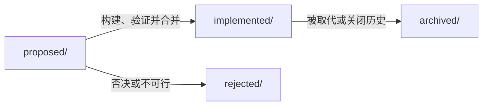

# Agent Notes

`.agents/notes/` 是 `mini-agent-harness` 的架构决策记录区，保存 ADR、提案、
实验依据、技术取舍、被拒方案和跨生命周期的过程指南。它回答“为什么这样做、
如何证明”，不是当前产品规格，也不是持续追加的项目日志。

当前产品行为、稳定配置和运行手册以 `docs/` 及各目录 README 为准；本目录中的
记录用于追溯决策和指导变更，不能替代这些规范。下面的工作清单只是导航，不是
另一个当前实现索引；完整记录始终以生命周期目录和文件内容为准。

## 1. 目录语义与布局

架构、功能、实验和决策记录使用两个正交轴：
`{lifecycle}/{class}/yyyy-mm-dd-topic-title.md`。

```text
.agents/notes/
├── README.md
├── proposal-quality-and-evidence-guide.md  # 跨生命周期的过程指南
├── proposed/                               # 评审中或尚未完成验证
├── implemented/                            # 已落地且仍指导当前实现
├── rejected/                               # 被否决但仍有护栏价值
└── archived/                               # 已冻结，仅供历史追溯
```

`class` 使用以下固定分类：

| Class | 内容范围 |
| --- | --- |
| `architecture` | 分层、协议、运行时、能力边界和服务关系 |
| `feature` | 新增用户或模型可见能力 |
| `simplification` | 删除代码、状态或认知负担而不损失能力 |
| `process` | 工具链、工作流、门禁和工程过程 |
| `testing` | 测试策略、fixture、scenario 和回归门禁 |
| `bug-fix` | 复杂架构缺陷的修复和证据闭环 |

## 2. 生命周期语义

| 生命周期 | 含义 | 文档要求 |
| --- | --- | --- |
| `proposed/` | 正在评审或尚未完成证据验证的方案 | 使用将来时，写清目标、验收、风险和批次 |
| `implemented/` | 已构建、验证并合并，仍指导当前实现的决策 | 使用现在时，记录实际决策、代码边界和验证结果 |
| `rejected/` | 评审中被否决，但理由能阻止重复误入 | 保留一行明确的否决原因和适用护栏 |
| `archived/` | 已被新决策取代或不再指导未来工作的历史快照 | 冻结，不再翻译、重排或追加 |

根目录只保留少量跨生命周期的过程指南。过程指南描述如何起草、实施和验证，
不代表某个功能已经实现，也不随单个提案移动到 `implemented/`。

## 3. 生命周期推进



### `proposed/` → `implemented/`

1. 将文件移动到对应的 `implemented/{class}/` 目录；
2. 将状态改为 `implemented`；
3. 把 `Proposal` 改写为现在时的 `Decision`；
4. 将验收和风险改为实际的 `Verification`、`Consequences` 和剩余风险；
5. 确认文档、协议、SDK、Web 和测试证据与已合并代码一致。

### `implemented/` → `archived/`

只有当决策已稳定、被后续决策吸收或不再指导变更时才归档。移动后加入归档日期，
并冻结内容；当前规范若仍需要说明，应更新 `docs/` 或新的当前决策记录。

### `proposed/` → `rejected/`

被否决的方案只有在其理由能阻止重复犯错时保留；否则不保留无价值的历史噪音。

## 4. 维护规则

- 当前行为写入 `docs/` 的主题文档；决策理由写入本目录的一篇主题记录；
- 一个主题只保留一个当前决策记录，不在旧记录末尾追加下一轮工作日志；
- 提案完成后移动到 `implemented/` 并改写为已实现的事实；
- 被否决的方案只在仍能阻止重复误入时保留；
- 已进入 `archived/` 的文件冻结，不再翻译、重排或追加内容；
- README 只维护 notes 的用途、目录语义、生命周期、工作清单和维护方式，不复制
  完整方案、测试输出、当前限制或用户操作步骤。

## 5. 工作清单

以下只列当前仍值得快速进入的参考点。它不是完整目录，也不替代文件中的状态、
验收标准和验证结果；新增、移动或归档这些参考点时应同步更新本节。

### Proposed

- [Codex-Aligned Agent Control Plane](proposed/architecture/2026-09-03-codex-aligned-agent-control-plane.md)
- [Codex-Aligned Agent Control Plane（中文）](proposed/architecture/2026-09-03-codex-aligned-agent-control-plane.zh.md)
- [Codex-Aligned Skills, Plugins, Builtin Tools, and ThreadItems](proposed/architecture/2026-09-01-codex-aligned-capabilities-thread-items.md)
- [Goal Runtime and Thread/Goal/Plan](proposed/architecture/2026-09-01-goal-runtime-thread-goal-plan.md)
- [Docker Sandbox Isolation Policy](proposed/architecture/2026-08-31-docker-sandbox-isolation-policy.md)
- [CLI Through App Server](proposed/architecture/2026-08-28-cli-through-app-server-unified-runtime.md)
- [Goal Runtime and Verifier Evidence](proposed/bug-fix/2026-08-28-goal-runtime-and-verifier-evidence.md)
- [Stabilization and Evidence Gates](proposed/process/2026-08-27-stabilization-and-evidence-gates.md)

### Implemented

- [Core Harness Boundary](implemented/architecture/2026-08-24-core-harness-boundary.md)
- [Hard Limits System](implemented/architecture/2026-08-24-hard-limits-system.md)
- [Session as Single Durable Store](implemented/architecture/2026-08-28-session-single-source-of-truth.md)
- [Runtime Authority and Action Ordering](implemented/architecture/2026-08-30-runtime-authority-and-action-ordering.md)
- [Python SDK and App Server Integration](implemented/architecture/2026-08-31-python-sdk-architecture-and-app-server-integration.md)
- [Codex-Aligned Thread and Goal Runtime](implemented/architecture/2026-09-03-codex-aligned-thread-goal-runtime.md)

### Process Guides

- [Proposal Quality and Evidence Guide](proposal-quality-and-evidence-guide.md)：提案
  起草、批次实施、跨仓同步、证据验证和状态晋级的可执行工作手册。

其他记录可直接在生命周期目录中查找；不把所有历史记录复制到 README，避免它
退化成重复维护的 changelog。
