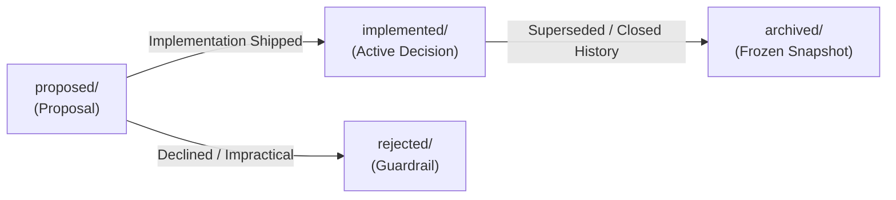

# mini-agent-harness Architecture and Design Decisions (Agent Notes)


This directory records architectural decision records (ADRs), technology selections, and trade-off analyses for the **mini-agent-harness** project.

---

## 1. Multi-Level Directory Semantics & Layout

Every Agent Note has two orthogonal axes encoded directly in its file path: `{lifecycle}/{class}/yyyy-mm-dd-topic-title.md`.

```text
.agents/notes/
├── proposed/                  # Proposals under review; not yet built (or partially built)
├── implemented/               # Decisions implemented and shipped in production
│   ├── architecture/          # Structural design, microkernel, capability seams, services
│   ├── feature/               # User- or model-facing agent capabilities
│   ├── simplification/        # Removing dead code/complexity without losing capabilities
│   ├── process/               # Development workflows, gates, tooling
│   ├── testing/               # Testing strategies and infrastructure
│   └── bug-fix/               # Postmortem fixes and architectural defect closure
├── rejected/                  # Proposals considered and declined (retained only if guardrail)
└── archived/                  # Completed historical snapshots that no longer guide future work
    ├── architecture/
    └── simplification/
```

### Primary Axis: Lifecycle (`{lifecycle}/`)
- **`proposed/`**: Proposals under review prior to implementation. Free-form future tense (`## Proposal`, `## Acceptance criteria`, `## Risks`).
- **`implemented/`**: Shipped reality. Kept current with actual code (facts, paths, names). Uses present tense (`## Decision`, `## Consequences`).
- **`rejected/`**: Proposals declined during review. Carries `Status: rejected — <why, in one line>`. Kept only when its rationale prevents a tempting mistake.
- **`archived/`**: Shipped decisions that are 100% complete and whose rationale is superseded or unlikely to guide future changes. Permanently frozen.

### Secondary Axis: Class (`{class}/`)
| Class | Scope & Coverage |
| :--- | :--- |
| `architecture` | Structural decisions about shipped source code: microkernel, service matrices, capability seams, protocols. |
| `feature` | New user-facing or model-facing capabilities (e.g. new plugin, TUI component). |
| `simplification` | Removing code, behavior, or cognitive overhead without sacrificing capability. |
| `process` | Tooling, workflow, package management, and linting around the codebase. |
| `testing` | Test frameworks, mocking strategies, and regression gates. |
| `bug-fix` | Postmortem fixes for subtle architectural defects. |

---

## 2. Lifecycle Progression & Evolution Methodology



### 1. Advancing from `proposed/` to `implemented/`
When code for a proposal is built, verified, and merged:
1. **Move File**: Move from `proposed/{topic}.md` to `implemented/{class}/{topic}.md`.
2. **Update Status**: Change `Status: proposed` to `Status: implemented`.
3. **Rewrite Body**:
   - Replace `## Proposal` with `## Decision` (written in present-tense fact).
   - Fold `## Acceptance criteria` and `## Risks` into `## Consequences` or `## Verification`.
   - Remove hypothetical or migration planning text in favor of what actually shipped.

### 2. Archiving from `implemented/` to `archived/`
When a decision is completely shipped, stable, and its rationale has been superseded or absorbed into newer notes:
1. **Move File**: Move from `implemented/{class}/{topic}.md` to `archived/{class}/{topic}.md` (`implemented` is omitted in the archive path).
2. **Add Archive Header**: Insert `Archived: YYYY-MM-DD` immediately below `Status: implemented`.
3. **Freeze Content**: Do not edit, translate, or refactor archived notes; they remain historical records.

### 3. Rejecting a Proposal
If a proposed approach is rejected during review:
1. **Move File**: Move from `proposed/{topic}.md` to `rejected/{class}/{topic}.md`.
2. **Update Status**: Set `Status: rejected — <concise rationale in one line>`.
3. **Retention Policy**: Retain only if the rejected proposal prevents a recurring, tempting mistake; otherwise delete.

---

## 3. Working Inventory of Agent Notes

### Proposed Notes Under Review (`proposed/`)

#### Architecture (`proposed/architecture/`)
| Date | Title | Focus |
|---|---|---|
| 2026-08-26 | [Session Branching Lanes](file:///D:/gh-ws/codex-ws/mini-codex/.agents/notes/proposed/architecture/2026-08-26-session-branching-lanes.md) | Multi-branch tree conversations and speculative exploration lanes |
| 2026-08-26 | [Local Sandbox Adapter](file:///D:/gh-ws/codex-ws/mini-codex/.agents/notes/proposed/architecture/2026-08-26-local-sandbox-adapter.md) | Pluggable container and sandbox isolation for shell tool execution |

#### Features & Extensions (`proposed/feature/`)
| Date | Title | Focus |
|---|---|---|
| 2026-08-26 | [Prompt Weight Evaluation](file:///D:/gh-ws/codex-ws/mini-codex/.agents/notes/proposed/feature/2026-08-26-prompt-weight-evaluation.md) | Real-model evaluation of minimal vs verbose system prompt policies |
| 2026-08-26 | [MCP Circuit Breaker](file:///D:/gh-ws/codex-ws/mini-codex/.agents/notes/proposed/feature/2026-08-26-mcp-circuit-breaker.md) | Circuit breaking and graceful degradation for failing remote HTTP MCP servers |

---

### Active Implemented Notes (`implemented/`)

#### Architecture (`implemented/architecture/`)
| Date | Title | Focus |
|---|---|---|
| 2026-08-24 | [Core Harness Boundary](file:///D:/gh-ws/codex-ws/mini-codex/.agents/notes/implemented/architecture/2026-08-24-core-harness-boundary.md) | Strict boundary between pure microkernel core and host CLI adapters |
| 2026-08-24 | [Hard Limits System](file:///D:/gh-ws/codex-ws/mini-codex/.agents/notes/implemented/architecture/2026-08-24-hard-limits-system.md) | Hard bounds on context, responses, step count, and UTF-8 head/tail truncation |

#### Features & Extensions (`implemented/feature/`)
| Date | Title | Focus |
|---|---|---|
| 2026-08-24 | [Context Compaction](file:///D:/gh-ws/codex-ws/mini-codex/.agents/notes/implemented/feature/2026-08-24-context-compaction.md) | Prefix compaction preserving latest world state and recent tool work verbatim |
| 2026-08-24 | [Durable Sessions & Recovery](file:///D:/gh-ws/codex-ws/mini-codex/.agents/notes/implemented/feature/2026-08-24-durable-sessions-and-recovery.md) | Append-only JSONL session checkpoints with torn-tail auto recovery |
| 2026-08-24 | [Independent Mentor System](file:///D:/gh-ws/codex-ws/mini-codex/.agents/notes/implemented/feature/2026-08-24-independent-mentor-system.md) | Tool-free independent verification model with isolated derived items |
| 2026-08-24 | [MCP & Skills Integration](file:///D:/gh-ws/codex-ws/mini-codex/.agents/notes/implemented/feature/2026-08-24-mcp-and-skills-integration.md) | Stdio and HTTP MCP support with progressive skill discovery |
| 2026-08-24 | [Explicit World State](file:///D:/gh-ws/codex-ws/mini-codex/.agents/notes/implemented/feature/2026-08-24-explicit-world-state.md) | Deterministic host environment detection and context injection |

#### Simplification (`implemented/simplification/`)
| Date | Title | Focus |
|---|---|---|
| 2026-08-24 | [Source Code Line Budget](file:///D:/gh-ws/codex-ws/mini-codex/.agents/notes/implemented/simplification/2026-08-24-source-code-line-budget.md) | Strict line budgets (20k core / 30k workspace) to prevent abstraction bloat |

---

### Rejected Proposals (Guardrails) (`rejected/`)

#### Architecture (`rejected/architecture/`)
| Date | Title | Rationale |
|---|---|---|
| 2026-08-24 | [Generic Persistence in Core](file:///D:/gh-ws/codex-ws/mini-codex/.agents/notes/rejected/architecture/2026-08-24-generic-persistence-in-core.md) | Cannot settle non-idempotent external effects; persistence belongs at edge |

#### Features & Extensions (`rejected/feature/`)
| Date | Title | Rationale |
|---|---|---|
| 2026-08-24 | [Un-Settled Effect Replay](file:///D:/gh-ws/codex-ws/mini-codex/.agents/notes/rejected/feature/2026-08-24-un-settled-effect-replay.md) | Replaying interrupted effects produces duplicate non-idempotent actions |
| 2026-08-24 | [Unrestricted Whole-File Rewrite](file:///D:/gh-ws/codex-ws/mini-codex/.agents/notes/rejected/feature/2026-08-24-unrestricted-whole-file-rewrite.md) | Full rewrites drop unrelated code in long contexts; exact replacement is safer |

---

### Historical Archive (`archived/`)

#### Experiments (`archived/experiments/`)
| Date | Title | Focus |
|---|---|---|
| 2026-08-24 | [Unknown-Tool Recovery](file:///D:/gh-ws/codex-ws/mini-codex/.agents/notes/archived/experiments/2026-08-24-unknown-tool.md) | Recovery-capable model passes by projecting tool failure back to context |
| 2026-08-24 | [Edit Surface Comparison](file:///D:/gh-ws/codex-ws/mini-codex/.agents/notes/archived/experiments/2026-08-24-edit-surface.md) | Exact unique replacement preserves collateral content over full rewrite |
| 2026-08-24 | [Tool-Output Retention](file:///D:/gh-ws/codex-ws/mini-codex/.agents/notes/archived/experiments/2026-08-24-tool-output-retention.md) | Head-plus-tail truncation preserves both orientation and final verdict |
| 2026-08-24 | [Effect Recovery Boundary](file:///D:/gh-ws/codex-ws/mini-codex/.agents/notes/archived/experiments/2026-08-24-effect-recovery.md) | Replay safety simulation across non-idempotent crash boundaries |
| 2026-08-24 | [Prompt Weight Protocol](file:///D:/gh-ws/codex-ws/mini-codex/.agents/notes/archived/experiments/2026-08-24-prompt-weight.md) | Benchmark protocol comparing minimal vs expanded operational system prompts |

