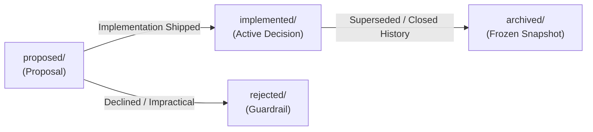

# mini-agent-harness Architecture and Design Decisions (Agent Notes)


This directory records architectural decision records (ADRs), technology selections, and trade-off analyses for the **mini-agent-harness** project.

---

## 1. Multi-Level Directory Semantics & Layout

Every Agent Note has two orthogonal axes encoded directly in its file path: `{lifecycle}/{class}/yyyy-mm-dd-topic-title.md`.

```text
.agents/notes/
├── proposed/                  # Proposals under review; not yet built (or partially built)
├── implemented/               # Decisions implemented and shipped in production
│   ├── architecture/          # Structural design, microkernel, capability seams, services
│   ├── feature/               # User- or model-facing agent capabilities
│   ├── simplification/        # Removing dead code/complexity without losing capabilities
│   ├── process/               # Development workflows, gates, tooling
│   ├── testing/               # Testing strategies and infrastructure
│   └── bug-fix/               # Postmortem fixes and architectural defect closure
├── rejected/                  # Proposals considered and declined (retained only if guardrail)
└── archived/                  # Completed historical snapshots that no longer guide future work
    ├── architecture/
    └── simplification/
```

### Primary Axis: Lifecycle (`{lifecycle}/`)
- **`proposed/`**: Proposals under review prior to implementation. Free-form future tense (`## Proposal`, `## Acceptance criteria`, `## Risks`).
- **`implemented/`**: Shipped reality. Kept current with actual code (facts, paths, names). Uses present tense (`## Decision`, `## Consequences`).
- **`rejected/`**: Proposals declined during review. Carries `Status: rejected — <why, in one line>`. Kept only when its rationale prevents a tempting mistake.
- **`archived/`**: Shipped decisions that are 100% complete and whose rationale is superseded or unlikely to guide future changes. Permanently frozen.

### Secondary Axis: Class (`{class}/`)
| Class | Scope & Coverage |
| :--- | :--- |
| `architecture` | Structural decisions about shipped source code: microkernel, service matrices, capability seams, protocols. |
| `feature` | New user-facing or model-facing capabilities (e.g. new plugin, TUI component). |
| `simplification` | Removing code, behavior, or cognitive overhead without sacrificing capability. |
| `process` | Tooling, workflow, package management, and linting around the codebase. |
| `testing` | Test frameworks, mocking strategies, and regression gates. |
| `bug-fix` | Postmortem fixes for subtle architectural defects. |

---

## 2. Lifecycle Progression & Evolution Methodology



### 1. Advancing from `proposed/` to `implemented/`
When code for a proposal is built, verified, and merged:
1. **Move File**: Move from `proposed/{topic}.md` to `implemented/{class}/{topic}.md`.
2. **Update Status**: Change `Status: proposed` to `Status: implemented`.
3. **Rewrite Body**:
   - Replace `## Proposal` with `## Decision` (written in present-tense fact).
   - Fold `## Acceptance criteria` and `## Risks` into `## Consequences` or `## Verification`.
   - Remove hypothetical or migration planning text in favor of what actually shipped.

### 2. Archiving from `implemented/` to `archived/`
When a decision is completely shipped, stable, and its rationale has been superseded or absorbed into newer notes:
1. **Move File**: Move from `implemented/{class}/{topic}.md` to `archived/{class}/{topic}.md` (`implemented` is omitted in the archive path).
2. **Add Archive Header**: Insert `Archived: YYYY-MM-DD` immediately below `Status: implemented`.
3. **Freeze Content**: Do not edit, translate, or refactor archived notes; they remain historical records.

### 3. Rejecting a Proposal
If a proposed approach is rejected during review:
1. **Move File**: Move from `proposed/{topic}.md` to `rejected/{class}/{topic}.md`.
2. **Update Status**: Set `Status: rejected — <concise rationale in one line>`.
3. **Retention Policy**: Retain only if the rejected proposal prevents a recurring, tempting mistake; otherwise delete.

---

## 3. Working Inventory of Agent Notes

### Proposed Notes Under Review (`proposed/`)

#### Development Process (`proposed/process/`)

| Date | Title | Focus |
|---|---|---|
| 2026-08-27 | [Stabilization and Evidence Gates](proposed/process/2026-08-27-stabilization-and-evidence-gates.md) | Close runtime boundary defects, verify complete workflows, and align release claims with evidence before expanding scope |

#### Features & Extensions (`proposed/feature/`)
| Date | Title | Focus |
|---|---|---|
| 2026-08-26 | [Prompt Weight Evaluation](.agents/notes/proposed/feature/2026-08-26-prompt-weight-evaluation.md) | Real-model evaluation of minimal vs verbose system prompt policies |

---

### Active Implemented Notes (`implemented/`)

#### Architecture (`implemented/architecture/`)
| Date | Title | Focus |
|---|---|---|
| 2026-08-24 | [Core Harness Boundary](.agents/notes/implemented/architecture/2026-08-24-core-harness-boundary.md) | Strict boundary between pure microkernel core and host CLI adapters |
| 2026-08-24 | [Hard Limits System](.agents/notes/implemented/architecture/2026-08-24-hard-limits-system.md) | Hard bounds on context, responses, step count, and UTF-8 head/tail truncation |
| 2026-08-26 | [Event-Driven Reactive Loop](.agents/notes/implemented/architecture/2026-08-26-event-driven-reactive-loop.md) | Passive immutable observers driving live client UI and rollout audit traces |
| 2026-08-26 | [Event Stream Rollout Replay](.agents/notes/implemented/architecture/2026-08-26-event-stream-rollout-replay.md) | Deterministic offline replay, playback, and inspection of JSONL traces |
| 2026-08-26 | [Session Branching Lanes](.agents/notes/implemented/architecture/2026-08-26-session-branching-lanes.md) | Multi-branch tree conversations and speculative exploration lanes |
| 2026-08-26 | [Local Sandbox Adapter](.agents/notes/implemented/architecture/2026-08-26-local-sandbox-adapter.md) | Codex-inspired 5-stage tool orchestrator, security presets, and Windows JobObject sandboxing |
| 2026-08-27 | [Model Context Boundaries & CLI Decoupling](.agents/notes/implemented/architecture/2026-08-27-model-context-boundaries-and-cli-decoupling.md) | Model item ceilings, atomic turn trimming, CLI decoupling, and session continuity |
| 2026-08-27 | [Subprocess CLI & ACP Subagent Execution](.agents/notes/implemented/architecture/2026-08-27-subprocess-cli-and-acp-subagent-execution.md) | Headless `mini-agent ask --json` subprocess spawning, `spawn_agent` tool, and Agent Client Protocol execution |
| 2026-08-27 | [Multi-turn Interactive Subagent Sessions](.agents/notes/implemented/architecture/2026-08-27-multi-turn-interactive-subagent-sessions.md) | Stateless session-backed resumption (`send_subagent_message`) and ACP streaming protocol |
| 2026-08-27 | [Subagent Trace Replay & Session Lineage](.agents/notes/implemented/architecture/2026-08-27-subagent-trace-replay-and-session-lineage.md) | Hierarchical trace rollup, nested replay drill-down, and session checkpoint graph |
| 2026-08-27 | [Session Directory & Metadata Architecture](.agents/notes/implemented/architecture/2026-08-27-session-directory-and-metadata-architecture.md) | Modular session directory: fast summary index, goal/plan state, subagent trees, and compaction segments |
| 2026-08-27 | [Builtin Agent & Persona Prompt System](.agents/notes/implemented/architecture/2026-08-27-builtin-agent-personas-and-file-contracts.md) | Builtin agent/persona prompts, dual-mode file contracts (review/summary), and issue state tracking |
| 2026-08-27 | [Goal and Plan Subsystem Architecture](.agents/notes/implemented/architecture/2026-08-27-goal-and-plan-subsystem-architecture.md) | Explicit triggers, Living Plan protocol (plan.md), and autonomous verification state machine (goal/) |
| 2026-08-27 | [web_fetch / read_image session impact](.agents/notes/implemented/architecture/2026-08-27-web-fetch-and-read-image-session-impact.md) | Envelope-only history; resume/fork attachments; compact empty tools; prefix-cache misses |

#### Features & Extensions (`implemented/feature/`)
| Date | Title | Focus |
|---|---|---|
| 2026-08-24 | [Context Compaction](.agents/notes/implemented/feature/2026-08-24-context-compaction.md) | Prefix compaction preserving latest world state and recent tool work verbatim |
| 2026-08-24 | [Durable Sessions & Recovery](.agents/notes/implemented/feature/2026-08-24-durable-sessions-and-recovery.md) | Append-only JSONL session checkpoints with torn-tail auto recovery |
| 2026-08-24 | [Independent Mentor System](.agents/notes/implemented/feature/2026-08-24-independent-mentor-system.md) | Tool-free independent verification model with isolated derived items |
| 2026-08-24 | [MCP & Skills Integration](.agents/notes/implemented/feature/2026-08-24-mcp-and-skills-integration.md) | Stdio and HTTP MCP support with progressive skill discovery |
| 2026-08-24 | [Explicit World State](.agents/notes/implemented/feature/2026-08-24-explicit-world-state.md) | Deterministic host environment detection and context injection |
| 2026-08-26 | [Fail-Closed Approval](.agents/notes/implemented/feature/2026-08-26-fail-closed-approval-and-tool-orchestration.md) | Permission matrix, interactive TTY approval, and path containment |
| 2026-08-26 | [Autonomous Goal Mode](.agents/notes/implemented/feature/2026-08-26-autonomous-goal-mode.md) | Long-running goal execution with convergence gates and loop detection |
| 2026-08-26 | [MCP Circuit Breaker](.agents/notes/implemented/feature/2026-08-26-mcp-circuit-breaker.md) | Circuit breaking and graceful degradation for failing remote HTTP MCP servers |
| 2026-08-27 | [DeepSeek and GLM Provider Seams](.agents/notes/implemented/feature/2026-08-27-deepseek-and-glm-provider-seams.md) | Responses adapter: built-in web_search, Files `file_id` vs GLM inline vision, Coding Plan endpoints |

#### Simplification (`implemented/simplification/`)
| Date | Title | Focus |
|---|---|---|
| 2026-08-24 | [Source Code Line Budget](.agents/notes/implemented/simplification/2026-08-24-source-code-line-budget.md) | Strict line budgets (20k core / 30k workspace) to prevent abstraction bloat |

---

### Rejected Proposals (Guardrails) (`rejected/`)

#### Architecture (`rejected/architecture/`)
| Date | Title | Rationale |
|---|---|---|
| 2026-08-24 | [Generic Persistence in Core](.agents/notes/rejected/architecture/2026-08-24-generic-persistence-in-core.md) | Cannot settle non-idempotent external effects; persistence belongs at edge |
| 2026-08-27 | [Subagent Task Scheduling & Delegation](.agents/notes/rejected/architecture/2026-08-27-subagent-task-scheduling-and-delegation.md) | In-process multi-tenant scheduler adds unnecessary core complexity; replaced by Subprocess CLI execution and session-backed multi-turn architecture |

#### Features & Extensions (`rejected/feature/`)
| Date | Title | Rationale |
|---|---|---|
| 2026-08-24 | [Un-Settled Effect Replay](.agents/notes/rejected/feature/2026-08-24-un-settled-effect-replay.md) | Replaying interrupted effects produces duplicate non-idempotent actions |
| 2026-08-24 | [Unrestricted Whole-File Rewrite](.agents/notes/rejected/feature/2026-08-24-unrestricted-whole-file-rewrite.md) | Full rewrites drop unrelated code in long contexts; exact replacement is safer |

---

### Historical Archive (`archived/`)

#### Experiments (`archived/experiments/`)
| Date | Title | Focus |
|---|---|---|
| 2026-08-24 | [Unknown-Tool Recovery](.agents/notes/archived/experiments/2026-08-24-unknown-tool.md) | Recovery-capable model passes by projecting tool failure back to context |
| 2026-08-24 | [Edit Surface Comparison](.agents/notes/archived/experiments/2026-08-24-edit-surface.md) | Exact unique replacement preserves collateral content over full rewrite |
| 2026-08-24 | [Tool-Output Retention](.agents/notes/archived/experiments/2026-08-24-tool-output-retention.md) | Head-plus-tail truncation preserves both orientation and final verdict |
| 2026-08-24 | [Effect Recovery Boundary](.agents/notes/archived/experiments/2026-08-24-effect-recovery.md) | Replay safety simulation across non-idempotent crash boundaries |
| 2026-08-24 | [Prompt Weight Protocol](.agents/notes/archived/experiments/2026-08-24-prompt-weight.md) | Benchmark protocol comparing minimal vs expanded operational system prompts |
