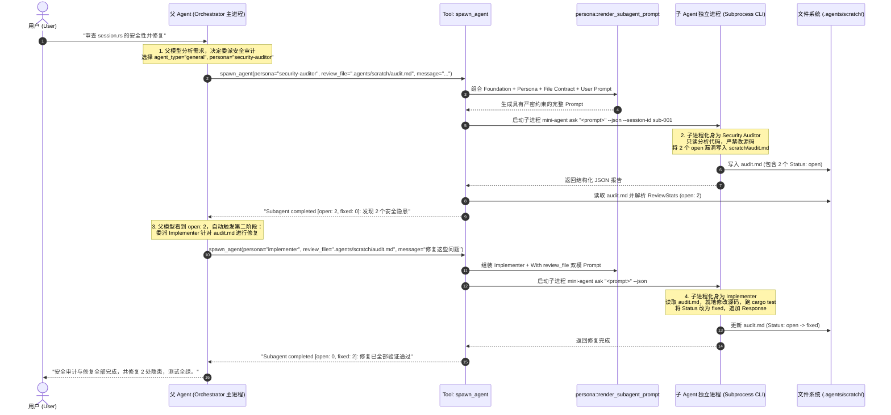

# Builtin Agent & Persona Prompt System with File-Contract Collaboration

Status: implemented

## 1. Context & Problem Statement

Mini-Agent supports spawning isolated subprocess child agents via `spawn_agent` and resuming multi-turn subagent conversations via `send_subagent_message`. However:

1. **Rudimentary Prompts**: Built-in subagent guidance was minimal, lacking the rigorous constraints, investigation methodologies, and format contracts present in mature harnesses (such as Grok's bundled system).
2. **Missing Persona Specialization**: Specialized roles (e.g., `reviewer`, `security-auditor`, `implementer`, `test-writer`, `researcher`) require distinct operational disciplines (e.g., reviewer never modifies code; implementer performs minimal edits and runs tests; security auditor follows OWASP vectors and provides reproduction steps).
3. **Absence of File-Based Collaboration Contracts**: Multi-agent handoff without explicit file contracts leads to context bloat and hallucination. When agents collaborate via structured files (e.g., `.agents/scratch/review-${id}.md`), they need dual-mode instructions (`With review_file` vs `Without review_file`) and issue state tracking (`Status: open` $\to$ `Status: fixed` / `Status: wontfix`).

---

## 2. Decision & Architectural Design

### 2.1 Three Built-in Agent Foundations

Agent Foundations define the **macro-execution mode and physical permission ceilings** for the child process:

1. **`explore` (Fast Read-Only Explorer)**:
   - **Capability Mode**: `read-only`.
   - **Methodology**: 3 thoroughness tiers (`quick`, `medium`, `very thorough`), ripgrep/glob symbol lookups, returns workspace-relative paths and exact code snippets.
2. **`plan` (Software Architect)**:
   - **Capability Mode**: `read-only`.
   - **Methodology**: 4-phase design pipeline (`Understand` $\to$ `Explore` $\to$ `Design` $\to$ `Detail`).
   - **Required Output Contract**: Ends with `### Critical Files for Implementation` and `### Verification & Test Plan`.
3. **`general` (Autonomous Task Executor)**:
   - **Capability Mode**: `all`.
   - **Methodology**: Pragmatic execution, minimal edits, no unnecessary file creation, test verification after modifications.

---

### 2.2 Seven Specialized Personas

Personas define the **micro-domain responsibilities, review checklists, and I/O file contracts**:

| Persona | Capability Mode | Primary Responsibility | Input Contracts | Output Contracts |
| :--- | :--- | :--- | :--- | :--- |
| **`reviewer`** | `scratch-write-only` | Correctness, edge cases, error gaps, unwrap/clone audits; writes structured issues. | `review_file` (opt), `summary_file` (opt) | `review_file` |
| **`implementer`** | `all` | Code changes addressing review issues or direct tasks; verifies with tests. | `review_file` (opt) | `summary_file` (opt), `review_file` (opt) |
| **`security-auditor`** | `scratch-write-only` | OWASP vulnerabilities, injection, authz, data leakage, cryptographic flaws, reproduction steps. | `review_file` (opt) | `review_file` |
| **`test-writer`** | `all` | Comprehensive unit/integration tests covering happy paths, edge cases, and regressions. | `review_file` (opt) | `summary_file` (opt), `review_file` (opt) |
| **`researcher`** | `read-only` | Deep investigation, evidence chains, citing file:line, verifying assumptions. | None | Final writeup |
| **`design-doc-writer`** | `all` | System design documents with Mermaid diagrams, trade-off analyses, and rollout plans. | `review_file` (opt) | `design_doc_file`, `summary_file` (opt), `review_file` (opt) |
| **`design-doc-reviewer`** | `scratch-write-only` | Senior staff review of architecture documents: completeness, feasibility, scalability. | `design_doc_file`, `review_file` (opt) | `review_file` |

---

### 2.3 Relationship: Foundations vs Personas (Hierarchy & Taxonomy)

```mermaid
graph TD
    subgraph AgentFoundations ["第一层：基础 Agent 形态 (Agent Foundations - 物理权限与运行模式)"]
        EXP["explore<br/>(只读探索基座)"]
        PLN["plan<br/>(规划设计基座)"]
        GEN["general<br/>(全功能执行基座)"]
    end

    subgraph Personas ["第二层：专业角色与契约 (Specialized Personas - 领域 SOP 与文件契约)"]
        RSR["researcher<br/>(深度调研 / 证据链)"]
        DDW["design-doc-writer<br/>(RFC / 系统设计文档)"]
        DDR["design-doc-reviewer<br/>(架构评审 / 可行性审计)"]
        REV["reviewer<br/>(代码质量 / 缺陷审查)"]
        SEC["security-auditor<br/>(OWASP / 安全漏洞审计)"]
        IMP["implementer<br/>(业务实现 / Issue 修复)"]
        TST["test-writer<br/>(单测与集成测试编写)"]
    end

    EXP -.->|特化为只读研究员| RSR
    PLN -.->|特化为架构设计者| DDW
    PLN -.->|特化为架构评审员| DDR
    GEN -.->|特化为代码审查员 (Scratch)| REV
    GEN -.->|特化为安全审计员 (Scratch)| SEC
    GEN -.->|特化为工程实现者 (All)| IMP
    GEN -.->|特化为测试工程师 (All)| TST
```

#### 正交矩阵对比

| 维度 | Three Agent Foundations (基础形态) | Seven Specialized Personas (专业角色) |
| :--- | :--- | :--- |
| **关注点** | **“你怎么运行”**（运行时沙箱、权限天花板、上下文策略） | **“你做什么事情”**（领域专业性、SOP 流程、输出契约） |
| **权限天花板** | 决定进程是否可以写文件（`read-only` vs `all`） | 在权限天花板下自我约束（如 Reviewer 自律不碰代码） |
| **上下文策略** | `fork_context`（是否继承父会话历史） | 决定关注点（如 Security Auditor 关注数据流和注入点） |
| **协作机制** | 独立的单次或多次 Tool 调用 | **双模文件契约**（`With review_file` 修复 vs `Without review_file` 初始） |
| **状态机驱动** | 进程级别的 Exit Code / Timeout | **业务级别的 Issue 状态机**（`Status: open -> fixed / wontfix`） |

---

## 3. End-to-End Automated Runtime Lifecycle (用户提问时的自动运行机制)

当用户提出复杂任务（例如：*“帮我审查 session 模块的安全性并修复”*）时，Foundation 与 Persona 的全自动运行时编排链路如下：



### 运行时三大核心阶段

1. **契约暴露阶段**：
   `crates/mini-agent-cli/src/subagent.rs` 向模型暴露 `spawn_agent` 的参数架构（`agent_type`, `persona`, `review_file`, `summary_file`），主 LLM 根据意图自主选择装配。
2. **动态提示词编织阶段 (`crates/mini-agent-cli/src/persona.rs`)**：
   - 自动匹配 Persona 专业规则与双模契约；
   - 注入输出文件路径要求（`Output file: Write to ...` 或 `Review notes file: ...`）；
   - 拼接用户任务指令。
3. **状态度量与闭环反馈阶段**：
   - 子进程退出后，`SpawnAgent` 自动读取 `review_file`；
   - 调用 `parse_review_stats` 实时统计 `[open: N, fixed: M]`；
   - 遥测数据落盘至 `.agents/sessions/<session_id>/subagents/<child_id>/meta.json`；
   - 父 Agent 依据状态机量化统计判断是否收敛闭环。

---

## 4. Implementation Specification

### 4.1 Module `crates/mini-agent-cli/src/persona.rs`
- Defines `AgentPromptKind` and `PersonaPromptKind`.
- Implements `render_subagent_prompt(agent_type, persona, message, review_file, summary_file)`.
- Implements `parse_review_stats(markdown)` returning `ReviewStats { open, fixed, wontfix, addressed }`.

### 4.2 Tool Integration in `crates/mini-agent-cli/src/subagent.rs`
- Extended `SpawnAgent` with `persona`, `review_file`, `summary_file`.
- Automatically calls `render_subagent_prompt` before subprocess launch.
- Automatically calculates and reports `ReviewStats` upon completion.

---

## 5. Line Budget & Complexity Guardrails

- `persona.rs` is purely functional prompt assembly and text parsing: $\sim 300$ lines.
- No dynamic template engines or complex plugin registries added.
- `mini-agent-core` remains untouched ($\le 20,000$ lines).
- Workspace stays comfortably under $30,000$ lines.
