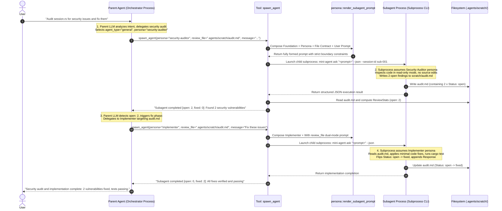

# Builtin Agent & Persona Prompt System with File-Contract Collaboration

Status: implemented

## 1. Context & Problem Statement

Mini-Agent supports spawning isolated subprocess child agents via `spawn_agent` and resuming multi-turn subagent conversations via `send_subagent_message`. However:

1. **Rudimentary Prompts**: Built-in subagent guidance was minimal, lacking the rigorous constraints, investigation methodologies, and format contracts present in mature harnesses (such as Grok's bundled system).
2. **Missing Persona Specialization**: Specialized roles (e.g., `reviewer`, `security-auditor`, `implementer`, `test-writer`, `researcher`) require distinct operational disciplines (e.g., reviewer never modifies code; implementer performs minimal edits and runs tests; security auditor follows OWASP vectors and provides reproduction steps).
3. **Absence of File-Based Collaboration Contracts**: Multi-agent handoff without explicit file contracts leads to context bloat and hallucination. When agents collaborate via structured files (e.g., `.agents/scratch/review-${id}.md`), they need dual-mode instructions (`With review_file` vs `Without review_file`) and issue state tracking (`Status: open` $\to$ `Status: fixed` / `Status: wontfix`).

---

## 2. Decision & Architectural Design

### 2.1 Three Built-in Agent Foundations

Agent Foundations define the **macro-execution mode and physical permission ceilings** for the child process:

1. **`explore` (Fast Read-Only Explorer)**:
   - **Capability Mode**: `read-only`.
   - **Methodology**: 3 thoroughness tiers (`quick`, `medium`, `very thorough`), ripgrep/glob symbol lookups, returns workspace-relative paths and exact code snippets.
2. **`plan` (Software Architect)**:
   - **Capability Mode**: `read-only`.
   - **Methodology**: 4-phase design pipeline (`Understand` $\to$ `Explore` $\to$ `Design` $\to$ `Detail`).
   - **Required Output Contract**: Ends with `### Critical Files for Implementation` and `### Verification & Test Plan`.
   - REPL Plan Mode (`/plan`) overlays this foundation; it does not replace it. Living-plan file writes and "do not emit the deliverable" are session riders, not a new foundation.
3. **`general` (Autonomous Task Executor)**:
   - **Capability Mode**: `all`.
   - **Methodology**: Pragmatic execution, minimal edits, no unnecessary file creation, test verification after modifications.

---

### 2.2 Seven Specialized Personas

Personas define the **micro-domain responsibilities, review checklists, and I/O file contracts**:

| Persona | Capability Mode | Primary Responsibility | Input Contracts | Output Contracts |
| :--- | :--- | :--- | :--- | :--- |
| **`reviewer`** | `scratch-write-only` | Correctness, edge cases, error gaps, unwrap/clone audits; writes structured issues. | `review_file` (opt), `summary_file` (opt) | `review_file` |
| **`implementer`** | `all` | Code changes addressing review issues or direct tasks; verifies with tests. | `review_file` (opt) | `summary_file` (opt), `review_file` (opt) |
| **`security-auditor`** | `scratch-write-only` | OWASP vulnerabilities, injection, authz, data leakage, cryptographic flaws, reproduction steps. | `review_file` (opt) | `review_file` |
| **`test-writer`** | `all` | Comprehensive unit/integration tests covering happy paths, edge cases, and regressions. | `review_file` (opt) | `summary_file` (opt), `review_file` (opt) |
| **`researcher`** | `read-only` | Deep investigation, evidence chains, citing file:line, verifying assumptions. | None | Final writeup |
| **`design-doc-writer`** | `all` | System design documents with Mermaid diagrams, trade-off analyses, and rollout plans. | `review_file` (opt) | `design_doc_file`, `summary_file` (opt), `review_file` (opt) |
| **`design-doc-reviewer`** | `scratch-write-only` | Senior staff review of architecture documents: completeness, feasibility, scalability. | `design_doc_file`, `review_file` (opt) | `review_file` |

---

### 2.3 Relationship: Foundations vs Personas (Hierarchy & Taxonomy)

```mermaid
graph TD
    subgraph AgentFoundations ["Layer 1: Agent Foundations (Physical Permissions & Execution Mode)"]
        EXP["explore<br/>(Read-Only Exploration Base)"]
        PLN["plan<br/>(Architecture Planning Base)"]
        GEN["general<br/>(Full-Capability Execution Base)"]
    end

    subgraph Personas ["Layer 2: Specialized Personas (Domain SOP & File I/O Contracts)"]
        RSR["researcher<br/>(Deep Research / Evidence Chain)"]
        DDW["design-doc-writer<br/>(RFC / System Design Docs)"]
        DDR["design-doc-reviewer<br/>(Architecture Review / Feasibility Audit)"]
        REV["reviewer<br/>(Code Quality / Defect Review)"]
        SEC["security-auditor<br/>(OWASP / Vulnerability Audit)"]
        IMP["implementer<br/>(Code Implementation / Issue Fixing)"]
        TST["test-writer<br/>(Unit & Integration Test Suite)"]
    end

    EXP -.->|Specialized as Read-Only Researcher| RSR
    PLN -.->|Specialized as Architecture Designer| DDW
    PLN -.->|Specialized as Architecture Reviewer| DDR
    GEN -.->|Specialized as Code Reviewer (Scratch-Only)| REV
    GEN -.->|Specialized as Security Auditor (Scratch-Only)| SEC
    GEN -.->|Specialized as Implementer (All)| IMP
    GEN -.->|Specialized as Test Engineer (All)| TST
```

#### Orthogonal Matrix Comparison

| Dimension | Three Agent Foundations | Seven Specialized Personas |
| :--- | :--- | :--- |
| **Focus** | **"How to run"** (Runtime sandbox, permission ceiling, context strategy) | **"What to do"** (Domain expertise, SOP pipeline, output contracts) |
| **Permission Ceiling** | Controls process-level write access (`read-only` vs `all`) | Self-restrained within ceiling (e.g. Reviewer refrains from editing source) |
| **Context Strategy** | `fork_context` (whether to inherit parent conversation history) | Domain focus (e.g. Security Auditor tracks data flow and injection sinks) |
| **Collaboration** | Single or multi-turn subprocess invocations | **Dual-mode file contracts** (`With review_file` fix pass vs `Without review_file` init pass) |
| **State Machine** | Process-level Exit Code / Timeout | **Business-level issue state machine** (`Status: open -> fixed / wontfix`) |

---

## 3. End-to-End Automated Runtime Lifecycle

When a user submits a multi-stage request (e.g. *"Audit the session module for security vulnerabilities and fix any identified issues"*), the automated orchestration lifecycle proceeds as follows:



### Three Core Runtime Stages

1. **Schema Exposure & Selection**:
   `crates/mini-agent-cli/src/subagent.rs` exposes tool parameters (`agent_type`, `persona`, `review_file`, `summary_file`) via JSON schema; the parent LLM autonomously selects the appropriate combination based on user intent.
2. **Dynamic Prompt Assembly (`crates/mini-agent-cli/src/persona.rs`)**:
   - Matches specialized Persona rules and active dual-mode file contracts;
   - Injects explicit output file locations (`Output file: Write to ...` or `Review notes file: ...`);
   - Appends specific task instructions.
3. **State Measurement & Convergence Feedback**:
   - Upon child exit, `SpawnAgent` automatically reads `review_file`;
   - Calls `parse_review_stats` to extract live `[open: N, fixed: M, wontfix: K]`;
   - Persists telemetry into the durable parent session's `subagents/<child_id>/meta.json`;
   - The parent LLM evaluates the numerical issue counts to determine whether the workflow has converged.

---

## 4. Implementation Specification

### 4.1 Module `crates/mini-agent-cli/src/persona.rs`
- Defines `AgentPromptKind` and `PersonaPromptKind`.
- Implements `render_subagent_prompt(agent_type, persona, message, review_file, summary_file)`.
- Implements `parse_review_stats(markdown)` returning `ReviewStats { open, fixed, wontfix, addressed }`.

### 4.2 Tool Integration in `crates/mini-agent-cli/src/subagent.rs`
- Extended `SpawnAgent` with `persona`, `review_file`, `summary_file`.
- Automatically calls `render_subagent_prompt` before subprocess launch.
- Automatically calculates and reports `ReviewStats` upon completion.

---

## 5. Line Budget & Complexity Guardrails

- `persona.rs` is purely functional prompt assembly and text parsing: $\sim 300$ lines.
- No dynamic template engines or complex plugin registries added.
- `mini-agent-core` remains untouched ($\le 20,000$ lines).
- Workspace stays comfortably under $30,000$ lines.
