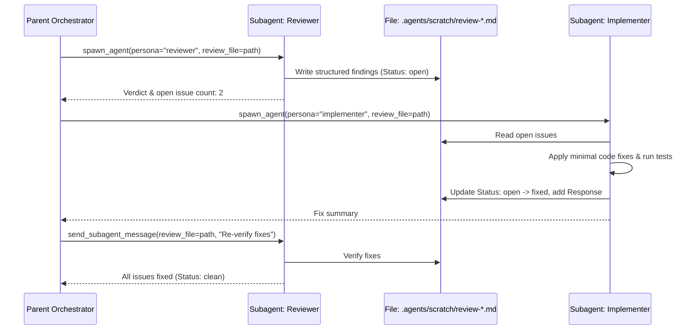

# Builtin Agent & Persona Prompt System with File-Contract Collaboration

Status: implemented

## 1. Context & Problem Statement

Mini-Agent currently supports spawning headless subprocess child agents via `spawn_agent` and resuming multi-turn subagent conversations via `send_subagent_message`. However:

1. **Rudimentary Prompts**: Built-in subagent guidance was minimal, lacking the rigorous constraints, investigation methodologies, and format contracts present in mature harnesses (such as Grok's bundled system).
2. **Missing Persona Specialization**: Specialized roles (e.g., `reviewer`, `security-auditor`, `implementer`, `test-writer`, `researcher`) require distinct operational disciplines (e.g., reviewer never modifies code; implementer performs minimal edits and runs tests; security auditor follows OWASP vectors and provides reproduction steps).
3. **Absence of File-Based Collaboration Contracts**: Multi-agent handoff without explicit file contracts leads to context bloat and hallucination. When agents collaborate via structured files (e.g., `.agents/scratch/review-${id}.md`), they need dual-mode instructions (`With review_file` vs `Without review_file`) and issue state tracking (`Status: open` $\to$ `Status: fixed` / `Status: wontfix`).

---

## 2. Decision & Architectural Design

### 2.1 Three Built-in Agent Foundations

1. **`explore` (Fast Read-Only Explorer)**:
   - **Capability Mode**: `read-only`.
   - **Methodology**: 3 thoroughness tiers (`quick`, `medium`, `very thorough`), ripgrep/glob symbol lookups, returns workspace-relative paths and exact code snippets.
2. **`plan` (Software Architect)**:
   - **Capability Mode**: `read-only`.
   - **Methodology**: 4-phase design pipeline (`Understand` $\to$ `Explore` $\to$ `Design` $\to$ `Detail`).
   - **Required Output Contract**: Ends with `### Critical Files for Implementation` and `### Verification & Test Plan`.
3. **`general` (Autonomous Task Executor)**:
   - **Capability Mode**: `all`.
   - **Methodology**: Pragmatic execution, minimal edits, no unnecessary file creation, test verification after modifications.

---

### 2.2 Seven Specialized Personas

| Persona | Capability Mode | Primary Responsibility | Input Contracts | Output Contracts |
| :--- | :--- | :--- | :--- | :--- |
| **`reviewer`** | `scratch-write-only` | Correctness, edge cases, error gaps, unwrap/clone audits; writes structured issues. | `review_file` (opt), `summary_file` (opt) | `review_file` |
| **`implementer`** | `all` | Code changes addressing review issues or direct tasks; verifies with tests. | `review_file` (opt) | `summary_file` (opt), `review_file` (opt) |
| **`security-auditor`** | `scratch-write-only` | OWASP vulnerabilities, injection, authz, data leakage, cryptographic flaws, reproduction steps. | `review_file` (opt) | `review_file` |
| **`test-writer`** | `all` | Comprehensive unit/integration tests covering happy paths, edge cases, and regressions. | `review_file` (opt) | `summary_file` (opt), `review_file` (opt) |
| **`researcher`** | `read-only` | Deep investigation, evidence chains, citing file:line, verifying assumptions. | None | Final writeup |
| **`design-doc-writer`** | `all` | System design documents with Mermaid diagrams, trade-off analyses, and rollout plans. | `review_file` (opt) | `design_doc_file`, `summary_file` (opt), `review_file` (opt) |
| **`design-doc-reviewer`** | `scratch-write-only` | Senior staff review of architecture documents: completeness, feasibility, scalability. | `design_doc_file`, `review_file` (opt) | `review_file` |

---

## 3. Dual-Mode File Collaboration Protocol

---

## 4. Implementation Specification

### 4.1 Module `crates/mini-agent-cli/src/persona.rs`
- Defines `AgentPromptPreset` and `PersonaPromptPreset`.
- Implements `render_subagent_prompt(agent_type, persona, message, review_file, summary_file)`.
- Implements `parse_review_stats(markdown)` to count `open`, `fixed`, `wontfix`, and `addressed` issues for telemetry and orchestration gating.

### 4.2 Tool Parameter Extension in `crates/mini-agent-cli/src/subagent.rs`
- `SpawnAgent` parameters:
  - `agent_type`: `"explore" | "plan" | "general"` (default: `"general"`).
  - `persona`: `"reviewer" | "implementer" | "security-auditor" | "test-writer" | "researcher" | "design-doc-writer" | "design-doc-reviewer"`.
  - `review_file`: Optional file path for review handoff.
  - `summary_file`: Optional file path for implementation deliverables.
  - `fork_context`: Boolean (default: true except explore/researcher).

---

## 5. Line Budget & Complexity Guardrails

- `persona.rs` is purely functional prompt assembly and text parsing: $\sim 300$ lines.
- No dynamic template engines or complex plugin registries added.
- `mini-agent-core` remains untouched ($\le 20,000$ lines).
- Workspace stays comfortably under $30,000$ lines.
