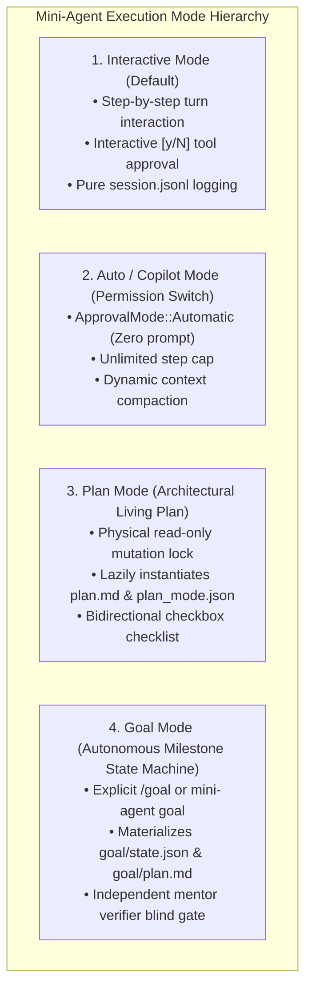
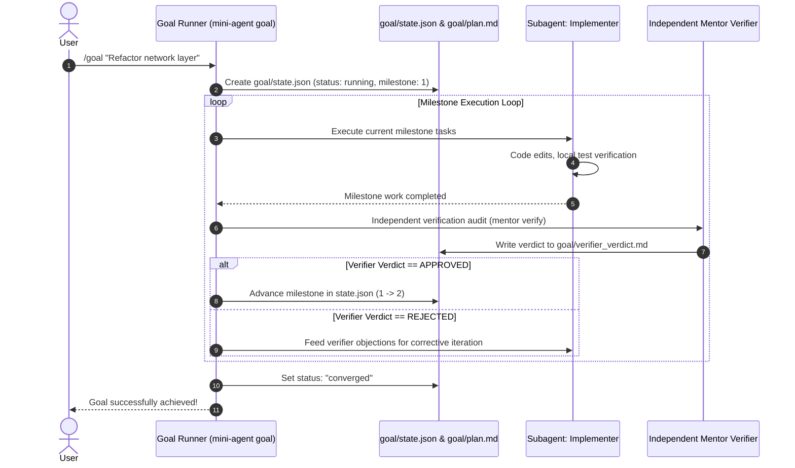

# Goal and Plan Subsystem Architecture: Explicit Triggers, Living Plan Protocol, and Autonomous Verification State Machine

Status: implemented

## 1. Context & Problem Statement

In Mini-Agent, we established the session directory layout containing placeholders for `plan.md`, `plan_mode.json`, and `goal/` (`state.json`, `plan.md`, `verifier_verdict.md`). However, an architectural review identified several key gaps:

1. **Semantic Conflation between `auto` and `goal`**:
   `mini-agent auto` and `/auto` serve as **execution permission policies** (automatic approval without `[y/N]` prompts + unlimited steps + compaction). They were colloquially conflated with long-running, multi-milestone **goal state machines**.
2. **Trigger Boundary Ambiguity**:
   Without explicit triggers, deciding whether a task is a 5-second bug fix or a 2-hour autonomous goal based purely on fuzzy keywords (e.g. "strictly execute") introduces false positives, directory pollution, and wasted model inference.
3. **Missing First-Class Plan Mode & Goal Mode Commands**:
   Users lack explicit `/plan` and `/goal` commands to deterministically enter collaborative living-plan drafting or multi-milestone autonomous verification loops.

---

## 2. Decision & Architectural Upgrades

### 2.1 Four-Tier Execution Mode Hierarchy



| Mode | Trigger | Permission / Sandbox | Session Artifacts Materialized | Primary Purpose |
| :--- | :--- | :--- | :--- | :--- |
| **Interactive** | `mini-agent` (default) | `ApprovalMode::Interactive` | `summary.json`, `session.jsonl` | Standard human-agent pairing |
| **Auto** | `/auto` or `mini-agent auto` | `ApprovalMode::Automatic` | `summary.json`, `session.jsonl` | Fast, frictionless execution of routine tasks |
| **Plan** | `/plan` or `mini-agent plan` | `read-only` (workspace writes blocked) | `plan.md`, `plan_mode.json` | Collaborative RFC & phased milestone design |
| **Goal** | `/goal` or `mini-agent goal` | `ApprovalMode::Automatic` + Sandboxed | `goal/state.json`, `goal/plan.md`, `goal/verifier_verdict.md` | Overnight, multi-stage autonomous goal execution |

---

### 2.2 Explicit Trigger Specification

#### 1. Plan Mode Trigger (`/plan` & `mini-agent plan`)
- **CLI Invocations**:
  ```sh
  mini-agent plan "Design modular session directory architecture"
  ```
- **REPL Slash Command**:
  ```text
  mini-agent> /plan
  plan mode on: workspace modifications disabled. Drafting plan.md...
  mini-agent> /plan off
  plan mode off: resumed standard interactive mode.
  ```
- **Behavior**:
  - Sets `execution_mode: "plan"` in `plan_mode.json`;
  - Disables workspace mutation tools (`write_file`, `edit_file`);
  - Automatically initializes and updates `plan.md` in the session directory;
  - Renders plan status in REPL banner.

#### 2. Goal Mode Trigger (`/goal` & `mini-agent goal`)
- **CLI Invocations**:
  ```sh
  mini-agent goal "Implement PASETO auth, achieve 100% test pass rate" --max-loops 20
  ```
- **REPL Slash Command**:
  ```text
  mini-agent> /goal "Refactor network crate to async-channel and pass integration tests"
  goal mode started: goal_id=g_1724751000, tracking in goal/state.json
  ```
- **Behavior**:
  - Lazily materializes `goal/` subdirectory;
  - Initializes `goal/state.json` with milestone breakdown;
  - Runs autonomous execution loop with independent `mini-agent mentor verify` gate after each milestone;
  - If user presses `Ctrl+C`, smoothly transitions `status: "running"` $\to$ `status: "user_paused"`.

---

### 2.3 Living Plan Protocol (`plan.md`)

When in Plan Mode, `plan.md` is maintained as a **living bidirectional document**:

```markdown
# Implementation Plan: [Goal Title]

## 1. Problem & Scope
- **Goals**: ...
- **Non-Goals**: ...

## 2. Critical Files
- `crates/mini-agent-cli/src/args.rs` [MODIFY]
- `crates/mini-agent-cli/src/goal.rs` [NEW]

## 3. Phased Milestones
- [x] Phase 1: Define GoalState and PlanMode structs
- [ ] Phase 2: Implement /plan and /goal slash commands in REPL
- [ ] Phase 3: Connect independent verifier loop
- [ ] Phase 4: Full verification gate

## 4. Verification Plan
- Automated test commands
- Edge case validation
```

---

### 2.4 Autonomous Goal Verification Loop



---

## 3. Implementation Specification

### 3.1 New Module `crates/mini-agent-cli/src/goal.rs`
- Defines `GoalState`, `GoalStatus` (`Running`, `Converged`, `Failed`, `UserPaused`).
- Implements `init_goal(workspace, session_dir, objective, max_loops)`.
- Implements `advance_goal_milestone(...)` and `pause_goal(...)`.

### 3.2 Slash Command Extension in `crates/mini-agent-cli/src/repl.rs`
- Add `/plan` and `/plan off` command parser.
- Add `/goal <prompt>` command parser.
- Update REPL prompt display to indicate active mode (e.g. `mini-agent (plan)>` or `mini-agent (goal: 2/5)>`).

### 3.3 CLI Subcommand Extension in `crates/mini-agent-cli/src/args.rs`
- Add `mini-agent plan [PROMPT]`.
- Add `mini-agent goal [OPTIONS] <PROMPT>` with `--max-loops <N>`.

---

## 4. Line Budget & Complexity Guardrails

- `goal.rs` is purely lightweight state file I/O: $\sim 200$ lines.
- `mini-agent-core` remains untouched ($\le 20,000$ lines).
- Workspace total remains comfortably below the $30,000$ line ceiling.
