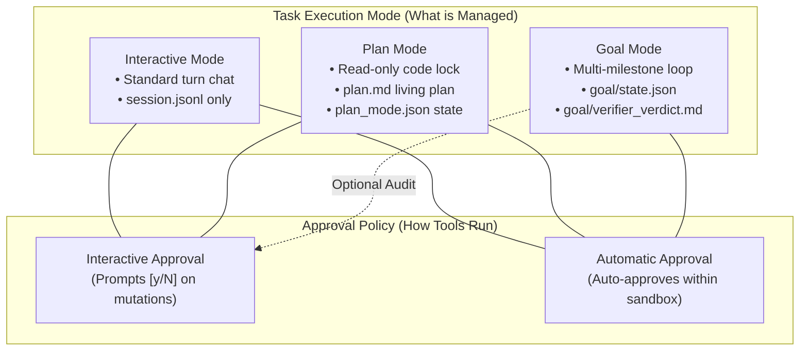
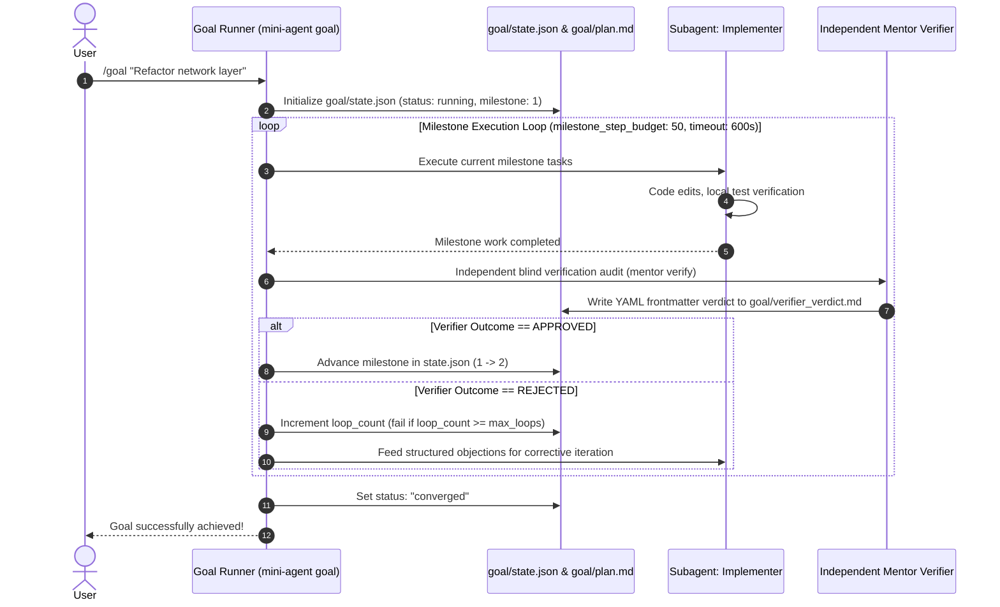

# Goal and Plan Subsystem Architecture: Explicit Triggers, Living Plan Protocol, and Autonomous Verification State Machine

Status: implemented

## 1. Context & Problem Statement

In Mini-Agent, we established the session directory layout containing placeholders for `plan.md`, `plan_mode.json`, and `goal/` (`state.json`, `plan.md`, `verifier_verdict.md`). An architectural review identified key ambiguities:

1. **Conflation between `auto` and `goal`**:
   `mini-agent auto` and `/auto` serve as **execution approval policies** (`ApprovalMode::Automatic` + unlimited steps + compaction), whereas `goal` represents a multi-milestone **autonomous task state machine**.
2. **Trigger Boundary Ambiguity**:
   Relying on fuzzy user keywords (e.g., "strictly execute", "production-ready") introduces false positives and overhead on trivial 5-second tasks.
3. **Missing First-Class Plan Mode & Goal Mode Commands**:
   Users lack explicit `/plan` and `/goal` commands to deterministically enter collaborative living-plan drafting or multi-milestone autonomous verification loops.
4. **Read-Only Lock & Whitelisting Specifics**:
   In Plan Mode, workspace modifications must be blocked while preserving write access exclusively for `plan.md`.
5. **Verifier Independence & Schema**:
   Verification must run against an independent model and clean context, outputting machine-parseable structured verdicts.

---

## 2. Decision & Architectural Upgrades

### 2.1 Orthogonal Mode & Approval Matrix

To preserve strict orthogonality, **Execution Mode** (Task Workflow) is decoupled from **Approval Policy** (Human-in-the-Loop Gate):



| Execution Mode | Supported Approval Policies | Workspace Code Mutation | `plan.md` Mutation | Session Artifacts Materialized |
| :--- | :--- | :---: | :---: | :--- |
| **Interactive** | `Interactive` (default), `Automatic` (`/auto`) | ✅ Allowed | ❌ Not managed | `summary.json`, `session.jsonl` |
| **Plan Mode** | `Interactive`, `Automatic` | ❌ **Locked (Read-Only)** | ✅ **Whitelisted** | `plan.md`, `plan_mode.json` |
| **Goal Mode** | `Automatic` (default), `Interactive` | ✅ Allowed | Baseline Frozen | `goal/state.json`, `goal/plan.md`, `goal/verifier_verdict.md` |

---

### 2.2 Plan Mode: Physical Read-Only Lock with Path Whitelisting

In Plan Mode (`/plan`, `/plan <prompt>`, or `mini-agent plan`):
1. **Workspace Mutation Block**: `write_file` and `edit_file` targeting workspace source files fail closed with `ToolError("workspace mutations locked in Plan Mode")`.
2. **Whitelisted Path**: `session_dir/plan.md` is exclusively whitelisted, enabling the agent to autonomously refine the Living Plan without touching codebase files. Relative `plan.md` and `./plan.md` are aliased to that session file so drafts do not land in the workspace root.
3. **Architect Overlay**: REPL Plan Mode overlays the builtin `plan` Software Architect foundation, then a living-plan rider: write `plan.md`, research only to inform the plan, and do not emit the final deliverable.
4. **Prompt Seeding**: `/plan <prompt>` writes the request into the living plan and immediately starts a planning turn.
5. **Shell Command Restriction**: High-risk shell commands are blocked; only non-destructive inspection commands (`git status`, `git diff`, `git log`, `grep`, `cargo check`) are permitted.

---

### 2.3 Living Plan Protocol (`plan.md`)

`plan.md` serves as a bidirectional living document:

```markdown
# Implementation Plan: [Goal Title]

## 1. Problem & Scope
- **Goals**: ...
- **Non-Goals**: ...

## 2. Critical Files
- `crates/mini-agent-cli/src/goal.rs` [NEW]
- `crates/mini-agent-cli/src/repl.rs` [MODIFY]

## 3. Phased Milestones
- [x] Phase 1: State machine and schema versioning
- [ ] Phase 2: REPL slash command integration
- [ ] Phase 3: Independent verifier gate connection
- [ ] Phase 4: Full verification gate

## 4. Verification Plan
- Automated test commands
- Integration verification
```

---

### 2.4 Autonomous Goal State Machine & Independent Verifier Gate



#### 1. `goal/state.json` Schema (`schema_version: 1`):
```json
{
  "schema_version": 1,
  "goal_id": "g_1724751000",
  "status": "running",
  "current_milestone": 2,
  "total_milestones": 4,
  "loop_count": 3,
  "max_loops": 20,
  "milestone_step_budget": 50,
  "milestone_timeout_secs": 600,
  "verifier_model": "deepseek-v4-verifier",
  "last_verifier_score": 92,
  "updated_at_ms": 1724751050000
}
```

#### 2. Machine-Readable `goal/verifier_verdict.md` Schema:
```yaml
---
verdict: approved
score: 95
summary: All 171 workspace tests pass, zero clippy warnings, microkernel boundary intact.
issues: []
---
### Summary
All 171 workspace tests pass, zero clippy warnings, microkernel boundary intact.
```

#### 3. Exception & Recovery Handling:
- **Loop & Step Cap**: If `loop_count >= max_loops` or step budget exceeds `50`, status transitions to `failed` and outputs diagnostic logs.
- **Verifier Fallback**: If the verifier encounters API timeouts or network errors, it retries up to 3 times before setting `status: "verifier_unreachable"` and notifying the user.
- **Graceful Pausing**: On `Ctrl+C` or `/goal --pause`, state transitions to `status: "user_paused"`; resuming with `/goal --resume` or `mini-agent resume` re-loads the active milestone without repeating already-settled work.

---

### 2.5 Plan to Goal Lifecycle Transition

When a user initiates `/goal` in a session where `plan.md` already exists:
1. `plan.md` is frozen into `goal/plan.baseline.md` as the immutable acceptance contract.
2. `goal/plan.md` is created with initial milestone checkboxes derived from the plan.
3. `plan_mode.json` transitions `active: false` as Goal Mode takes precedence.

---

## 3. Implementation Specification

### 3.1 Module `crates/mini-agent-cli/src/goal.rs`
- Defines `GoalState`, `GoalStatus` (`Running`, `Converged`, `Failed`, `UserPaused`), and `PlanModeState`.
- Implements `init_plan_mode` and `disable_plan_mode`.
- Implements `init_goal_workspace`, `advance_goal_milestone`, `pause_goal`, and `parse_verifier_verdict`.
- Includes `is_living_plan_whitelisted` for fine-grained path authorization.

### 3.2 REPL Slash Commands (`crates/mini-agent-cli/src/repl.rs`)
- `/plan` / `/plan on` / `/plan off` / `/plan <prompt>`.
- `/goal <objective>` / `/goal --resume`.
- Mode status display in REPL banner.

---

## 4. Line Budget & Complexity Guardrails

- `goal.rs` is fully decoupled from `mini-agent-core`: $\sim 280$ lines.
- `mini-agent-core` remains untouched ($\le 20,000$ lines).
- Total workspace size: **21,097 / 30,000 lines**.
