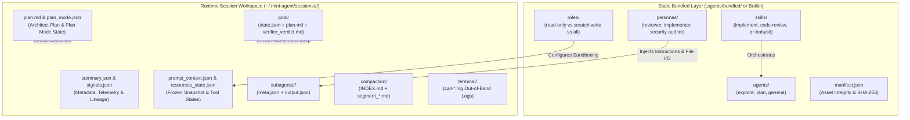

# Dual-Layer Agent Architecture: Bundled Asset System and Session Directory Layout

Status: implemented

## 1. Context & Empirical Motivation

A comprehensive audit of the Grok system architecture (`~/.grok/bundled/` and `~/.grok/sessions/<workspace>/<session_id>/`) reveals a cohesive **Dual-Layer Architecture**:

1. **Static Bundled Asset Layer (`bundled/`)**:
   Defines the capabilities, persona behaviors, tool permission presets, and orchestration workflows:
   - **`agents/`**: Top-level foundational entities (`explore`, `plan`, `general-purpose`).
   - **`roles/`**: Lightweight runtime execution policies (`capability_mode`, `reasoning_effort`, `fork_context`).
   - **`personas/`**: Domain-specific behavioral instructions and explicit **File-Based I/O contracts** (`[[inputs]]`/`[[outputs]]`).
   - **`skills/`**: Multi-agent orchestration pipelines (e.g. `implement`, `code-review`, `design`).
   - **`manifest.json`**: Asset integrity and distribution verification via SHA-256 checksums.

2. **Runtime Session Execution Layer (`sessions/`)**:
   Maintains the active state, lineage, memory, and telemetry of running workflows:
   - **`summary.json` & `signals.json`**: Fast $O(1)$ discovery and quantitative telemetry.
   - **`prompt_context.json` & `resources_state.json`**: Frozen environment snapshot and active tool limits/states.
   - **`plan.md` & `goal/`**: Execution contracts generated by bundled `plan` agents and goal state machines.
   - **`subagents/<id>/`**: Child execution records tracking role, persona, duration, and output.
   - **`compaction/`**: Memory segment archives (`INDEX.md` + `segment_*.md`).
   - **`terminal/`**: Out-of-band execution logs for large shell captures and failed command diagnostics.

This proposal establishes a unified architecture for `mini-agent` that bridges **Static Bundled Assets** with **Dynamic Session Workspaces** while honoring our strict line budget (20k core / 30k workspace).

---

## 2. Global Dual-Layer Architecture



---

## 3. Static Bundled Layer Specification

### 3.1. Bundled Directory Structure
```
.agents/bundled/ (or embedded within mini-agent-cli)
├── agents/
│   ├── explore.md            # Read-only exploration agent
│   ├── plan.md               # Read-only software architect agent
│   └── general-purpose.md    # Full-capability general agent
├── roles/
│   ├── explore.toml          # capability_mode = "read-only", reasoning_effort = "medium", fork_context = false
│   ├── plan.toml             # capability_mode = "read-only", reasoning_effort = "high", fork_context = true
│   ├── reviewer.toml         # capability_mode = "scratch-write-only", reasoning_effort = "high", fork_context = true
│   ├── implementer.toml      # capability_mode = "all", reasoning_effort = "high", fork_context = true
│   └── security-auditor.toml # capability_mode = "scratch-write-only", reasoning_effort = "high", fork_context = true
├── personas/
│   ├── reviewer.toml         # Review rules + [[inputs]]/[[outputs]] file contract
│   ├── implementer.toml      # Implementation guidelines + fix verification
│   └── security-auditor.toml # OWASP Top 10 + vulnerability analysis
├── skills/
│   ├── implement/SKILL.md    # Implement -> Multi-Reviewer -> Fix -> Re-review loop
│   └── code-review/SKILL.md  # Structural simplification & Code Judo review
└── manifest.json             # SHA-256 asset checksums
```

### 3.2. Role Capability Modes & `fork_context` Definition

To resolve permission ambiguities, `capability_mode` supports three distinct granularities:

| `capability_mode` | Workspace Mutation (`write_file`, `edit_file`) | Scratch Dir Mutation (`.agents/scratch/*`) | Shell Commands | Typical Roles |
| :--- | :--- | :--- | :--- | :--- |
| **`read-only`** | ❌ Denied | ❌ Denied | Read-only only (`git log`, `grep`, `cat`) | `explore`, `plan` |
| **`scratch-write-only`** | ❌ Denied | ✅ Allowed (for `[[outputs]]`) | Read-only only | `reviewer`, `security-auditor` |
| **`all`** | ✅ Allowed | ✅ Allowed | Full execution (subject to `SecurityPreset`) | `implementer`, `general-purpose` |

#### `fork_context` Semantic Definition:
- **`fork_context = true`**: Subagent inherits a settled snapshot of the parent's conversational prefix (injected as an immutable `<background_context>` system block). Used by `plan`, `reviewer`, `implementer` who need awareness of the user's prior discussion.
- **`fork_context = false`**: Subagent starts with a completely clean, isolated context containing only its initial prompt and explicit file inputs. Used by `explore` to prevent token dilution.

### 3.3. File-Based Handoffs & Concurrency Safety

To prevent race conditions during parallel subagent execution (e.g. when 3 reviewers run concurrently):
1. **Isolated Output Paths**: Each subagent writes to an exclusively owned scratch path:
   `.agents/scratch/review-${session_id}-${subagent_id}.md`
2. **Completion Gating**: The parent agent **never reads partial files**. It waits for child process termination (Exit Code `0`) before opening any `[[outputs]]` file.
3. **Deterministic Merge**: The orchestrator (`implement/SKILL.md`) reads the individual review files sequentially, tags findings with `[General]`, `[Security]`, etc., deduplicates issues, and writes the consolidated `.agents/scratch/review-${session_id}-merged.md`.

---

## 4. Runtime Session Directory Specification

Sessions are isolated in the user config directory (`~/.mini-agent/sessions/<workspace_key>/<session_id>/`) where `<workspace_key>` is a safe percent-encoded workspace path (e.g., `D%3A%5Cgh-ws%5Ccodex-ws%5Cmini-codex`).

```text
~/.mini-agent/sessions/<workspace_key>/<session_id>/
├── summary.json              # Fast O(1) session index & lineage metadata
├── signals.json              # Quantitative telemetry (step count, tool calls, turn counts)
├── prompt_context.json       # Frozen environment snapshot (AGENTS.md, OS, shell, timestamp)
├── system_prompt.txt         # Exact rendered system prompt for deterministic replay
├── session.jsonl             # Append-only active conversation & checkpoint ledger
├── session.lock              # Mutex lock preventing concurrent multi-process write corruption
│
├── plan.md                   # Active architectural plan (Problem, Non-goals, Approach, Verification)
├── plan_mode.json            # Interactive planning state (active, awaiting_approval)
│
├── goal/                     # Autonomous Goal Mode runtime directory
│   ├── state.json            # Goal state machine (goal_id, status, loop_count, verifier_score)
│   ├── plan.md               # Acceptance criteria, verification steps, and milestone checklist
│   └── verifier_verdict.md   # Independent adversarial verifier/mentor report
│
├── subagents/                # Nested subagent execution records
│   └── <child_session_id>/
│       ├── meta.json         # Subagent invocation params, duration, steps, exit_code, review_stats
│       └── output.json       # Structured return result payload and stderr
│
├── compaction/               # Archived conversation memory segments
│   ├── INDEX.md              # Markdown index table (Segment, Turns, Hard Facts & Decisions)
│   └── segment_000.md        # Pruned conversation turns preserved for retrieval
│
└── terminal/                 # Out-of-band process execution logs
    └── call-<call_id>.log    # Output for commands > 32 KiB OR commands with exit_code != 0
```

### 4.1. Fast Indexing & Quantitative Telemetry

- **`summary.json`**:
  ```json
  {
    "id": "s_1724750000000_a1b2",
    "created_at_ms": 1724750000000,
    "updated_at_ms": 1724750050000,
    "turn_count": 3,
    "bytes": 20480,
    "last_prompt": "Audit session.rs security and fix issues",
    "last_status": "completed"
  }
  ```
  Enables `mini-agent sessions` to perform instantaneous $O(1)$ discovery without parsing multi-megabyte JSONL streams.

- **`signals.json`**:
  ```json
  {
    "turn_count": 3,
    "step_count": 14,
    "tool_call_count": 9,
    "updated_at_ms": 1724750050000
  }
  ```

---

### 4.2. Interactive Planning (`plan.md` & `plan_mode.json`) vs Autonomous Goal (`goal/`)

To prevent state-machine conflict between interactive planning and autonomous execution:

| Subsystem | Core Artifacts | Execution Semantics | Mutating Tools |
| :--- | :--- | :--- | :--- |
| **Interactive REPL** | `session.jsonl` | Step-by-step interactive human-agent collaboration | Subject to `SecurityPreset` |
| **Plan Mode** | `plan.md`, `plan_mode.json` | Collaborative architecture design & living checklist | Workspace mutating tools disabled |
| **Autonomous Goal Mode** | `goal/state.json`, `goal/plan.md`, `goal/verifier_verdict.md` | Multi-hour autonomous execution loop with independent verifier gates | Fully autonomous under sandbox |

#### `goal/state.json` Schema:
```json
{
  "goal_id": "g_1724750900",
  "status": "running",
  "current_milestone": 3,
  "total_milestones": 5,
  "loop_count": 8,
  "max_loops": 30,
  "last_verifier_score": 95,
  "updated_at_ms": 1724750980000
}
```

#### Independent Mentor/Verifier Gate (`goal/verifier_verdict.md`):
The executing subagent is decoupled from verification. After each milestone, an independent `mini-agent mentor verify` process grades the deliverable against acceptance criteria. Only `Verdict: APPROVED` advances `current_milestone` in `state.json`.

---

### 4.3. Compaction Segment Indexing (`compaction/INDEX.md`)

To ensure reliable context retrieval without bloated token overhead, `compaction/INDEX.md` records **Decisions & Hard Facts** rather than ambiguous keywords:

```markdown
# Compaction Segment Index

| Segment | File | Turns | Bytes | Semantic Summary | Key Decisions & Hard Facts |
|---|---|---|---|---|---|
| 000 | segment_000.md | 1-25 | 480 KB | Architecture exploration for Auth | Rejected JWT; adopted PASETO v4. Decided on SQLite session store. |
| 001 | segment_001.md | 26-50 | 512 KB | Test suite implementation | Added 12 mock integration tests. Fixed token expiry race condition. |
```

---

### 4.4. Diagnostic Logging for Out-of-Band Output (`terminal/`)

`crates/mini-agent-cli/src/workspace.rs` enforces out-of-band disk logging for:
1. Outputs exceeding **32 KiB** (to prevent model context flooding).
2. **Any command with `exit_code != 0`**, regardless of size (to guarantee complete diagnostic visibility during debugging).

---

## 5. Lifecycle Binding: From Bundled Template to Session Artifact

```
1. Invocation (/implement or spawn_agent):
   - Host reads bundled skill or persona preset (e.g., `persona: "reviewer"`).
   - Injects foundational role guidelines (`explore`, `plan`, `general`).

2. Session Initialization:
   - Creates `~/.mini-agent/sessions/<workspace_key>/<session_id>/`.
   - Writes atomic `summary.json`, `signals.json`, and `prompt_context.json`.
   - Injects frozen workspace `AGENTS.md` and OS environment snapshot.

3. Subagent Execution & File Contract Handoff:
   - Spawns child agent with `role: "reviewer"`, `capability_mode: "scratch-write-only"`, `fork_context: true`.
   - Child writes structured findings to `.agents/scratch/review-${session_id}-${child_id}.md`.
   - Parent validates child exit code 0 and parses ReviewStats before reading deliverables.

4. Compaction & Archival:
   - When memory threshold is reached, summarizes prefix turns into `compaction/segment_NNN.md` with explicit Hard Facts and updates `INDEX.md`.

5. Telemetry Finalization:
   - Updates `summary.json` and `signals.json` with token consumption, step metrics, and subagent tree lineage.
```

---

## 6. Budget & Implementation Guardrails

1. **Zero Core Bloat**:
   `mini-agent-core` remains untouched ($\le 20,000$ lines). Bundled asset loading, persona rendering, and session layout management live purely in `mini-agent-cli`.
2. **Minimal Static Footprint**:
   Bundled assets are embedded or lazily loaded from disk with lightweight TOML parsing.
3. **Strict Line Budget**:
   Workspace addition stays safely within our 30,000 line limit.