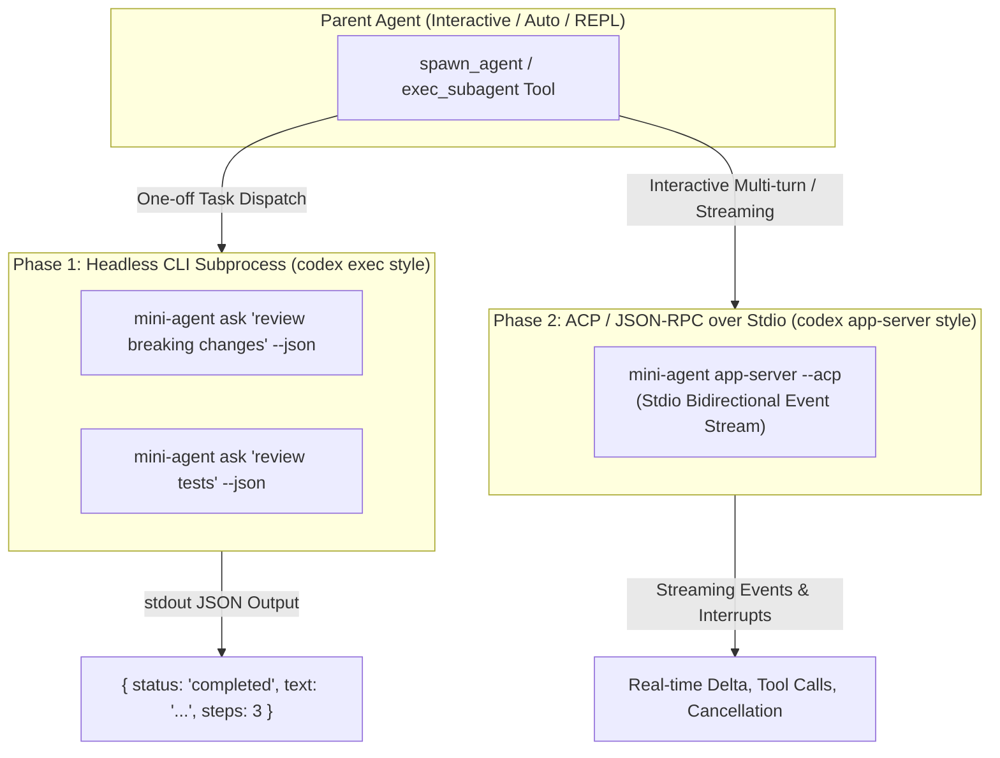

# Subprocess CLI and ACP-Style Headless Subagent Execution Architecture

Status: implemented

## 1. Context & Motivation

In traditional complex agent engines (e.g., full Codex runtime), multi-agent orchestration is often implemented as a monolithic in-process multi-tenant scheduler managing in-memory session locks, mailbox channels, and concurrent turn runtimes. For `mini-agent-harness`—whose primary mission is studying agent harness behavior within strict budget limits (20k lines core / 30k total)—such an in-process approach risks:
1. **Severe Code Bloat**: Adding 500–1,000+ lines of mailbox multiplexing, async lock coordination, and multi-tenant memory management.
2. **Runtime Fragility**: Tokio worker thread starvation, deadlocks, or subagent memory leaks impacting the parent agent loop.
3. **Context Bleed**: Accidental sharing or leakage of prompt state, cache, or tool results.

However, `mini-agent` possesses a distinct structural advantage: **a tiny standalone binary footprint (~10 MB) with millisecond-level cold start**. 

By leveraging subcommands like `mini-agent ask "<prompt>" --json` and `mini-agent auto "<goal>" --json` (analogous to `codex exec` and `codex app-server`), we can implement subagent task scheduling through **OS-level subprocess invocation** or lightweight **Agent Client Protocol (ACP)** over stdio.

---

## 2. Architectural Models



### Model A: Headless CLI Subprocess Execution (`mini-agent ask/auto --json`)

For bounded, one-off subagent tasks (such as code review passes, isolated test executions, or targeted code searches), the parent harness directly spawns a child process using `std::env::current_exe()`:

```sh
mini-agent ask "Review breaking changes against .codex/skills/code-review-breaking-changes/SKILL.md" \
  --json \
  --security-preset default \
  --sandbox native
```

**Workflow**:
1. Parent tool invokes child process via standard process spawning.
2. Child process boots an isolated harness, loads workspace `WorldState` and relevant `skills`, and executes the run loop to completion.
3. Child outputs a structured JSON result (`final_text`, `steps`, `model_requests`, `tool_calls`).
4. Child writes its own independent audit trace (`.agents/sessions/<child-id>.jsonl`).
5. Process terminates, and the OS reclaims 100% of memory and file handles instantly.

### Model B: ACP (Agent Client Protocol) / Stdio RPC Execution

For complex multi-turn subagent collaborations requiring intermediate feedback, progress streaming, or interactive pause/resume:
1. Parent spawns `mini-agent app-server` / `mini-agent acp` with piped `stdin` and `stdout`.
2. Communication runs over standard JSON-RPC 2.0 / ACP messages:
   - `agent/spawnTurn` -> Triggers a subagent turn.
   - `agent/event` -> Streams back `AssistantTextDelta`, `ToolStarted`, and `ToolFinished`.
   - `agent/interrupt` -> Cancels a running subagent turn gracefully.

---

## 3. Comparative Evaluation

| Metric / Dimension | In-Process Multi-Tenant Engine | Subprocess CLI (`mini-agent ask`) | Stdio ACP (`mini-agent app-server`) |
| :--- | :--- | :--- | :--- |
| **Memory & Crash Isolation** | Shared memory space; panic in child can corrupt parent | 100% physical OS process isolation | 100% physical OS process isolation |
| **Token & Context Hygiene** | Requires complex manual history filtering | Fresh zero-state memory (`fork_turns: none`) | Session-isolated state per connection |
| **Harness Code Complexity** | High (+800~1,500 lines of schedulers & mailboxes) | **Minimal (<100 lines)** wrapper around `Command` | Moderate (+250~400 lines of stdio RPC) |
| **Audit & Replay Trace** | Mixed into parent session or requires multi-lane demux | **Separate `.agents/sessions/<id>.jsonl` per child** | Separate session file per connection |
| **Lifecycle & Kill Safety** | Cooperative cancellation flags | Immediate OS process tree kill (`taskkill` / `SIGKILL`) | JSON-RPC cancel request + process kill fallback |
| **Cold Start Overhead** | ~0 ms | ~10–25 ms (negligible vs 1–5s LLM calls) | ~10–25 ms once at connection start |

---

## 4. Phased Implementation Roadmap

### Phase 1: Headless CLI Task Invocation (Immediate Priority)

Implement the `spawn_agent` / `exec_subagent` tool backend in `crates/mini-agent-cli/src/workspace.rs` using `std::env::current_exe()`:

```rust
// Conceptual implementation in Host Adapter (CLI)
pub fn execute_subagent_task(
    prompt: &str,
    security_preset: SecurityPreset,
    sandbox: SandboxKind,
    timeout: Duration,
) -> Result<SubagentOutput, ToolError> {
    let current_exe = std::env::current_exe()
        .map_err(|e| ToolError(format!("cannot resolve current binary: {e}")))?;
    
    let mut cmd = std::process::Command::new(current_exe);
    cmd.args(&["ask", prompt, "--json", "--security-preset", security_preset.as_str()]);
    
    // Execute under ProcessSandbox guard for timeout & descendant termination
    let output = run_sandboxed_process(cmd, timeout)?;
    let result: SubagentOutput = serde_json::from_slice(&output.stdout)
        .map_err(|e| ToolError(format!("invalid subagent JSON output: {e}")))?;
    Ok(result)
}
```

### Phase 2: Agent Client Protocol (ACP) Stdio Subcommand

Introduce `mini-agent acp` subcommand supporting bidirectional JSON-RPC for long-running streaming interactions without altering `mini-agent-core`.

---

## 5. Security & Resource Controls

1. **Process Sandboxing & Tree Termination**:
   All child subagent processes are attached to `ProcessSandbox` (Windows JobObjects / POSIX process groups). If a timeout fires or parent interrupts, the entire descendant process tree is terminated without orphaned zombie processes.
2. **Inherited Security Presets**:
   Child processes receive the parent's active `--security-preset` (`default`, `full-machine`, `turbomode`) and `--sandbox` flags.
3. **Trace Discoverability**:
   Child session IDs are linked in the parent's trace logs, enabling direct replay via `mini-agent trace <child-id>`.

---

## 6. Acceptance Criteria

1. **Headless Execution**:
   - `mini-agent ask "<prompt>" --json` returns valid JSON with `status: "completed"` and exit code 0.
   - `spawn_agent` CLI tool successfully executes child processes and receives structured output.
2. **Isolation & Concurrency**:
   - Spawning 4 parallel child review agents completes concurrently without file lock conflicts or mutual interference.
3. **Timeout & Kill Verification**:
   - A stalled child process is cleanly terminated upon timeout without hanging the parent agent.
4. **Line Budget**:
   - Phase 1 implementation requires $< 120$ lines of code in `mini-agent-cli`, adding 0 lines to `mini-agent-core`.

---

## 7. Non-Goals

- **No Remote Network Clustering**: All subagents execute locally via subcommands or stdio pipes.
- **No Shared In-Memory State**: Data exchange between parent and child is strictly mediated via CLI parameters, stdio, and workspace files.