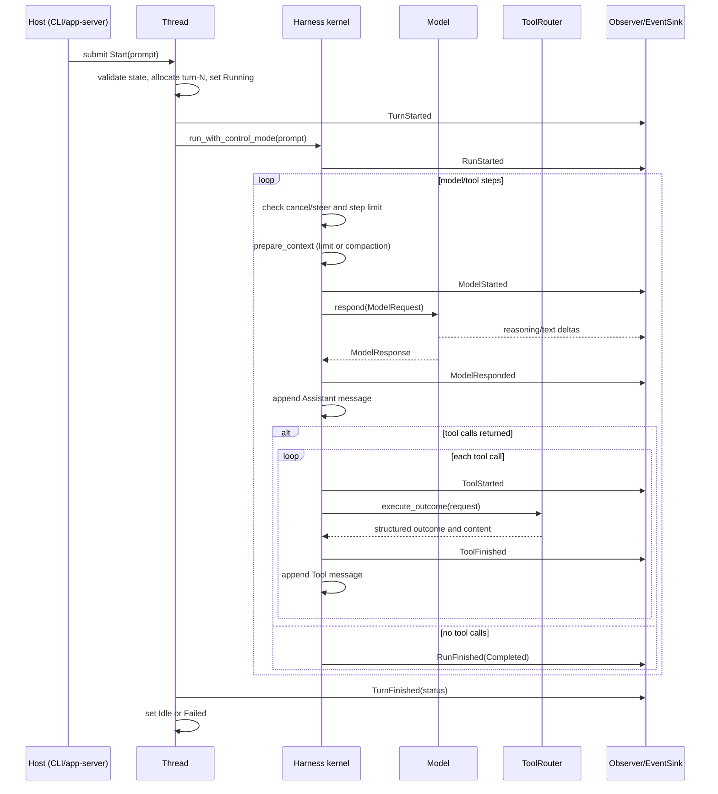

# Current Harness Execution Flow

Status: implemented

## Decision

The current harness has one execution kernel and three host entry paths. The
kernel is `mini-agent-core`; CLI and app-server only choose how a Thread is
created, controlled, observed, and persisted.

## Entry paths

### One-shot CLI

`mini-agent ask <prompt>` and `mini-agent auto <prompt>` construct the local App Server runtime, which owns the host `Harness<OpenAiModel>`. They persist a settled session record and exit after the run. They do
not create a `Thread`, so they do not emit Thread-level lifecycle envelopes or
provide a live input channel for steering.

### Interactive CLI

`mini-agent` and `mini-agent auto` without a prompt start the REPL. The REPL
main thread reads input and renders events; a worker thread owns the mutable
`Thread<OpenAiModel>`. Each prompt is executed with
`Thread::run_turn_with_events` and `SteeringMode::StopAtCheckpoint`.

While a turn is active, `/steer <message>` submits a priority steer input to
`RunControl`. Plain input submits a FIFO `FollowUp`. The worker persists the
settled turn before the next queued input is started.

### In-process app-server

`mini-agent-app-server` owns a command queue and an exclusive core `Thread`.
`turn_start` acknowledges accepted work, while `subscribe` delivers the
ordered `EventEnvelope` stream. During an active turn the worker accepts
`Steer`, `FollowUp`, and matching `TurnCancel` commands through `RunControl`.
After the active turn settles, queued steer input is selected before follow-up
input and is started as a new turn.

The app-server is a control-plane adapter, not a second model loop or tool
orchestrator.

## One turn

The model request always receives the current system prompt, bounded session
messages, tool specifications, and the configured response limit. In Compact
mode, context compaction is attempted before a request once the configured
threshold is reached; otherwise an over-limit context is rejected.

Tool output is bounded before it is retained in the session and emitted. The
retained `Message::Tool` and `ToolFinished` event carry the structured outcome
status (`completed`, `failed`, `needs_approval`, `deferred`, or `retryable`).

## Control and stopping semantics

`RunControl` is cooperative. It does not forcibly interrupt an in-flight model
request or a partially executed tool batch. Cancellation and steering are
observed at safe boundaries:

- before the next model step;
- after a model response;
- after a complete tool batch.

With `StopAtCheckpoint`, a steer causes `RunFinished(Steered)` and settles the
current turn. The host then starts the steer message as a new turn. With
`ContinueSameTurn`, a steer message is appended to the current context and the
same harness run continues. Follow-up input never takes priority over an
active turn and is started only after settlement.

## Event and state closure

The kernel emits `Event` values. `Thread` adds `thread_id`, `turn_id`, and a
monotonic `sequence` through `EventEnvelope`. CLI observers use this stream for
terminal rendering; the session store appends settled records and app-server broadcasts it to
subscribers.

Successful stop reasons are `Completed`, `StepLimit`, `Steered`, and
`Cancelled`. Model, compaction, limit, and Thread errors emit failure events
and settle the Thread as `Failed`.

`SessionState` and `Context` are owned by core and remain storage-neutral. A
`ThreadCheckpoint` contains only settled core values and can be restored after
a restart; it never replays an uncertain external tool effect. JSONL session files, approval state, sandbox/process state, and terminal UI remain host or edge responsibilities.

## Source references

- `mini-agent-core/src/harness.rs`: model/tool loop, limits, compaction, and stop reasons.
- `mini-agent-core/src/thread.rs`: Thread lifecycle, turn identity, envelopes, and checkpoints.
- `mini-agent-core/src/input.rs`: bounded steer/follow-up queue.
- `mini-agent-protocol/src/event.rs`: event and envelope contracts.
- `mini-agent-protocol/src/turn.rs`: turn input, status, and submission contracts.
- `mini-agent-app-server/src/lib.rs`: serialized control-plane worker and event broadcast.
- `mini-agent-host/src/harness_builder.rs`: provider, prompt, workspace tool, MCP, and world assembly.
- `mini-agent-cli/src/repl.rs`: interactive worker, input routing, and settled persistence.
- `mini-agent-cli/src/ask.rs`: one-shot execution and edge persistence.
