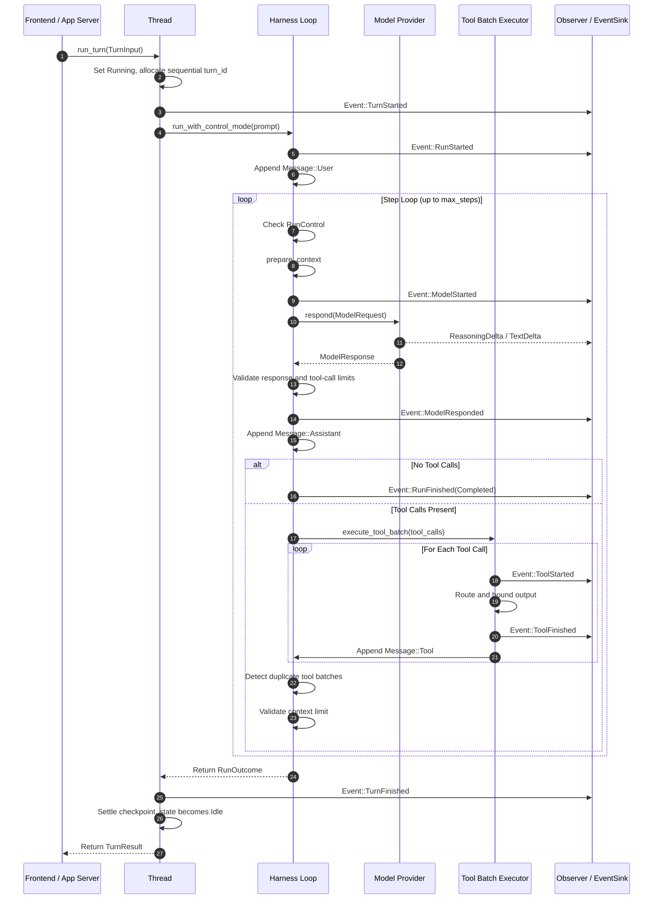

# Agent Framework 与 Harness 成熟度分析

Status: implemented

> 本文合并了 mini-agent-harness 的架构与成熟度分析，以及它与 Codex 原生框架、原生 Turn 流程的对照。内容基于当前工作区源码，描述已实现的事实。

## 摘要

Mini Agent Harness 建立在一个清晰的边界上：

$$\text{agent} = \text{model} + \text{harness}$$

模型负责提出回复和工具行动；Harness 负责上下文准备、工具调度、确定性限制、失败分类、观察事件分发，以及协作式运行控制。

mini-agent-harness 与 Codex 原生实现共享同一个最小闭环：

```text
用户输入
  → 构造上下文
  → 模型生成
  → 判断是否调用工具
  → 执行工具并写回结果
  → 再次请求模型
  → 最终回复或停止
```

两者的定位不同：

- mini-agent-harness 是小型、显式、可替换的 Agent 执行内核，适合研究和验证 Harness 行为。
- Codex 原生框架是生产级、持久化、异步、事件驱动的 Agent Runtime，整合 Session、Task、Turn、Item、工具、沙箱、MCP、审批、上下文压缩、恢复和 App Server。

简化理解：

```text
mini-agent-harness = model + tool loop 的最小可观察实现

Codex native = durable Session + Task + Turn + Item + Tool + Event 的完整运行时
```

## 1. mini-agent-harness 的分层

mini-codex 不是“缩小版 Codex”，而是把 Agent Harness 的核心机制单独抽出，并把 provider、文件、进程、审批、持久化和终端输出放到 Core 之外。

```text
CLI / 客户端
    ↓
mini-agent-app-server
    ↓
mini-agent-host
    ↓
mini-agent-capabilities
    ↓
mini-agent-core
    ↓
mini-agent-protocol
```

### Crate 职责

| Crate | 角色与职责 | 关键符号 / 模块 |
| :--- | :--- | :--- |
| `mini-agent-protocol` | 纯协议契约：消息、工具、工具规格、事件、停止原因和限制描述；只依赖 serde 与标准库 | `Message`、`ToolSpec`、`Event`、`EventEnvelope`、`StopReason` |
| `mini-agent-core` | 纯执行内核：内存中的执行循环、Turn/Step、限制、模型/机械压缩和协作式控制；不直接访问磁盘、网络或 I/O | `Harness`、`Thread`、`SessionState`、`RunControl` |
| `mini-agent-capabilities` | 具体能力：OpenAI/Responses 模型、workspace 文件工具、进程与沙箱、Result Store、审批和 MCP | `OpenAiModel`、`Workspace`、`ProcessManager`、`ResultStore` |
| `mini-agent-host` | Host 组合与 Profile：workspace profile、WorldState、Goal/Plan、RuntimeFactory 和 Observer | `HostRuntimeFactory`、`WorldState`、`GoalState`、`RunObserver` |
| `mini-agent-app-server` | 服务控制面：Actor action sequencing、`stateRevision`/CAS、ApprovalBroker、JSON-RPC stdio/in-process 传输 | `AppServer`、`RuntimeActor`、`AppServerRuntime` |
| `mini-agent-cli` | 前端与终端 UI：REPL、`ask`、`auto`、会话恢复/分叉和事件渲染；只消费 App Server 边界 | `repl`、`ask`、terminal observers |

当前运行时的状态权威集中在 App Server Runtime Actor：它按顺序处理 Thread、World、Workflow、MCP、Session 和 revision 相关动作。这样可以避免多个入口各自维护一份运行状态。

## 2. Core Harness 执行流程

一个 Agent interaction 是一个 Turn，Turn 内含一个或多个 Step；每个 Step 通常是一次模型采样，然后是一个工具执行 batch。

### mini Turn 序列



对应的显式循环是：

```text
1. 校验用户输入
2. 追加 User Message
3. 准备上下文，必要时压缩
4. 请求模型
5. 检查响应大小和工具调用数量
6. 没有工具调用 → 完成本轮
7. 有工具调用 → 执行完整工具批次
8. 把工具结果加入上下文
9. 回到第 3 步
```

### 生命周期要点

1. 输入首先受 `max_user_input_bytes` 限制，默认是 32 KiB。
2. Context 总字节数由 system prompt、序列化消息和工具定义共同决定。
3. `Compact` 模式接近上限时先做 LLM prefix compaction；摘要无效或不能缩小上下文时使用机械 FIFO 裁剪。
4. 模型响应先通过响应字节数和工具调用数量验证，验证失败时不会执行工具副作用。
5. 工具结果在写入模型上下文前进行 UTF-8 安全的 head/tail 截断；大型结果通过 Result Store handle 分页。
6. 连续重复的工具 batch 会注入 loop warning，提示模型更换策略。
7. Cancel 和 Steer 只在模型步骤之间或完整工具 batch 之后观察，不会把工具副作用截断在中间状态。

## 3. mini 的确定性硬限制

每个模型可见或外部 I/O 边界都应有明确上限：

| 边界 | 默认限制 | 到达限制时的行为 |
| :--- | ---: | :--- |
| Host context item | 8 KiB | 保留前拒绝 |
| User input | 32 KiB | 保留 prompt 前拒绝 |
| Model response | 64 KiB | 保留文本/工具调用前拒绝 |
| Tool calls per step | 8 | 整个 proposal 拒绝，不执行副作用 |
| Tool result output | 16 KiB | 保留 UTF-8 安全的头尾 |
| Model request context | 1 MiB | Reject 或触发 compaction |
| Steps per turn | `ask`/interactive 为 8，`auto` 为无限上限 | 返回 `StopReason::StepLimit` |
| Foreground shell capture | 合计 8 MiB | 有界捕获并安全 drain pipes |
| In-memory Result Store | 每个结果 8 MiB | 使用 handle 和 16 KiB 分页块 |
| Session log record | 每行 512 KiB，文件 32 MiB | 原子 JSONL append，启动时修剪 torn tail |

这些限制是 Harness 的运行语义，而不是只依赖 provider 或客户端自觉遵守。

## 4. Codex 原生框架

Codex 原生的核心不是一个简单的 `Harness`，而是持久化的 Session/Task Runtime：

```text
CLI / TUI / App Server
        ↓
CodexThread
        ↓
Session
        ↓
SessionTask / RegularTask
        ↓
run_turn
        ↓
ModelClientSession + ToolRouter
        ↓
Responses API stream
```

原生 App Server 的对象层级是：

```text
Thread
  └── Turn
        └── Item
              ├── userMessage
              ├── agentMessage
              ├── reasoning
              ├── commandExecution
              ├── fileChange
              ├── mcpToolCall
              └── ...
```

- Thread 是持久化会话。
- Turn 是一次用户驱动的 Agent 工作单元。
- Item 是持久化的细粒度输入、输出、推理、工具和文件变化。

一个原生 Turn 内可以包含多次模型采样；一次采样也可以产生多个输出 Item 和异步工具任务。App Server 对客户端提供从 `turn/started` 到 `turn/completed` 的 Turn 生命周期，以及每个 Item 的 started、delta 和 completed 事件。

原生 Turn 的输入路由、任务启动、模型流处理和事件映射分别由 `turn_input`、`RegularTask`、`session/turn` 和 App Server event handling 协同完成。

## 5. 概念映射

| 概念 | mini-agent-harness | Codex 原生 |
| :--- | :--- | :--- |
| 会话 | `Thread` + `SessionState` | `CodexThread` + `Session` |
| Turn | 一次 `Thread::run_turn` | 一个由 `RegularTask` 驱动的持久化 Turn |
| Step | 一次 `Model::respond` | 一次 Responses API sampling/stream |
| 上下文 | `Vec<Message>` | Response Items、rollout、TurnContext、StepContext |
| 模型输出 | 一个 `ModelResponse`，附带简单 delta | 多个流式 `ResponseEvent` 和 Output Item |
| 工具调用 | 模型返回后串行执行 batch | `ToolRouter` 创建异步工具任务，可并行或串行 |
| 取消 | 在安全边界检查 atomic flag | `CancellationToken`、task abort、interrupt lifecycle |
| Steering | 通过输入队列在边界注入 | 通过 Session input queue/mailbox 注入当前 Turn |
| 压缩 | 字节限制 + summary/mechanical compaction | token budget、模型相关自动压缩、本地/远程 compact |
| 事件 | 小型稳定的 `Event` / `EventEnvelope` | Item/Turn lifecycle、token、diff、MCP、raw response 等 |
| 持久化 | checkpoint、SessionStore、settled turns | rollout、thread store、response item、恢复/fork |
| 工具上下文 | `ToolRegistry` | ToolRouter、审批、沙箱、MCP、环境、StepContext |

## 6. Steering、Cancel 与 Turn 边界

这是两套框架最重要的流程差异。

### mini：默认“当前 Turn 停止，再启动下一个 Turn”

mini Core 支持 `StopAtCheckpoint` 和 `ContinueSameTurn` 两种 steering mode，但 App Server Worker 当前主要使用 `StopAtCheckpoint`：

```text
当前模型步骤完成
  ↓
检查 cancel / steer
  ↓
结束当前 Harness Turn
  ↓
持久化 checkpoint
  ↓
取出 queued steer/follow-up
  ↓
必要时启动新的 Turn
```

因此外部表现通常是：

```text
Turn 1 被 steer
  ↓
Turn 1 在安全边界停止
  ↓
启动 Turn 2，带上新的输入
```

一次 `turn/start` 请求在 App Server 层也可能因为 queued steer/follow-up 连续 settle 多个 Core Turn；每个 Core Turn 仍然遵守自己的 checkpoint 和持久化边界。

### 原生 Codex：steer 通常继续当前 Turn

原生 `turn/steer` 把新输入放入 Session 的 input queue/mailbox。当前 `RegularTask` 检测到 pending input 后，在同一个外部 Turn 内继续下一次 `run_turn` 或 sampling：

```text
Turn 1
  ├─ sampling 1
  ├─ tool execution
  ├─ 收到 steering input
  ├─ sampling 2，带上新的输入
  └─ Turn 1 完成
```

因此原生 steering 更像“修改当前 Agent 工作过程”，而 mini 默认 steering 更像“结束当前工作单元并开始下一个工作单元”。两者都采用协作式边界，不会在工具副作用执行到一半时强行打断。

## 7. 两套完整 Turn 流程

### mini-agent-harness

```text
turn/start
  ↓
App Server Actor
  ↓
Thread.begin_turn()
  ↓
Harness.run_with_control_mode()
  ↓
User Message + context check/compact
  ↓
Model.respond()
  ├─ 无工具 → 完成
  └─ 有工具 → 串行执行 batch
                    ↓
                 追加 Tool Message
                    ↓
                 再次 Model.respond()
  ↓
Turn 完成
  ↓
checkpoint / persist
  ↓
消费 steer/follow-up
  ↓
必要时启动下一个 Turn
```

### Codex 原生

```text
JSON-RPC turn/start
  ↓
turn_processor
  ↓
CodexThread::start_or_steer_turn()
  ↓
Session::start_task()
  ↓
tokio task / RegularTask
  ↓
准备 TurnContext、hooks、MCP、AGENTS.md、skills、history
  ↓
run_turn()
  ↓
构造 prompt + 当前 history + tools
  ↓
Responses API stream
  ├─ 输出 Item / delta
  ├─ 持久化 Item
  ├─ ToolRouter 创建异步工具任务
  └─ stream 完成后 drain 工具 futures
  ↓
需要继续？
  ├─ 是 → 自动压缩或处理 pending input → 下一次 sampling
  └─ 否 → stop hooks → Turn 完成
  ↓
rollout flush / 状态更新 / turn-completed
```

### 一次模型 Step 的对应关系

```text
mini:
  Model::respond()
    → ModelResponse
    → serial tool batch
    → next Model::respond()

native:
  ModelClientSession::stream()
    → ResponseEvent stream
    → handle_output_item_done()
    → async tool futures
    → drain futures
    → next sampling
```

mini 的 Step 更容易观察和测试；原生的 Step 更像一次 provider stream 与多个 Item/tool future 的协调过程。

## 8. 成熟度评估

这里的“成熟”指面向聚焦型 coding agent 的运行基础设施成熟度，不等同于覆盖所有通用 Agent 场景。

### 当前行数门禁快照

截至 2026-08-31，行数门禁已经进入高水位，新增功能必须先做净行数预算：

| 范围 | 当前 / 上限 | 使用率 | 剩余 |
| :--- | ---: | ---: | ---: |
| runtime（`core + protocol + host + app-server`） | 15,367 / 20,000 | 76.8% | 4,633 |
| all Rust source | 28,472 / 30,000 | 94.9% | 1,528 |

组成明细：

- runtime：production 11,851，unit 3,516，integration 0；合计 15,367。
- all Rust source：production 21,400，unit 5,931，integration 1,141；合计 28,472。

全 workspace 的 30,000 行门禁已经是当前实际瓶颈：可用余量只有 1,528 行，约为总预算的 5.1%。因此后续新增能力不能只看 runtime 还剩 4,633 行，还必须同时计入 CLI、测试和 integration 的全局增长。

### 简化方案推进状态

截至本次整理：

1. **阶段 0：临时冻结——已执行**。本轮没有新增能力，只做重复测试支持、重复请求构造和无行为变化的运行时分支收敛。
2. **阶段 1：先释放全局预算——进行中**。相对本次整理前的 28,934 行，已释放 471 行；当前仍需继续形成足够的维护余量，不能恢复常规扩展节奏。
3. **阶段 2：保护核心边界——作为施工约束执行，尚未单独验收**。Core loop、硬限制、协议边界、App Server Actor/CAS、Session 持久化和被动事件观察仍保持不变。
4. **阶段 3：恢复预算门禁——尚未开始**。20,000/30,000 行上限持续生效，没有放宽预算；待阶段 1、2 完成后再恢复正常功能准入。

当前每个变更至少需要说明：删除或替换的旧概念、净行数影响、是否触及 Core/Protocol/Actor/Session 边界，以及对应的定向测试和 `python scripts/line_budget.py` 结果。

### 最近一批生产包装审计

本轮审计范围限定为 `mini-agent-capabilities` 与 `mini-agent-app-server` 的生产代码：

| 区域 | 已处理 | 结果 | 边界判断 |
| :--- | :--- | :--- | :--- |
| App Server action transport | 9 个 action 方法重复创建 oneshot、发送命令、处理 worker 断连并等待响应 | 收敛为私有 `request_action`，不同命令和错误语义仍保持独立；净释放 45 行 | 不改变 Actor 排队、CAS/revision 或 Session 语义 |
| Capabilities tool helpers | `processes` 重复实现 `string_arg` 与 `io_error` | 复用 `workspace` 的既有辅助函数；净释放 9 行 | 不改变审批、沙箱、进程生命周期或 Result Store |
| `SandboxKind` / `SecurityPreset` 字符串入口 | `as_str` 是 `name` 的公共别名；Host 仍有调用，且属于 crate 公共 API | 暂缓删除，先保留兼容入口 | 需要单独 API 决策，不为释放少量行数破坏 embedding 面 |
| MCP / profile 配置别名 | `parse` 中的旧拼写和 transport 字段别名属于输入兼容 | 暂缓删除 | 删除会改变已有配置行为，保留并纳入后续兼容策略 |
| App Server frontend/runtime 便捷包装 | CLI/embedding 使用的 facade、profile、approval 和 runtime 转换入口 | 暂缓删除 | 这些是有意的依赖边界，不是内部重复执行逻辑 |

本批验证：`cargo test -p mini-agent-capabilities`（63 passed）、`cargo clippy -p mini-agent-capabilities --all-targets -- -D warnings`、`python scripts/line_budget.py` 均通过。累计阶段 1 释放量按门禁脚本从 462 行更新为 471 行；本批不删除 Core 核心测试，也不移动 Actor/CAS/Session 边界。

工程含义：

1. 新增较大功能前应先删除重复抽象、兼容边缘和无效测试，按“净增行数”而不是新增文件大小做预算。
2. 单次变更应优先保持在几百行以内；接近 1,000 行的功能必须拆分为可独立验证的阶段，或明确对应的代码释放来源。
3. 测试不是免费的预算：unit/integration 测试分别占 all Rust source 的 20.8% 和 4.0%，新增测试需要和生产代码一起纳入门禁评估。
4. 当前门禁的目的不是继续堆满代码，而是强制保持 Harness 的核心边界、可观察性和长期可维护性。

| 维度 | 评价 | 依据 |
| :--- | :---: | :--- |
| 架构与分层 | ★★★★★ | Core 是纯执行微内核，外部效果隔离，crate 依赖单向 |
| 边界与纵深防御 | ★★★★★ | I/O 字节上限、UTF-8 安全、Result Store handle 和 loop detection |
| 并发与状态权威 | ★★★★★ | 单一 App Server Actor、CAS revision、协作式中断 |
| 工程质量与测试 | ★★★★☆ | runtime/whole-workspace 行数门禁、警告视为错误、完整测试门禁 |
| 持久化与会话连续性 | ★★★★☆ | append-only JSONL、torn-write 恢复、fork/resume |
| 协议与集成 | ★★★★☆ | MCP stdio/HTTP、JSON-RPC 服务边界、Host capability profiles |
| 模型生态与多 Agent | ★★★☆☆ | 聚焦 Responses 风格 provider，保留有限的多 Agent 边界，刻意不做 swarm graph |

### 已形成的优势

1. **Context 不泄漏、不无限膨胀**：工具输出、模型响应和 session history 都有硬上限，降低 runaway token cost 和 context exhaustion 风险。
2. **效果完成后才结算**：工具副作用完成后才形成 settled turn，JSONL torn tail 可在启动时修复。
3. **Actor 控制面**：并发 RPC、用户 steering 和 Workflow/Session/World/MCP 状态更新都经过统一顺序化。
4. **观察与执行解耦**：Observer/EventSink 是被动观察者，不改变 Harness 执行结果。
5. **主路径足够清晰**：CLI → App Server → Host → Core/Protocol，provider 和 capability 不反向侵入 Core。

### 有意保留的限制

1. **行数预算**：runtime 上限 20,000 行，workspace 上限 30,000 行；当前分别使用 76.8% 和 94.9%，这是复杂度门禁，不是扩展目标。
2. **单 Agent 优先**：Harness 优先保证可靠的单 Agent coding loop，而不是通用的多 Agent swarm 调度图。
3. **默认行为优先**：只有两个有实际价值且不能同时作为默认的行为才引入配置项。
4. **模型可见输入必须有界**：新增 message、tool 或 event shape 必须适配既有 hard limit，或同时引入明确上限。

## 9. 设计判断

### 何时使用 mini 的视角

如果目标是理解 Agent 的最小闭环、provider/tool 替换、上下文限制、stop reason、steering 或 cancel，应先看 mini：

```text
Context → Model → Tool → Context
```

### 何时使用原生 Codex 的视角

如果目标是理解长时间任务、流式 UI、MCP/审批/沙箱、会话恢复、fork、rollout 或细粒度 Item 事件，应看原生运行时：

```text
Thread
  → Session
    → Task
      → Turn
        → Step
          → Streaming Items
            → Async Tools
              → Persistence / Events / Policies / Recovery
```

最终共同原则是：

> 模型负责提出回复或行动建议；Harness/Runtime 负责上下文、工具、限制、持久化、事件，以及何时继续或停止。

## 10. 源码参考

### mini-codex

- `crates/mini-agent-protocol/src/model.rs`
- `crates/mini-agent-protocol/src/event.rs`
- `crates/mini-agent-core/src/harness.rs`
- `crates/mini-agent-core/src/thread.rs`
- `crates/mini-agent-core/src/run_control.rs`
- `crates/mini-agent-core/src/tool_batch_executor.rs`
- `crates/mini-agent-core/src/context_controller.rs`
- `crates/mini-agent-app-server/src/worker.rs`
- `crates/mini-agent-app-server/src/runtime_actor.rs`
- `crates/mini-agent-host/src/harness_builder.rs`
- `crates/mini-agent-host/src/runtime_factory.rs`
- `.agents/notes/README.md`

### Codex 原生对照

对照源码位于本工作区的 `D:\gh-ws\codex\codex-rs`：

- `core/src/codex_thread.rs`
- `core/src/session/turn_input.rs`
- `core/src/session/input_queue.rs`
- `core/src/tasks/regular.rs`
- `core/src/tasks/mod.rs`
- `core/src/session/turn.rs`
- `core/src/session/step_context.rs`
- `core/src/stream_events_utils.rs`
- `core/src/tools/parallel.rs`
- `app-server/src/request_processors/turn_processor.rs`
- `app-server/src/bespoke_event_handling.rs`
- `app-server/README.md`
