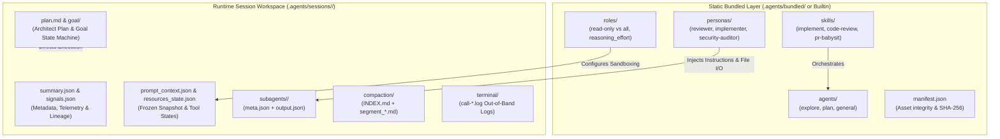

# Dual-Layer Agent Architecture: Bundled Asset System and Session Directory Layout

Status: proposed

## 1. Context & Empirical Motivation

A comprehensive audit of the Grok system architecture (`~/.grok/bundled/` and `~/.grok/sessions/<workspace>/<session_id>/`) reveals a cohesive **Dual-Layer Architecture**:

1. **Static Bundled Asset Layer (`bundled/`)**:
   Defines the capabilities, persona behaviors, tool permission presets, and orchestration workflows:
   - **`agents/`**: Top-level foundational entities (`explore`, `plan`, `general-purpose`).
   - **`roles/`**: Lightweight runtime execution policies (`capability_mode`, `reasoning_effort`, `fork_context`).
   - **`personas/`**: Domain-specific behavioral instructions and explicit **File-Based I/O contracts** (`[[inputs]]`/`[[outputs]]`).
   - **`skills/`**: Multi-agent orchestration pipelines (e.g. `implement`, `code-review`, `design`).
   - **`manifest.json`**: Asset integrity and distribution verification via SHA-256 checksums.

2. **Runtime Session Execution Layer (`sessions/`)**:
   Maintains the active state, lineage, memory, and telemetry of running workflows:
   - **`summary.json` & `signals.json`**: Fast $O(1)$ discovery and quantitative telemetry.
   - **`prompt_context.json` & `resources_state.json`**: Frozen environment snapshot and active tool limits/states.
   - **`plan.md` & `goal/`**: Execution contracts generated by bundled `plan` agents and goal state machines.
   - **`subagents/<id>/`**: Child execution records tracking role, persona, and output.
   - **`compaction/`**: Memory segment archives (`INDEX.md` + `segment_*.md`).
   - **`terminal/`**: Out-of-band execution logs for large shell captures.

This proposal establishes a unified architecture for `mini-agent` that bridges **Static Bundled Assets** with **Dynamic Session Workspaces** while honoring our strict line budget (20k core / 30k workspace).

---

## 2. Global Dual-Layer Architecture



---

## 3. Static Bundled Layer Specification

### 3.1. Bundled Directory Structure
```
.agents/bundled/ (or embedded within mini-agent-cli)
├── agents/
│   ├── explore.md            # Read-only exploration agent
│   ├── plan.md               # Read-only software architect agent
│   └── general-purpose.md    # Full-capability general agent
├── roles/
│   ├── explore.toml          # capability_mode = "read-only", reasoning_effort = "medium"
│   ├── plan.toml             # capability_mode = "read-only", reasoning_effort = "high"
│   ├── reviewer.toml         # capability_mode = "all", fork_context = true
│   └── implementer.toml      # capability_mode = "all", fork_context = true
├── personas/
│   ├── reviewer.toml         # Review rules + [[inputs]]/[[outputs]] file contract
│   ├── implementer.toml      # Implementation guidelines + fix verification
│   └── security-auditor.toml # OWASP Top 10 + vulnerability analysis
├── skills/
│   ├── implement/SKILL.md    # Implement -> Multi-Reviewer -> Fix -> Re-review loop
│   └── code-review/SKILL.md  # Structural simplification & Code Judo review
└── manifest.json             # SHA-256 asset checksums
```

### 3.2. Role & Persona File Contracts
Personas decouple inter-agent communication from memory context by defining standard file-based handoffs:
- **`[[inputs]]`**: Defines incoming files (e.g. `summary_file`, `review_file`).
- **`[[outputs]]`**: Defines outgoing deliverables (e.g. `review_file`).
- **Runtime Binding**: `mini-agent` injects scratch file paths (`.agents/scratch/grok-review-${ID}.md`) and enforces that child agents produce structured markdown rather than unstructured chat turns.

---

## 4. Runtime Session Directory Specification

```
.agents/sessions/<session_id>/
├── summary.json              # Fast O(1) session index & lineage metadata
├── signals.json              # Quantitative telemetry (token usage, tool call counts, latencies)
├── prompt_context.json       # Frozen environment snapshot (AGENTS.md, OS, shell, timestamp)
├── system_prompt.txt         # Exact rendered system prompt for deterministic replay
├── session.jsonl             # Append-only active conversation & checkpoint log
│
├── plan.md                   # Active architectural plan (Problem, Non-goals, Approach, Verification)
├── plan_mode.json            # Interactive planning state (Active / Inactive, awaiting_approval)
│
├── goal/                     # Autonomous Goal Mode runtime directory
│   ├── state.json            # Goal state machine (objective, worker/verify rounds, baseline_commit)
│   ├── plan.md               # Acceptance criteria, verification steps, and task checklist
│   └── verifier_verdict.md   # Adversarial classifier/verifier report
│
├── subagents/                # Nested subagent execution records
│   └── <child_session_id>/
│       ├── meta.json         # Subagent invocation params, duration, turns, tool calls, role
│       └── output.json       # Structured return result payload
│
├── compaction/               # Archived conversation memory segments
│   ├── INDEX.md              # Markdown index table (Segment, Turns, Approx bytes, Keywords)
│   └── segment_000.md        # Pruned conversation turns preserved for retrieval
│
└── terminal/                 # Out-of-band process execution logs
    └── call-<call_id>.log    # Full stdout/stderr for commands > 32 KiB
```

---

## 5. Lifecycle Binding: From Bundled Template to Session Artifact

```
1. Invocation (/implement or spawn_agent):
   - Host reads bundled skill `skills/implement/SKILL.md`.
   - Resolves bundled roles (`roles/implementer.toml`, `roles/reviewer.toml`).

2. Session Initialization:
   - Creates `.agents/sessions/<id>/` with `summary.json` and `prompt_context.json`.
   - Injects frozen workspace `AGENTS.md` and OS environment into `prompt_context.json`.

3. Subagent Execution:
   - Spawns child agent with `role: "reviewer"` and `capability_mode: "read-only"`.
   - Child output writes to `.agents/scratch/review-${ID}.md` and `.agents/sessions/<id>/subagents/<child_id>/`.

4. Compaction & Archival:
   - When memory threshold is hit, trims prefix turns into `compaction/segment_NNN.md` and updates `INDEX.md`.

5. Telemetry Finalization:
   - Updates `summary.json` and `signals.json` with token consumption, tool distributions, and Git commit records.
```

---

## 6. Budget & Implementation Guardrails

1. **Zero Core Bloat**:
   `mini-agent-core` remains untouched. Bundled asset loading, persona rendering, and session layout management live purely in `mini-agent-cli`.
2. **Minimal Static Footprint**:
   Bundled assets are embedded or lazily loaded from disk with lightweight TOML parsing.
3. **Strict Line Budget**:
   Workspace addition estimated at $< 250$ lines, safely preserving our headroom under the 30,000 line limit.