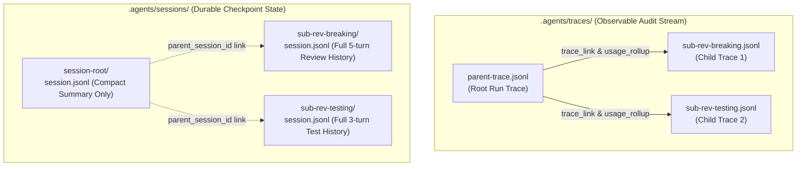

# Subagent Trace Replay, Summary Rollup, and Hierarchical Session Checkpoints

Status: proposed

## 1. Context & Motivation

When an agent harness supports spawning child subagents (and potentially recursive subagents up to depth $D \le 3$), execution is physically distributed across independent OS processes and isolated sessions.

This introduces three critical operational challenges:
1. **Trace Fragmentation & Cost Undercounting**: If child trace logs are isolated and unindexed, `mini-agent trace summary` on the parent trace will only show a single `spawn_agent` tool call, severely undercounting actual model requests, step counts, and token expenditures across the entire agent tree.
2. **Replay Invisibility**: Developers replaying a parent trace (`mini-agent trace replay`) cannot see why a subagent failed or what internal tool steps it took without manually hunting for disconnected log files.
3. **Session Checkpoint Bloat vs. Disconnection**: Merging child message history into parent checkpoints would immediately violate the 10K-token item ceiling and 1 MiB checkpoint limits; however, completely untracked child sessions lead to dangling orphan files and broken resume chains.

This proposal establishes the **Hierarchical Trace and Session Lineage Architecture** for multi-subagent workflows.

---

## 2. Architecture & Lineage Graph



---

## 3. Impact on Trace Logs & Observation Events

### 3.1. Lineage Metadata in Tool Events

When `spawn_agent` executes, `mini-agent-cli` assigns deterministic trace and session identifiers to the child process and records them in the parent's `ToolFinished` event metadata:

```json
{
  "type": "ToolFinished",
  "name": "spawn_agent",
  "result": "Subagent 'breaking_changes' completed (in 3 steps):\n\nNo breaking API changes detected.",
  "metadata": {
    "task_name": "breaking_changes",
    "subagent_session_id": "sub-20260827-01-breaking",
    "subagent_trace_file": ".agents/traces/sub-20260827-01-breaking.jsonl",
    "usage": {
      "steps": 3,
      "input_tokens": 2840,
      "cached_input_tokens": 1024,
      "output_tokens": 420,
      "tool_calls_total": 4,
      "duration_ms": 3250
    }
  }
}
```

### 3.2. Hierarchical `trace summary` (Recursive Rollup)

`mini-agent trace summary` is updated to support cumulative cost aggregation:
- **Direct Metrics**: Tokens and steps consumed directly by the parent.
- **Tree Rollup Metrics**: Aggregate summation across all child and descendant subagents.

```text
Trace Summary: .agents/traces/parent-trace.jsonl
Prompt: "Perform full code review on PR #42"
Status: Completed (1 parent turn, 4 subagents)

Cumulative Token & Step Breakdown:
─────────────────────────────────────────────────────────────────────────────
Agent Level                 Steps   Model Req   Input Tokens   Output Tokens
─────────────────────────────────────────────────────────────────────────────
[Root] /root                    2           2          3,100             450
  ├─ [Subagent] breaking        3           3          2,840             420
  ├─ [Subagent] change_size     2           2          1,450             280
  ├─ [Subagent] context         2           2          1,620             310
  └─ [Subagent] testing         4           4          3,900             680
─────────────────────────────────────────────────────────────────────────────
Total Cumulative Resources:    13          13         12,910           2,140
```

### 3.3. `trace replay` (Nested Tree Rendering & Drill-Down)

During replay, subagent invocations are rendered with structured visual boundaries:
```text
[Step 1] Parent invoked spawn_agent("breaking_changes")
  ┌─── [Subagent /root/breaking_changes] (Trace: sub-breaking.jsonl) ───
  │ Step 1: ReadFile("crates/mini-agent-core/src/harness.rs") -> 4.2 KiB
  │ Step 2: Shell("git diff origin/main") -> 12 lines
  │ Step 3: Assistant final verdict generated (420 tokens)
  └─── [Subagent Settled: Success in 3.25s] ───────────────────────────
[Step 2] Parent received summary and compiled final review report.
```
- Flag `--no-expand-subagents`: Collapses child steps into a single line summary.
- Flag `--expand-subagents` (default for interactive terminals): Expands child execution in indented sub-trees.

---

## 4. Impact on Session Checkpoints (`session.rs`)

### 4.1. Strict Context Boundary (No Raw Inlining)

To protect the parent harness from context explosion:
- **Parent Checkpoint**: Stores only the subagent's structured output in `Message::Tool` (bounded to $\le 32$ KiB). It **never** inlines the child's 20 raw intermediate tool results.
- **Child Checkpoint**: Stores the child's complete turn history and intermediate tool calls in its own dedicated file: `.agents/sessions/<child_session_id>/session.jsonl`.

### 4.2. Session Lineage & Tree Hierarchy

Every session header record contains explicit lineage pointers:
```json
{
  "type": "SessionHeader",
  "session_id": "sub-20260827-01-breaking",
  "root_session_id": "root-20260827-abc",
  "parent_session_id": "root-20260827-abc",
  "depth": 1,
  "task_name": "breaking_changes",
  "created_at": "2026-08-27T12:00:00Z"
}
```

### 4.3. Session Discovery & Tree Listing (`mini-agent sessions`)

`mini-agent sessions` renders sessions in a parent-child hierarchy:
```text
root-20260827-abc (Root Session - 12.4 KiB, 2 turns)
  ├── sub-20260827-01-breaking (Subagent: breaking_changes - 4.1 KiB, 1 turn)
  ├── sub-20260827-02-size (Subagent: change_size - 2.8 KiB, 1 turn)
  ├── sub-20260827-03-context (Subagent: context - 3.2 KiB, 1 turn)
  └── sub-20260827-04-testing (Subagent: testing - 6.5 KiB, 2 turns)
```

### 4.4. Fork & Resume Semantics with Subagents

1. **`mini-agent resume <root_id>`**:
   Resumes the parent agent. If the parent sends a follow-up to a subagent (`send_subagent_message`), the child session is resumed seamlessly using its existing `.agents/sessions/<child_id>/` history.
2. **`mini-agent fork <root_id>`**:
   Branches the parent session into `<new_root_id>`. Child sessions remain referenced read-only until a follow-up turn is dispatched, at which point child sessions are branched on-demand (`fork_subagent`) to preserve branching purity.
3. **Garbage Collection & Archival**:
   Deleting or archiving a root session automatically cascades to all child sessions linked via `root_session_id`.

---

## 5. Security & Resource Guardrails

1. **Trace Path Sandboxing**: Subagent trace paths must remain strictly within `.agents/traces/` or the designated `--trace` directory (preventing directory traversal).
2. **Session Cleanup on Failures**: If a subagent process encounters an unrecoverable crash or timeout before writing its initial checkpoint, its partially written session directory is cleaned up to prevent corrupted residue.
3. **Hard Depth Guard**: Lineage tracking verifies `depth <= 3` before launching subagents.

---

## 6. Acceptance Criteria

1. **Trace Aggregation**:
   - `mini-agent trace summary <parent_trace>` correctly calculates and displays cumulative token usage and step counts across all linked subagents.
2. **Trace Replay**:
   - `mini-agent trace replay <parent_trace>` renders subagent execution phases clearly with indented boundary visualizers.
3. **Session Checkpoint Isolation**:
   - Parent checkpoints remain bounded $< 1$ MiB regardless of how many steps child subagents perform.
   - `mini-agent sessions` displays parent-child session trees accurately.
4. **Line Budget**:
   - Trace and session lineage extensions require $< 180$ lines in `crates/mini-agent-cli` with 0 lines added to `mini-agent-core`.