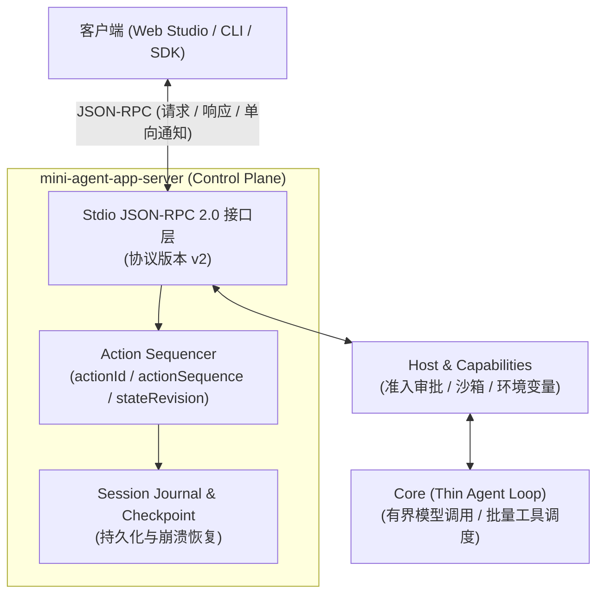
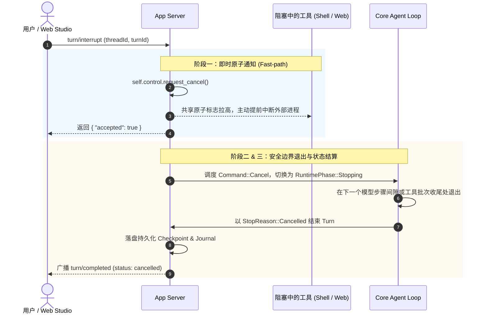

# 01 Mini Agent App Server：面向交付的 Agent 控制面协议设计

在构建自主 Agent 系统时，许多实现往往止步于一个简单的命令行或单次模型交互循环（Agent Loop）。然而，当 Agent 需要走出玩具阶段、进入长生命周期的交付场景时，系统必须提供可靠的控制平面（Control Plane）：如何安全暂停和恢复任务？如何实施细粒度的人工审批（Human-in-the-Loop）？如何在进程崩溃后对齐工具副作用？

Mini Agent 运行时通过 `mini-agent-app-server` 暴露了这套控制面契约。它采用 **“薄 Agent Loop、厚 Control Plane”** 的核心哲学，基于 Stdio JSON-RPC 2.0 协议构建。本文将全面解析 Mini Agent App Server 的协议体系、核心接口分类与状态流转机制。

---

## 一、协议基础与核心设计理念

### 1. 架构边界：Thin Loop vs Thick Control Plane

在 Mini Agent 体系中，执行边界被严格划分为四个层次：

* **Core（薄执行内核）**：仅负责有界的模型/工具推理循环、上下文尺寸裁剪、停止原因分类与底层事件产出，不直接接触外部副作用。
* **Host / Capabilities（能力与准入）**：负责工具准入控制、安全沙箱、具体副作用执行与策略检查。
* **App Server（厚控制面中枢）**：管理长生命周期的 `Thread`、`Turn`、`Session`、持久化 Journal、状态机（CAS/版本控制）以及外部 JSON-RPC 通信。
* **Client / Gateway（客户端与网关）**：CLI、Python SDK、FastAPI Gateway 和 Web Studio 均作为客户端消费 App Server 的统一协议。



### 2. 传输与定序契约（Action Envelope & stateRevision）

* **传输载体**：基于标准输入/输出（Stdio）的换行符分隔 JSONL（Newline-delimited JSON-RPC 2.0）。
* **协议协商**：启动时通过 `initialize` 强制协商协议版本（当前主版本为 `2`）。
* **状态定序凭据（Action Envelope）**：所有进入核心状态机（Runtime Actor）的写操作，响应均包裹在带有确定性版本元数据的载荷中：
  ```json
  {
    "value": { "status": "started", "turn_id": "turn-1" },
    "actionId": 1,
    "actionSequence": 1,
    "stateRevision": 1
  }
  ```
  `actionSequence` 保证服务端处理顺序单调递增，`stateRevision` 则捕获该操作生效时运行时的全局版本快照，彻底杜绝客户端基于过期状态发生并发冲突。
* **快慢通道分离（Fast-Path）**：为了防止长时间运行的工作线程阻塞紧急控制指令，App Server 将安全审批响应（`approval/respond`）和中断请求（`turn/interrupt`）设计为控制面快路径，在 I/O 调度层直接短路拦截，不参与排队等待。

---

## 二、RPC 接口全景分类

App Server 提供了约 40 个标准 JSON-RPC 方法，按职责划分为七大功能模块：

### 1. 连接初始化与协商（Lifecycle）

| 方法名 | 类型 | 说明 |
| :--- | :--- | :--- |
| `initialize` | Request | 协商协议版本（必须为 2）、客户端能力（如 `capabilities.userQuestions`）及配置模型供应商 |
| `initialized` | Notification | 客户端完成初始化的确认通知 |

### 2. 会话生命周期（Thread & Session）

Thread 是执行上下文的容器，Session 拥有持久化与恢复的权威：

* `thread/start`：在 App Server 中初始化并启动指定 Thread。
* `thread/list`：枚举当前运行实例托管的所有 Thread。
* `thread/read`：读取 Thread 当前状态、上下文来源清单（Context Manifest）及消息摘要。
* `thread/close`：优雅关闭 Thread，清理后台进程组。
* `thread/fork` / `session/fork`：基于持久化检查点（Checkpoint）进行分支派生，内置 CAS 防覆盖保护。
* `thread/resume`：从历史 Journal 重建并恢复会话状态。
* `thread/items/list`：基于游标分页拉取结构化的 `ThreadItem`，为上层 Web Studio 提供高性能增量渲染投影。
* `session/control`：显式推动 Session 的持久化控制状态（如暂停、冻结、强制收敛）。

### 3. 执行轮次与控制（Turn Lifecycle & Steering）

Turn 代表一次用户指令引发的完整模型交互循环：

* `turn/start`：输入 prompt 或模式设置，触发新一轮执行。
* `turn/steer`：在 Turn 运行过程中插入协同指导信息，在模型下一个迭代边界或工具批次间隙生效，不破坏执行一致性。
* `turn/interrupt`：**两段式协同中断**。设置共享原子取消标记，唤醒阻塞工具，通知 Worker 进入 `stopping` 阶段并在安全边界结算。
* `turn/read`：读取已完结 Turn 的完整结算数据（Token 消耗、耗时指标、工具调用明细）。
* `turn/resume`：从非正常中断状态中唤醒挂起的 Turn。
* `turn/reconcile`：针对崩溃或异常掉电后状态不明的工具调用，执行安全调和（Reconcile）。

### 4. 人机协同介入（Human-in-the-Loop）

Mini Agent 不将审批硬编码在工具内部，而是抽象为控制面的独立契约：

* `approval/respond`：针对敏感工具操作（如命令执行、文件改写）提交用户的授权决议。支持提交结构化的授权范围（`grant_scope`），并由服务端 `ActionGrantKey` 校验。
* `user-question/respond`：配合 `ask_user` 工具，支持交互式表单和单选问答的多轮反馈。

### 5. 目标驱动与验证（Goals & Verifier）

支持以目标导向（Goal-oriented）的自治运行：

* `thread/goal/set`：绑定长周期目标指令。
* `thread/goal/get`：获取目标进度及验证状态。
* `thread/goal/clear`：清除或废弃当前活跃目标。
* 核心机制：每个阶段性结果经过独立的无工具 Verifier 验证，验证通过后才推进后续步骤。

### 6. 长效任务与后台进程（Task Management）

* `child/task`：对派生出来的 Child Session 任务进行统一调度与控制。
* `background-task/*`（`list` / `read` / `logs` / `stop` / `restart`）：控制由 Shell 工具衍生的长生命周期后台守护进程，进程所有权由 App Server 统一托管并自动清理。
* `scheduled-task/*`（`list` / `read` / `cancel`）：注册延迟检查时间锚点，便于后续轮次主动对齐外部异步事件。

### 7. 环境扩展与持久化记忆

* `session/notebook/*`（`read` / `write` / `forget`）：管理会话绑定的结构化知识与记忆沉淀。
* `mcp/status` / `mcp/retry`：Model Context Protocol（MCP）服务器状态检测与重试。
* `skills/list`：列出当前系统加载的技能清单（Skills Catalog）。
* `model/catalog/manage`：模型目录与 API 凭据的热管理。

---

## 三、服务端单向事件流（Server Notifications）

App Server 在相同的 Stdio 传输流上向客户端有序推送事件，构建起实时反应式前端：

```text
[App Server 运行时] 
       │
       ├── turn/event (细粒度流式事件：模型 Token、Thinking、工具启停)
       ├── item/started & item/completed (结构化 UI 卡片聚合生命周期)
       ├── approval/request & approval/resolved (权限审批卡片广播)
       ├── user-question/request & user-question/updated (分步交互问答)
       └── runtime/status/updated (全局相位切换：idle / running / stopping)
       │
       ▼
[Client / Gateway 界面渲染]
```

1. **`turn/event`**：携带严格单调自增的 `sequence`，包含 `model_started`、`model_streamed`（文本与深度思考增量）、`tool_started`、`tool_completed`、`context_injected` 等底层原语。
2. **`item/*` 投影通知**：将离散的底层事件收敛为业务可视的条目（`ThreadItem`），便于前端无需自己拼接复杂的分片逻辑。
3. **`approval/request`**：主动推送包含结构化操作类型、受影响路径、风险级别及建议授权范围的审批通知。

---

## 四、核心机制剖析：两段式协同中断

在 Agent 运行中，“如何安全停下来”是衡量控制面成熟度的试金石。Mini Agent 的 `turn/interrupt` 实现了严格的事务安全：



这种两段式设计保证了：正在执行的副作用不会半途损毁数据，已完成的操作被忠实记录在 Journal 中，未执行的工具被优雅取消，会话始终处于随时可以继续（Resume）的合法状态。

---

## 五、小结

Mini Agent App Server 展现了一种克制且极度严谨的架构范式：它不把 IDE、终端或文件系统的全部细节无休止地堆砌进接口中，而是紧紧围绕**会话状态机、准入授权、持久化安全与确定性定序**这四根支柱，为工业级 Agent 系统的构建提供了最小完备的控制面范本。
