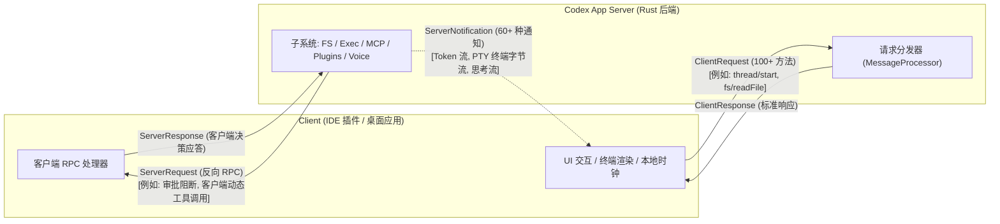
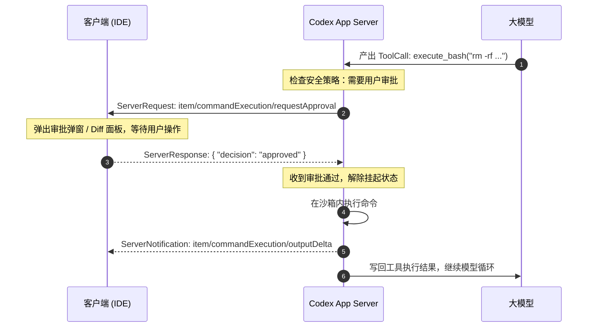

# 02 Codex App Server：全功能开发平台的双向全双工 RPC 架构

在 AI 原生编程助手领域，OpenAI Codex 是当之无愧的工业标杆。除了强大的底层模型与代码理解能力外，Codex 的工程架构同样具有高度的启发性。在其 Rust 实现（`codex-rs`）中，`app-server` 承担着统管 IDE 插件、桌面端应用及云端环境的核心中枢职责。

与普通 Agent 后端仅提供简单的 API 封装不同，Codex 的 `app-server` 是一套**全功能、多领域、全双工对等交互的重型协议系统**。本文将深入剖析 Codex App Server 的通信机制、反向 RPC 模式以及百余个接口的领域构成。

---

## 一、架构设计：全双工对等网络与重型统一中枢

### 1. 设计定位

Codex App Server 的定位不仅仅是驱动模型跑循环，而是**将客户端（如 VS Code 扩展、桌面端 App）转变为渲染与交互终端，由服务端全权接管开发环境的一切运行时状态**。

在 `codex-rs` 的宏定义（[`app-server-protocol/src/protocol/common.rs`](file:///Users/cch/gh-ws/codex-ws/codex/codex-rs/app-server-protocol/src/protocol/common.rs)）中，通信协议由三个对等的宏统一编织：

### 2. 三位一体的交互模型

传统 JSON-RPC 往往是单向的“客户端请求，服务端响应”。而 Codex 突破了这一范式，引入了完整的双向对等设计：

1. **`ClientRequest`**：由客户端发起，服务端执行。覆盖了会话、终端命令、远程文件、插件市场等 100 多个方法。
2. **`ServerRequest`（反向 RPC）**：**由服务端在执行过程中主动向客户端发起请求，并挂起等待客户端回复**。这是 Codex 处理权限审批与本地动态工具调用的杀手锏机制。
3. **`ServerNotification`**：服务端单向流式推送事件，包含细粒度的终端 Base64 字节流、深度思考增量等 60 多类通知。

---

## 二、领域能力矩阵：覆盖开发全链路的 ClientRequest

Codex 的客户端请求协议非常庞大，按子系统可划分为八大功能集群：

### 1. 会话调度与多级队列（Thread & Queue）
* `thread/start`、`thread/resume`、`thread/fork`：生命周期的启动、恢复与分支。
* `thread/turns/list`、`thread/items/list`：查询历史交互条目，底层直接并发读取追加式 Rollout 存储。
* `thread/queue/*`（`add`, `list`, `update`, `delete`, `reorder`, `start`）：**原生会话队列机制**，支持用户预先排队多个任务指令，由后台依次推进。
* `thread/compact/start`：手动触发上下文清理和历史修剪。

### 2. 轮次推进与协同插话（Turn & Steering）
* `turn/start`：提交输入并开启执行轮次。
* `turn/steer`：在 Turn 执行中途插入动态指导提示。
* `turn/interrupt`：中断正在执行的轮次。
* `turn/settings/update`：运行时动态修改特定轮次的运行环境。

### 3. 沙箱命令与原生 PTY（Command & Process Exec）
Codex 对命令行的控制达到了终端模拟器级别：
* **沙箱化命令（`command/exec`）**：
  * `command/exec`：在受控沙箱环境下启动命令并分配虚拟 PTY。
  * `command/exec/write`：向进程标准输入写入字节。
  * `command/exec/resize`：同步 PTY 窗口行高列宽（Rows/Cols）。
  * `command/exec/terminate`：强制杀死指定进程。
* **原生进程（`process/spawn`）**：
  * 支持绕过沙箱的原生系统进程调度，配合 `process/outputDelta` 推送流式输出。

### 4. 远程文件系统（Remote File System）
为了让客户端（如远程 Web 界面）无需本地挂载即可操作代码，Codex 直接内嵌了高并发文件系统 RPC：
* `fs/readFile`、`fs/writeFile`、`fs/createDirectory`、`fs/readDirectory`、`fs/remove`、`fs/copy`。
* `fs/watch`、`fs/unwatch`：在指定目录下建立文件系统观察者（File Watcher），变更时主动推送 `fs/changed` 通知。

### 5. 实时多模态与端到端语音（Realtime Voice）
Codex 内建了极低延迟的语音交互支持：
* `thread/realtime/start` / `stop`：建立 WebRTC / 实时音频会话。
* `thread/realtime/appendAudio` / `appendSpeech`：流式推送麦克风音频帧。
* `thread/realtime/listVoices`：查询服务端支持的语音音色库。

### 6. MCP 生态（Model Context Protocol）
* `mcpServer/oauth/login`：支持符合 MCP 标准的 OAuth 认证链路。
* `config/mcpServer/reload`、`mcpServerStatus/list`：MCP 服务的状态监测与热重载。
* `mcpServer/resource/read`、`mcpServer/tool/call`：直接通过协议层访问 MCP 资源与工具。

### 7. 插件体系与市场（Plugins & Marketplace）
* `plugin/list`、`plugin/install`、`plugin/uninstall`、`plugin/search`。
* `plugin/share/*`（`save`, `list`, `checkout`, `delete`）：插件共享与团队分发治理。
* `marketplace/*`（`add`, `remove`, `upgrade`）：外部插件市场源的动态订阅与升级。

### 8. 项目、环境与远程控制
* `project/*`（`list`, `create`, `update`, `move`, `delete`）：项目工作区元数据管理。
* `environment/*`（`add`, `info`, `status`）：远程容器/执行环境声明。
* `remoteControl/*`（`enable`, `disable`, `pairing/*`, `client/*`）：支持异地设备配对与远程接管。

---

## 三、反向 RPC 机制（ServerRequest）：真正的 Human-in-the-Loop

大部分系统在实现人工审批或动态工具时，通常是将流程打断为一个错误状态，或者由客户端长轮询。Codex 采用了极具创新的 **反向 RPC** 设计：

当服务端在执行 Turn 过程中遇到需要确认或客户端代理的操作时，**服务端作为 Client 发送 Request，客户端作为 Server 处理并回传 Response**。

### 核心 ServerRequest 方法

| 方法名 | 触发场景 | 客户端应答内容 |
| :--- | :--- | :--- |
| `item/commandExecution/requestApproval` | Agent 准备执行危险 Shell 命令 | 用户批准、拒绝或修改执行策略 |
| `item/fileChange/requestApproval` | Agent 准备通过补丁改写源码文件 | 批准或拒绝文件修改 |
| `item/permissions/requestApproval` | 申请临时突破沙箱路径范围或特权 | 授权范围确认 |
| `item/tool/requestUserInput` | 工具需要向用户征询额外表单信息 | 用户的表单输入参数 |
| `item/tool/call` | **客户端动态工具调用** | 客户端在本地执行工具后回传的执行结果 |
| `mcpServer/elicitation/request` | 依赖 MCP 服务触发的动态身份质询 | 认证与参数反馈 |

通过这种反向调用机制，整个交互循环的上下文始终驻留在服务端内存中，无需拆解为离散的多次 HTTP 请求，保持了状态的高度连贯。

---

## 四、事件通知流（ServerNotification）

在服务端单向流式推送方面，Codex 涵盖了极度细化的开发体验需求：

* **思考流与文本分流**：
  * `item/reasoning/textDelta` 与 `item/reasoning/summaryTextDelta`：独立推送模型的思维链（Reasoning Process）。
  * `item/agentMessage/delta`：推送正式回答正文。
* **终端实时流**：
  * `command/exec/outputDelta`：通过 Base64 实时输出伪终端打印字符，保证 ANSI 颜色与控制码完美透传给前端终端组件（如 xterm.js）。
* **自动化安全审计**：
  * `item/autoApprovalReview/started` 与 `completed`：后台 Guardian 自动化审计流程的运行事件。

---

## 五、小结

Codex App Server 是一座功能极其完备的**“航空母舰”**：
1. **边界大包大揽**：从文件读写、PTY 仿真、WebRTC 实时音频到插件市场，几乎将开发环境所需要的所有支撑全部整合进统一协议中。
2. **双向全双工 RPC**：通过 ServerRequest 模式，优雅且无缝地解决了 Human-in-the-Loop、动态工具分发与权限介入问题。
3. **面向平台型产品**：非常适合作为大型云原生开发工作台或一体化 IDE 的统一服务核心。
