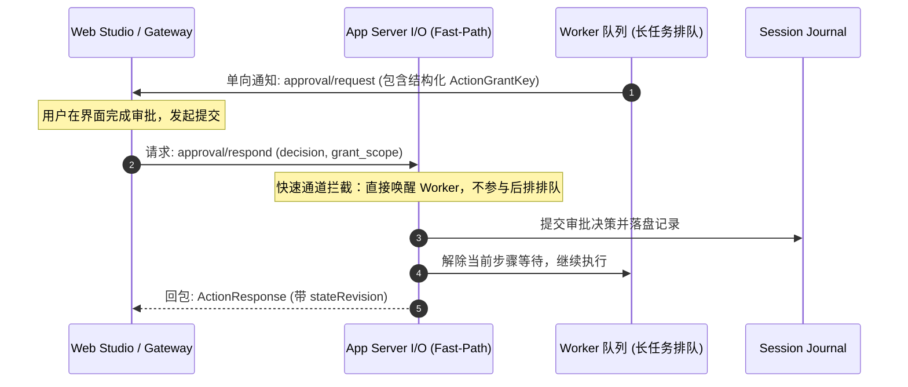

# 03 从航空母舰到精悍快艇：Codex 与 Mini Agent 的 App Server 协议对比与架构演进

在深入审查了 **Codex** 与 **Mini Agent** 两套系统的 App Server 接口协议之后，我们可以清晰地看到两种截然不同但又各具代表性的工程取向：
* **Codex** 是一座功能完备、大包大揽的**“航空母舰”**，构建了一个集文件、终端、语音、插件生态于一体的统一操作系统。
* **Mini Agent** 则是一艘机动敏捷、边界极度收敛的**“精悍快艇”**，恪守“薄 Agent Loop、厚 Control Plane”原则，只聚焦于让 Agent 运行在时间与结构上可控制、可观察与可交付。

本文将从架构哲学、交互模型、状态一致性与工程演进四个维度，对两者的协议设计进行深度对比与反思。

---

## 一、核心维度对比矩阵

| 比较维度 | Codex App Server (`codex-rs`) | Mini Agent App Server (`mini-agent-harness`) |
| :--- | :--- | :--- |
| **设计定位** | AI 原生开发工作台统一操作系统（IDE & Cloud） | 面向交付的工业级 Agent 控制面与运行时 |
| **架构理念** | 全栈覆盖、能力下沉、统一中心化协议 | **薄 Agent Loop、厚 Control Plane**，严格有界 |
| **RPC 通信范式** | **双向全双工对等 RPC**（ClientRequest + ServerRequest + Notification） | **单向命令 + 事件流**（ClientRequest + Notification），配合 Fast-Path |
| **人机审批模式** | **反向 RPC**：服务端主动发 `ServerRequest` 挂起等待客户端回应 | **通知 + 快路径确认**：服务端推送 `approval/request`，客户端调用 `approval/respond` |
| **状态一致性保障** | Rollout 追加日志，依赖会话局部锁与内存管理 | **Action Sequencer**，提供 `actionSequence` 与 `stateRevision`，严格 CAS |
| **系统边界范围** | 包含远程 FS、原生 PTY、实时 WebRTC 语音、插件共享市场 | 收敛于 Thread、Turn、Session、持久化恢复、任务并发与审批 |
| **客户端实现门槛** | 较高（客户端必须实现 RPC 服务端以处理 ServerRequest） | 较低（标准客户端模式，天然贴合 REST / WebSocket 网关） |

---

## 二、架构哲学的分野：全栈平台 vs 交付运行时

### 1. Codex 的“加法”哲学：统一所有基础设施

Codex 的协议体系包含了超过 100 个客户端请求与数十个通知。它不仅管理会话，还将很多本属于 IDE 或底层操作系统的事情全部纳入协议：
* **远程文件系统（`fs/*`）**：在没有本地文件系统的 Web 或移动端场景下，直接通过 RPC 读写目录与文件，监听文件变动。
* **终端与进程控制器（`command/exec/*`, `process/*`）**：完整实现了 PTY 的标准输入输出管道、窗格尺寸调整与 ANSI 转义流传输。
* **实时多模态语音（`thread/realtime/*`）**：内建 WebRTC 语音会话与音频流管理。
* **插件生态与市场（`plugin/*`, `marketplace/*`）**：插件的检索、安装、协同共享与分发。

这种架构的优势在于**极致的一体化体验**：任何客户端（无论是 VS Code、Web 应用还是桌面端）只要接通这个 Stdio 管道，就能立刻拥有一个完整的云端开发环境。但代价是服务端体积庞大，边界模糊，任何子系统的故障都可能影响核心 Agent 的稳定性。

### 2. Mini Agent 的“减法”哲学：守住最小完备控制面

与 Codex 相比，Mini Agent 做出了大量克制且清醒的架构收敛：
* **拒绝做第二个操作系统**：文件读写与命令执行由底层的具体工具沙箱（Tool Runtime）负责，App Server 协议层只暴露任务级的执行结果与有界投影，坚决不暴露低级的文件流和终端 PTY 协议。
* **聚焦生命周期与确定性**：Mini Agent 将重点全面投射在 **Thread 状态流转、Session 崩溃恢复、CAS 分叉检测、两段式协同中断以及结构化授权** 上。

这种减法使得 Mini Agent 的协议可以稳定在 40 个核心方法内，既保证了长时间运行任务的可靠性，又避免了向模型或客户端泄露无限的上下文与低级细节。

---

## 三、交互模型的深层剖析：反向 RPC vs 声明式通知+快路径

两套系统在解决 **Human-in-the-Loop（人机协同审批）** 这一关键问题上，采用了截然不同的通信模式。

### 1. Codex 的反向 RPC（ServerRequest）

在 Codex 中，当 Agent 运行遇到审批（如改写文件或执行命令）时，App Server 充当客户端的 Caller，发起 `ServerRequest`：

```text
[Codex App Server] ──(ServerRequest: item/commandExecution/requestApproval)──> [Client]
[Codex App Server] <──(ServerResponse: { decision: "approved" })───────────── [Client]
```

* **优点**：心智模型直观，交互像一次标准的函数调用（Call/Return），服务端上下文直接在单次等待中闭环。
* **痛点**：
  * **客户端复杂度高**：客户端不仅是调用方，还必须自己跑一套 RPC 服务端，处理反向路由与超时。
  * **网络与网关适配成本高**：在 Web 架构中，HTTP Gateway 很难将一个纯粹的后端反向调用透传给浏览器；浏览器短线重连时，未决的 ServerRequest 极易出现连接悬挂或死锁。

### 2. Mini Agent 的声明式通知 + 快路径确认（Notification + Fast-Path）

Mini Agent 摒弃了反向 RPC，回归标准的客户端/服务端角色模型：

```text
[App Server] ──(ServerNotification: approval/request)──> [Client / Gateway]
[App Server] <──(ClientRequest: approval/respond)──────── [Client / Gateway]
```



* **设计亮点**：
  * **网关与浏览器极其友好**：浏览器只需监听普通 WebSocket 事件，并使用普通 REST/WS 接口回传审批，符合主流 Web 开发范式。
  * **彻底杜绝死锁（Fast-Path）**：由于审批响应走独立的控制面快速拦截通道，即使工作线程的执行队列中有后续任务在排队，审批提交也能立即穿透生效。
  * **可恢复性高**：审批状态被完整记录在持久化 Journal 中。即使浏览器掉线重连，调用 `thread/read` 就能立即重建待审批状态，无需担心反向 RPC 通道被掐断。

---

## 四、状态一致性与确定性控制的演进

在面对崩溃、中断与恢复等复杂状态时，两者的演进轨迹呈现出明显的不同：

### 1. 授权身份与安全保证
* **Codex**：在早期协议中，很多审批判断基于人类可读的展示字符串或简单的布尔开关。
* **Mini Agent**：严格要求授权匹配必须依赖结构化的 **`ActionGrantKey`** 和经过规范化的路径范围（`grant_scope`），坚决不在跨 RPC 边界时将多维状态退化为单维布尔值，杜绝了权限漂移漏洞。

### 2. 状态定序与并发冲突
* **Codex**：主要依靠 Rollout 追加式存储和内存中的状态投影。
* **Mini Agent**：引入了 **Action Sequencer** 机制。每个经过核心运行时准入的动作，都会获得严格单调递增的 `actionSequence` 以及运行时的快照版本号 `stateRevision`。
  * 会话分叉（Fork）与恢复原生支持 **CAS（Compare-And-Swap）**，若两个客户端并发修改同一个会话，低版本操作会被立刻拒绝并返回明确的冲突码（`SESSION_FORK_CONFLICT_CODE`）。

### 3. 中断停止机制（Cancellation）
* **Codex**：提供 `turn/interrupt`，向内部下发取消信号。
* **Mini Agent**：实现了**两段式协同中断**。第一阶段通过共享原子标记（`RunControl::cancellation_token`）立即通知阻塞中的工具（如运行外部脚本的子进程）快速止血；第二阶段驱动 Worker 切换为 `Stopping` 相位，并在模型推理边界或工具批次收尾处安全结算，保证会话数据不损坏、可审计。

---

## 五、总结与架构启示

从 Codex 到 Mini Agent，我们见证了 Agent 系统架构从**“平台型堆砌”**向**“工程化交付”**的演进：

1. **清晰的权责边界是系统稳健的前提**：
   如果一个 Agent 服务端既要当文件浏览器，又要当终端仿真器，还要负责语音传输，系统的攻击面和运维复杂度将急剧膨胀。将非 Agent 核心的基础设施剥离给外部专业服务，让 App Server 专注解决会话、准入与持久化，是更适合交付的架构路线。
2. **永远优先考虑网关与 Web 的集成成本**：
   双向全双工的反向 RPC 在桌面端本地通信时非常优雅，但在微服务、网关和 Web 前端面前却往往变成噩梦。Mini Agent 的“单向事件流 + 控制面快路径”证明了：无需反向 RPC，同样可以优雅、高响应度地实现 Human-in-the-Loop。
3. **确定性状态是 Agent 从玩具走向生产的基石**：
   大语言模型本身是随机的，但驱动它的控制面必须是绝对确定、单调定序且具备强事务恢复能力的。`stateRevision`、CAS 机制与两段式协同中断，为长生命周期 Agent 的工程落地提供了坚实的底座。
