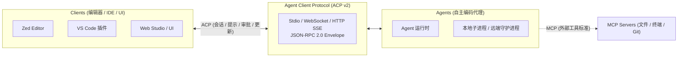
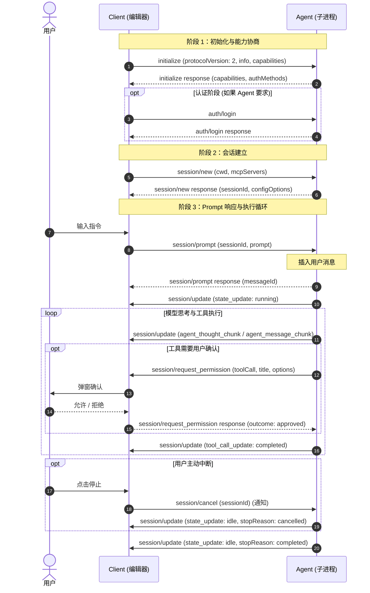

# 04 Agent Client Protocol (ACP) v2：开放标准下的 Agent-Client 交互协议详解

在 AI 编码工具的发展历程中，语言服务器协议（LSP）统一了编辑器与编程语言后端的通信，模型上下文协议（MCP）统一了大模型与外部数据/工具的集成。而在**编辑器/客户端（Client）**与**自主编码智能体（Agent）**之间，由 Zed 团队主导并联合社区制定的 **Agent Client Protocol (ACP)** 则正在成为新的开放标准。

本文结合 ACP 官方规范（v2 Overview）以及本地开源实现（`agent-client-protocol` 规范仓库与 `rust-sdk`），系统性梳理 **ACP v2** 的 JSON-RPC 2.0 协议体系、核心生命周期、接口定义及其前向兼容的设计哲学。

---

## 一、ACP 的定位与角色边界

ACP 解决的核心痛点是：不同的代码编辑器（Zed、VS Code、JetBrains、Neovim）无需针对每个 Agent（如 Claude Code、Codex、Mini Agent、Aider）编写专属插件；Agent 开发者也无需为每个前端生态重复适配通信层。

在 ACP 体系中：
* **Client**：用户界面的宿主（通常是编辑器），负责环境管理、用户交互以及向用户索取权限审批。
* **Agent**：运行 AI 交互循环的程序，通常作为 Client 的子进程启动，通过 Stdio 进行通信。
* **分工哲学（v2 核心演进）**：v2 大幅裁剪了客户端文件系统（`fs/*`）和重型终端模拟（`terminal/*`）的私有接口，转而通过标准的 **MCP（Model Context Protocol）** 供给客户端本地工具，自身专注协议层的会话控制。

---

## 二、通信模型与核心生命周期

ACP 严格遵循 JSON-RPC 2.0 规范，分为**方法（Methods）**与**单向通知（Notifications）**。

### 1. 完整执行流转阶段

### 2. Prompt 生命周期的重构（v2 核心变化）

在 v1 中，`session/prompt` 的响应直接代表整个执行轮次的结束；而在 **ACP v2** 中：
* `session/prompt` 的响应**仅代表 Agent 成功接收并插入了该用户消息**，立即返回分配的 `messageId`。
* 后续所有的模型思考、流式文本、工具调用进度以及前台运行状态，均通过 **`session/update` 通知** 异步推送。
* 轮次的终结由带有 `stopReason`（如 `completed`, `cancelled`, `error`）的 `state_update (idle)` 通知权威声明。

---

## 三、Agent 暴露的方法与通知（Client → Agent）

由 Agent 实现、接收客户端调用的接口：

### 1. 基线方法（Baseline Methods）

| 方法名 | 类型 | 说明 |
| :--- | :--- | :--- |
| `initialize` | Request | 协商协议版本（`protocolVersion: 2`）、交换双方实现元数据（`info`）与能力清单（`capabilities`） |
| `auth/login` | Request | 向 Agent 进行身份认证（支持 OAuth、API Key、外部终端交互等认证模式） |
| `auth/logout` | Request | 注销当前认证状态 |
| `session/new` | Request | 创建新的交互会话，传入当前工作目录（`cwd`）及客户端可供挂载的 `mcpServers` |
| `session/resume` | Request | 恢复已有历史会话，支持指定 `replayFrom`（如从头重放所有历史 updates） |
| `session/prompt` | Request | 发送用户输入（富文本、文件资源块），收到确认即代表消息已被摄入 |
| `session/set_config_option` | Request | 调整会话配置项（如切换底层模型 `model`、思考深度或工作模式） |
| `session/list` | Request | 查询所有已保存或已知历史会话列表 |
| `session/close` | Request | 优雅关闭活跃会话，释放占用资源 |
| `session/delete` | Request | 物理删除指定的持久化会话（需声明 `session.delete` 能力） |

### 2. 客户端控制通知（Client Notifications）

* **`session/cancel`**：
  * 客户端通知 Agent 立即终止当前正在执行的前台任务。
  * 作为单向 Notification 发送，无需返回值；Agent 在停止后通过 `session/update` 发送 `state_update (idle, stopReason: cancelled)` 进行结算确认。

### 3. 不稳定扩展方法（Draft / Unstable Surfaces）

* `providers/list`, `providers/set`, `providers/disable`：动态切换与配置 LLM 提供商凭证。
* `session/fork`：基于已有会话在特定节点分叉产生子分支。
* `nes/*`（Next Edit Suggestions，代码编辑实时预测）：
  * 包括 `nes/start`、`nes/suggest`、`nes/accept`、`nes/reject`、`nes/close`；
  * 以及文档变动感知：`document/didOpen`、`document/didChange`、`document/didSave`、`document/didFocus`、`document/didClose`。

---

## 四、Client 暴露的方法与通知（Agent → Client）

由 Client（编辑器）实现、接收 Agent 反向调用的接口：

### 1. 人机权限审批：`session/request_permission`

当 Agent 准备执行具有破坏性或敏感的工具操作时，调用该方法等待用户决议：

* **请求载荷**：包含操作标题（`title`）、操作标的（`subject`，如目标文件或 Shell 命令行）、工具调用标识（`toolCall`）及可选决策项（`options`）。
* **响应结果**：返回结构化的 `RequestPermissionOutcome`：
  * `approved`：用户同意；
  * `denied`：用户拒绝；
  * `cancelled`：由于任务已被 cancel 而自动作废。

### 2. 结构化交互问答：`elicitation/create`

当 Agent 需要向用户采集额外表单数据或引导用户完成外部认证时调用：
* **表单模式（Form）**：包含具名的字段列表、类型约束和验证说明；
* **URL 引导模式（URL）**：打开指定网页，配合 `elicitation/complete` 通知确认回调。

### 3. 会话状态与内容流：`session/update`（核心事件通知）

ACP v2 将所有的流式输出和状态演进收敛为一个具有统一 **Upsert（按 ID 修补更新）** 语义的通知：

| `sessionUpdate` 标识符 | 语义类型 | 描述 |
| :--- | :--- | :--- |
| `user_message_chunk` / `user_message` | 消息层 | 用户消息的流式分片或整条更新 |
| `agent_message_chunk` / `agent_message` | 消息层 | Agent 正文回复的流式文本分片与整条更新 |
| `agent_thought_chunk` / `agent_thought` | 思考层 | Agent 内部思考链（Reasoning / Thinking）的增量流式输出 |
| `state_update` | 控制层 | 前台任务运行状态：`running`、`requires_action` 或 `idle`（带 `stopReason`） |
| `tool_call_update` | 工具层 | 工具调用的生命周期（`in_progress` / `completed` / `failed`）及输入输出参数 |
| `tool_call_content_chunk` | 工具层 | 针对大型工具结果（如长输出日志）的流式增量分块 |
| `terminal_update` | 终端层 | Agent 自主运行命令时的展示型虚拟终端状态 |
| `terminal_output_chunk` | 终端层 | 虚拟终端的标准输出/错误字节流分块 |
| `plan_update` | 规划层 | Agent 生成和动态维护的执行计划树/步骤列表 |
| `available_commands_update` | 扩展层 | 动态注册或更新斜杠命令（Slash Commands） |
| `config_option_update` | 配置层 | 广播当前会话生效的配置参数更新 |
| `usage_update` | 遥测层 | 上报当前会话累计消耗的 Token 计数及预估费用 |

---

## 五、ACP v2 的关键工程哲学与能力边界重构

从 `agent-client-protocol` 规范和 `rust-sdk` 的实现细节中，可以清晰地看到 ACP v2 在架构上的重大收敛与演进哲学：

### 1. 统一的 Upsert 修补语义
在 `session/update` 中，所有实体（消息、工具调用、计划、终端）均遵循严格的 Patch 规范：
* **属性省略**：保持该属性当前状态不变；
* **显式 `null`**：清空重置该属性；
* **提供具体值**：整体覆盖更新；
* **Chunk 类型**：按序追加到现有内容流末尾。

这使得客户端无需维护复杂的状态合并机，保证了网络重连后重放历史（`replayFrom`）的幂等性。

### 2. 边界收缩与职责正交化：为什么 v2 彻底移除 `fs/*` 和 `terminal/*`？

ACP v2 最具标志性的破坏性变更，就是彻底移除了 v1 中定义的客户端文件系统和终端执行接口：
* **移除的具体表面**：
  * `clientCapabilities.fs` 及 `fs/read_text_file`、`fs/write_text_file` 方法；
  * `clientCapabilities.terminal` 及 `terminal/create`、`terminal/output`、`terminal/release`、`terminal/wait_for_exit`、`terminal/kill` 方法；
  * 继承自 v1 的客户端创建型终端工具调用内容语义。

#### 🔍 核心因果链条剖析

必须明确指出：**ACP v2 摒弃 `fs/*` 和 `terminal/*` 绝非“因为引入了某个 Rust 库（如 rmcp）”，而是协议层面主动收缩了未被广泛采用的客户端能力边界，将工具职责重新正交归还给 MCP 生态。**

其背后的深层架构考量包括三点：

1. **消除 Agent 内部的“双重执行路径”（Dual Execution Paths 坏味道）**：
   * 在 v1 规范下，Agent 陷入了两难：如果连接的客户端声明支持 `fs` 和 `terminal`，Agent 就需要通过 RPC 委托客户端执行；如果客户端不支持（或者支持参差不齐），Agent 又必须回退使用自身内置的沙箱。
   * 这导致几乎所有工业级 Agent 被迫在内部维护两套执行机制。而在实践中，绝大多数 Agent 更倾向于使用自己可控的环境与策略，客户端提供的执行面反而在非 IDE 场景下罕有完整实现。
2. **降低非 IDE 客户端的实现门槛**：
   * 除了重量级的桌面 IDE，轻量级客户端（Web 工作台、移动端面板、纯交互 Bot）根本无法或不应该向外部 Agent 暴露宿主机的底层文件读写与终端会话。
3. **保持协议正交性（Separation of Concerns）**：
   * **ACP 负责“人-机协作层”**：关注 Session 状态流转、Turn 推进、用户授权审批（`session/request_permission`）、交互问答与 UI 投影。
   * **MCP 负责“工具扩展层”**：关注具体的 Tools、Resources 与 Prompts。
   * 文件读写与 Shell 执行本质上就是具体工具（Tools），强行将其作为特权 RPC 塞入 ACP 顶层协议，打破了协议的正交分工。

#### 🔄 替代方案：移交 MCP 生态与只读终端展示面

* **客户端侧工具通过 MCP Server 暴露**：如果客户端确实希望向 Agent 提供本地专有工具（如访问编辑器未保存的脏缓冲区、特定工作区文件或定制终端），官方指定途径是**由客户端向会话挂载一个标准的 MCP Server**（在 `session/new` / `session/resume` 中通过 `mcpServers` 传递），让这些能力与所有外部工具平权。
* **Agent 拥有的只读终端展示面（Display-only Terminal）**：作为终端替代，v2 引入了 `terminal_update` 与 `terminal_output_chunk`。终端完全由 Agent 拥有与上报，携带命令、绝对工作目录、回放快照与退出码，**仅用于向客户端提供 byte-faithful 的输出渲染，不包含任何客户端反向执行或控制方法**。

### 3. `agent-client-protocol-rmcp` 的角色：落地路径而非协议动因

在此因果链条下，`rust-sdk` 中的 `agent-client-protocol-rmcp` crate 的定位就一目了然了：
* 它是一个**可选的、实现层桥接工具（Integration Crate）**，旨在将 Rust 社区标准的 [`rmcp`](https://docs.rs/rmcp) 库与 ACP 框架打通。
* 当开发者在 Rust 中实现客户端，并希望通过协议直接提供 MCP 工具时，它可以借助 `unstable_mcp_over_acp` 特性，实现 **MCP-over-ACP** 隧道化传输（直接复用 Stdio 连接与 `mcp/message` RPC，无需额外启动外部进程或 HTTP 端口）。

#### 📊 完整版本依赖矩阵

| 集成 Crate (`agent-client-protocol-rmcp`) | 核心 ACP SDK (`agent-client-protocol`) | MCP Rust SDK (`rmcp`) | MCP 协议规范基线 | 状态 |
| :--- | :--- | :--- | :--- | :--- |
| **1.x** | **1.x** | **1.x** | 早期 MCP 草案 | 历史版本 |
| **2.x** | **1.x** | **2.x** | 2025-11-25 | 历史版本 |
| **3.x** | **2.x** | **2.x** | **2025-11-25** | 旧稳定版 |
| **4.x** (当前最新 `4.0.1`) | **3.x** (当前 `3.1.0`) | **3.x** (`3.4.0`) | **2026-07-28** | **当前主线** |

> **升级注意**：`agent-client-protocol-rmcp 4.x` 联动升级到核心 ACP 3.x 与 `rmcp 3.4.0`，全面支持 **MCP 2026-07-28** 规范的按请求无状态模型（Request-scoped Binding），彻底废弃了旧版有状态的 `mcp/connect` / `mcp/disconnect` 握手。

### 4. 前向兼容与弹性扩展（Extensibility）
* 所有数据结构严格预留 `_meta` 自定义扩展字段；
* 自定义私有方法与字段强制以 `_` 开头；
* 枚举和 Tagged Union 在反序列化时默认宽容未知的新字段，确保老版本 Client 面对新版本 Agent 推送的新 update 类型时不会崩溃。

---

## 六、横向观察：ACP 与 Codex、Mini Agent 的异同

| 维度 | Agent Client Protocol (ACP v2) | Codex (`codex-rs`) | Mini Agent (`mini-agent-harness`) |
| :--- | :--- | :--- | :--- |
| **生态定位** | 开放的行业通用协议（IDE 与 Agent 解耦） | 专属 IDE/Cloud 深度绑定的重型自研体系 | 面向企业独立交付的工业级控制面运行时 |
| **工具访问模型** | **解耦**：通过标准 MCP 提供客户端工具 | **全包**：在 App Server 中硬编码实现远程 FS、PTY | **沙箱化**：由 Host 与 Tool Runtime 提供本地有界沙箱 |
| **审批交互** | 反向 RPC：`session/request_permission` | 反向 RPC：`item/*Approval` | 声明式通知：`approval/request` + Fast-path 响应 |
| **流式事件设计** | 单一通知大一统：`session/update` (Upsert) | 多类型专有通知：`item/*Delta`, `outputDelta` | 结构化事件流：`turn/event` + 投影项 `item/*` |
| **状态结算语义** | Prompt 快速受理，由 `state_update` 异步结算 | 由 Turn 结果对象与 Rollout 日志落盘结算 | 强定序：`actionSequence` + `stateRevision` 原子结算 |

---

## 七、小结

ACP v2 的成型标志着 Agent 软件工程正在经历类似 LSP 时代的“标准化拐点”。它通过**异步受理的 Prompt 生命周期**、**统一的 Upsert 状态流**、以及**拥抱 MCP 的工具解耦策略**，为业界构建开放、互操作且健壮的 AI 编程 Agent 提供了清晰的协议蓝图。
