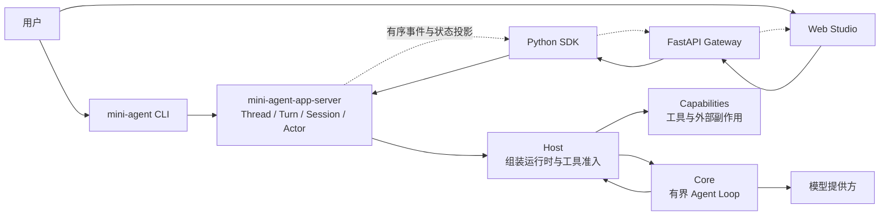

# 01 从 Agent Loop 到 Control Plane：Mini Agent 的运行时骨架

一个 Agent 产品看起来像聊天框：用户输入一句话，模型返回答案。但只要它开始读文件、运行命令、等待审批、保存进度或恢复中断，这个“聊天循环”就必须回答一组更难的问题：谁能执行副作用？状态保存在哪里？断线后界面凭什么知道任务走到了哪一步？

Mini Agent 把这些问题放进一套运行时里处理。理解它的关键，是看清两件事：**Core 负责把一轮模型工作跑得有界；Control Plane 负责让运行可控制、可观察、可恢复。**

## 先看两条路径

CLI 和 Web Studio 是这套运行时的两个客户端。Web Studio 多了一层 Gateway，但它不会另起一个 Agent Loop：它把控制请求交给同一个 App Server，再把服务端事件和持久状态投影到界面上。

图里有两种方向。客户端把输入和控制动作送进 App Server；运行时则由 Core 发起模型步骤，需要工具时交给 Host 和 Capabilities。App Server 统一管理 Thread、Turn、Session 与事件；Host/Capabilities 执行审批和授权规则，再由 App Server 把相关状态投影给客户端。

## 小循环负责什么

Core 的职责刻意收得很窄：准备有界上下文，调用模型，检查模型响应，执行有界工具批次，把结果写回对话，再判断继续还是结束。它拥有 Agent Loop 的执行语义，却不直接打开文件、创建进程、弹出审批窗口或写 Session 文件。

这条边界让 Core 的行为保持可组合。模型返回一个 `apply_patch` 调用时，Core 按名称把它交给路由器；Host 和 Capabilities 再根据路径、工具策略和审批规则决定是否执行文件修改。

## 控制面负责长生命周期

Control Plane 把一次模型调用变成一个能够管理的任务：

| 部分 | 运行时责任 |
| --- | --- |
| Core | 模型与工具循环、上下文和响应限制、停止分类、执行事件、对话写回 |
| Host | 组装提示与运行环境，按顺序做工具准入、审批和执行协调 |
| Capabilities | 提供模型、工作区、进程、沙箱及其他具体能力 |
| App Server | 管理 Thread、Turn、Goal、Session、Actor/CAS、持久状态、恢复与 JSON-RPC |
| SDK、Gateway、Web Studio | 连接服务端、传递控制请求、呈现有界状态和事件投影 |

Control Plane 负责**运行的身份和生命周期**：当前是哪个 Thread、哪个 Turn 正在运行、操作是否等待审批、哪些状态已写入 Session、哪些未知结果需要核对。

## 为什么 Mini Agent 和 Web Studio 共用运行时

如果终端和浏览器各自实现模型循环，恢复、审批和历史就会分裂成两套语义。Mini Agent 让 CLI 和 Web Studio 调用同一个 App Server：CLI 适合本地运行和脚本；Web Studio 适合观察长任务、控制子任务和处理审批。界面可以缓存投影以便显示，但不能因此成为执行、授权或 Session 历史的第二个权威来源。

这也给故障边界一个清楚的归属：浏览器断线意味着界面暂时看不到新事件；它不意味着 Turn 已停止。Gateway 重连之后应从 App Server 的事件和持久状态恢复，不能重复提交同一条输入。

## 带着这张图继续读

后面三篇沿着一次真实运行往下走：

1. [任务如何编排：从一个 Turn 到一组 Child Session](02-task-orchestration.md)
2. [上下文与状态：模型看见什么，系统记住什么](03-context-and-state.md)
3. [受控执行：模型提出工具调用之后发生什么](04-controlled-execution.md)

## 代码与规范入口

- Harness 的运行时边界：[Runtime architecture](../../harness-framework.md)、[Studio integration](../../studio-integration.md)。
- 核心循环：[crates/mini-agent-core/src/harness.rs](../../../crates/mini-agent-core/src/harness.rs)。
- Host 运行时组装：[crates/mini-agent-host/src/harness_builder.rs](../../../crates/mini-agent-host/src/harness_builder.rs)。
- App Server 协议分发：[crates/mini-agent-app-server/src/json_rpc.rs](../../../crates/mini-agent-app-server/src/json_rpc.rs)。
- Web 仓库入口（相对 `mini-agent-web` 根目录）：`server/routes/agent_ws.py`、`sdk/python/src/mini_agent/client.py`。
