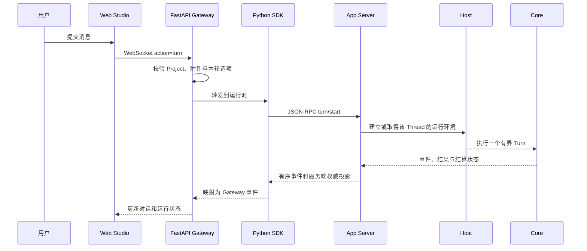
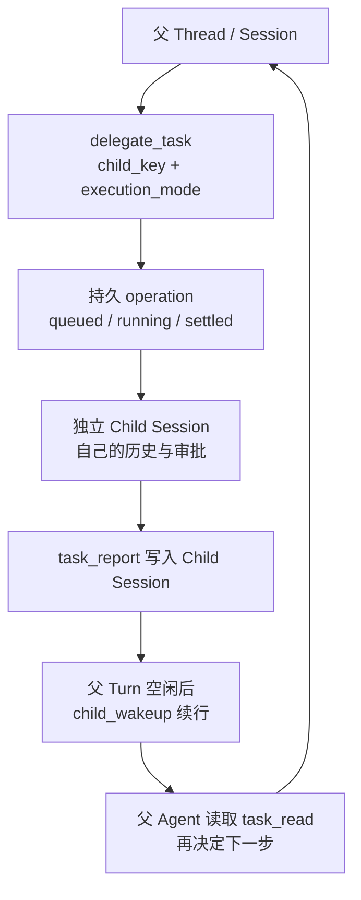

# 02 任务如何编排：从一个 Turn 到一组 Child Session

用户在 Web Studio 里输入“检查这个项目，找出问题并给出修复建议”时，界面只看到一条消息。运行时却要处理输入校验、Thread 身份、模型步骤、可能的子任务、事件流和最终结算。要读懂这条链路，先把四个容易混在一起的名词分开：**Thread、Turn、Session 和 Child operation。**

## 一条输入怎样进入运行时

WebSocket 的 `turn` 是浏览器与 Gateway 之间的消息；`turn/start` 是 SDK 与 App Server 之间的协议调用。它们处在不同边界，不能把 Gateway 内部任务误认为第二个 Agent Loop。当前 Rust App Server 协议和 Python SDK 都协商版本 `2`。

## 四种身份，各自回答一个问题

| 名称 | 它回答的问题 | 生命周期要点 |
| --- | --- | --- |
| Thread | 用户正在查看哪个对话？ | 客户端可读写、读取历史并订阅事件的对话身份。 |
| Turn | 这次运行从哪里开始，到哪里结束？ | `turn/start` 建立一次运行；结束后留下结果和结算状态。 |
| Session | 哪些运行上下文和持久记录属于同一个长期会话？ | 保存 settled checkpoint、operation 记录及受控恢复数据。 |
| Child operation | 被委派的工作处于排队、执行、暂停还是完成？ | operation 身份跨尝试保留；每个 attempt 对应新的 Child Turn。 |

把四种身份分开，就能准确判断一次恢复或重试应该作用在哪一层。例如，Session checkpoint 提供下一轮的对话上下文；活动 Turn 则有自己的执行状态。Child operation 的 `completed` 表示委派已完成，Child Session 最近一次 Turn 的 UI 状态需要单独读取。

## 子任务调度由控制面承接

当主 Agent 调用 `delegate_task`，Host 和 App Server 才接手建立独立的 Child Session 并启动另一份运行时。Core 仍然只负责当前 Turn 的模型与工具循环；子任务队列、并发槽位和重试由控制面管理。

父 Session 内唯一的 `child_key` 用来建立稳定子身份；显示标题不是身份。`execution_mode` 必须是 `parallel` 或 `sequential`。Web Studio 默认每个父任务最多有两个活动 Child；Host 可把容量设在 `1..=8`。并发超额时任务进入持久队列。顺序组还必须提供 `group_id` 和从零开始的 `sequence`，缺号时不会跳过前序任务。

Child 的完整对话留在自己的 Session。父会话只读取有界的 operation 摘要和显式 `task_report` 进展，不把整个子对话复制进父模型上下文。父 Turn 正在运行时，子报告先写入持久状态；父 Turn 结束后，或报告到达时父 Thread 已空闲，Gateway 再用 `turnSource: "child_wakeup"` 启动续行。该来源作为控制元数据出现在 Turn 事件和 Item 投影中，界面应把它显示为子任务更新。

## 重试是新 Turn，不是重放旧 Turn

同一个 Child operation 可以经历初次执行、retry 或 follow-up。`operationId` 保持不变，`operationAttempt` 递增；新 attempt 会启动新的 Child Turn。稳定的 request ID 让重复提交的 follow-up 可以幂等返回同一次分配。

这一区分对恢复很重要：网络超时、进程重启或页面断线都不能单独证明任务失败。客户端先读取 App Server 的 operation 和 Turn 状态，再决定是否使用已有 retry/follow-up 控制。Gateway 事件用于刷新界面；operation/report 的持久投影才是恢复依据。

## 停止、纠偏和恢复各有自己的结算点

停止请求会尽快中断本地正在等待的模型请求和可取消工具，不必等一段很长的生成自然结束。它仍不保证供应商立即停止远端计算，也不能撤销已经发生的工具副作用。

停止后，尚未开始的工具不会继续启动；已经开始的工具则保留实际结果。如果进程在副作用发生后、结果保存前退出，执行结果仍然未知，需要操作者核对。界面只有在运行时确认结算后才显示停止完成。

纠偏有自己的到达时机。运行时先记录请求，再在安全边界把它加入后续模型上下文；所以“已收到”不等于模型已经看到它。如果停止先结算，纠偏会明确留作未应用，原有思考和工具活动也不会因此被切成新的历史段。

浏览器断开不会自动取消任务。Gateway 收到 Ctrl+C 时会先停止接收新任务，并请求活动中的主任务和子任务停止，再关闭自己管理的运行进程。若退出前无法确认结算，执行会保留为未知，不会被伪装成成功或失败。

运行时重启后，会从保存的会话历史和执行进度恢复；事件回放补充界面变化，但不代替持久记录，也不会自动重跑未结任务。操作者先核对结果未知的工具，再明确选择是否继续原任务。这让“正在运行”“等待核对”“等待继续”和“已结算”保持为不同状态。

## 代码与规范入口

- [App Server：Turn 与 Child operation 方法](../../app-server.md#turn-execution)、[Child operations](../../app-server.md#child-operations-and-session-notebook)。
- [跨仓库运行路径](../../studio-integration.md#turn-事件与重连)、[Fork 与 Child Session](../../studio-integration.md#fork-child-session-与-notebook)。
- Harness 协议分发：[crates/mini-agent-app-server/src/json_rpc.rs](../../../crates/mini-agent-app-server/src/json_rpc.rs)。
- Web 仓库入口（相对 `mini-agent-web` 根目录）：`server/routes/agent_ws.py`、`sdk/python/src/mini_agent/client.py`、`server/session_manager.py`。
