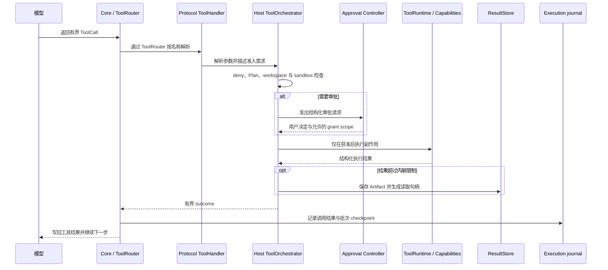

# 04 受控执行：模型提出工具调用之后发生什么

模型可以提出“读取这个文件”或“运行这条命令”，但提议不是授权，也不是副作用。真正执行之前，系统还要回答：工具是否存在、参数是否有效、操作是否在可用范围内、当前审批策略允许什么、是否需要用户批准，以及结果如何安全地回到模型上下文。

## 一次工具调用经过哪些边界



工具调用的顺序是：

```text
deny → Plan lock → workspace 与 sandbox → approval → execution → event 与 receipt
```

Core 的 `ToolRouter` 只按名称解析工具并维持有界循环。Protocol handler 负责解析参数、描述请求要做什么以及需要什么准入。Host 的 `ToolOrchestrator` 组织准入、审批和执行顺序；具体 `ToolRuntime` 才拥有文件、进程或其他真实副作用。即使模型生成的调用合法，前置拒绝、路径限制或审批仍然可以阻止它。

当前 Host 对已经迁移到 typed admission 的工具执行这套结构化流程；尚未迁移的工具仍有 `Legacy` 兼容分支。因此描述实现时要区分目标边界和已完成迁移范围，不能笼统说每个工具都已走完整 typed 流程。

## 三种“权限设置”不能揉成一个开关

执行路径包含几个彼此独立的维度：

- `project` 与 `full_machine` 描述访问范围。
- `interactive`、`automatic` 与 `trusted` 描述全局审批策略。
- `once`、`session` 与 `project` 描述用户批准后 grant 的复用范围。
- Plan Mode、工具可用性、Deny 规则和 sandbox 配置各自在自己的边界生效。

例如 `full_machine` 只是扩大候选文件范围，不代表允许所有操作。审批 grant 也不能推翻之前的 Deny。Host/Capabilities 用完整结构化 `ActionGrantKey` 匹配授权，包含动作类别、规范化动作、目标路径、访问范围、工作区和版本；界面显示的“运行命令”文字不承担安全身份的作用。Gateway 负责把审批卡送到浏览器并转回用户决定，不缓存授权 grant。

## 沙箱与运行环境的边界

工具运行时使用所选配置执行副作用。以 Shell 为例，Docker 必须被明确选中；如果 Docker 不可用，执行会失败，不会自动退回 Native。Native Shell 使用当前操作系统用户的权限，Docker 提供面向本地开发的隔离，但两者都不承诺抵御恶意代码攻击主机、Docker daemon 或内核。文件工具的 workspace 根限制也不等同于进程沙箱。

所以“有 sandbox 配置”不能被简化成“模型代码被隔离”。审查一个工具调用时，应同时看准入边界和最终执行的 ToolRuntime 配置。

## 结果回到模型之前仍受限制

每个模型步骤最多接受 8 个工具调用，单条结果默认最多向模型内联 16 KiB。较大的 Host 结果会保存为 Session artifact，并返回有界预览和分页读取句柄；如果持久化失败，系统也会明确返回被截断的预览和错误，而不是假装完整结果仍可读取。

工具生命周期状态和结构化 outcome 分开保存。Studio 可以据此区分“等待审批”“被准入层 defer”“执行失败”和“成功但输出被截断”，无需根据错误字符串猜权限或执行结果。重连后，App Server 的 ThreadItem、审批请求和执行记录才是状态依据。

## 用一组问题读工具路径

下次看到工具边界或新增能力时，可以顺着这些问题检查代码：

1. 哪一层解析了名称与参数？
2. 哪一层根据路径、Plan、Deny 和审批策略作准入决定？
3. 哪个 Runtime 真正完成副作用，它使用什么 sandbox 配置？
4. 结果如何被截断、保存、标识和写回 Session？
5. 浏览器收到的是结构化状态，还是只能从文本猜测？

如果答案跨越多个层，检查每一层是否只拥有一个清楚的责任。Agent 的安全性取决于提议、准入、副作用与持久结果之间完整可审计的控制路径。

## 代码与规范入口

- [默认工具面与准入顺序](../../harness-tool-surface.md)、[审批与 App Server 协议](../../app-server.md)、[Shell 与上下文限制](../../limits.md)。
- Core 执行工具批次：[crates/mini-agent-core/src/tool_batch_executor.rs](../../../crates/mini-agent-core/src/tool_batch_executor.rs)。
- Host 准入和审批协调：[crates/mini-agent-host/src/tool_orchestrator.rs](../../../crates/mini-agent-host/src/tool_orchestrator.rs)。
- Web 审批桥接入口（相对 `mini-agent-web` 根目录）：`server/routes/agent_ws.py`、`server/routes/agent_turns.py`、`sdk/python/src/mini_agent/client.py`。
